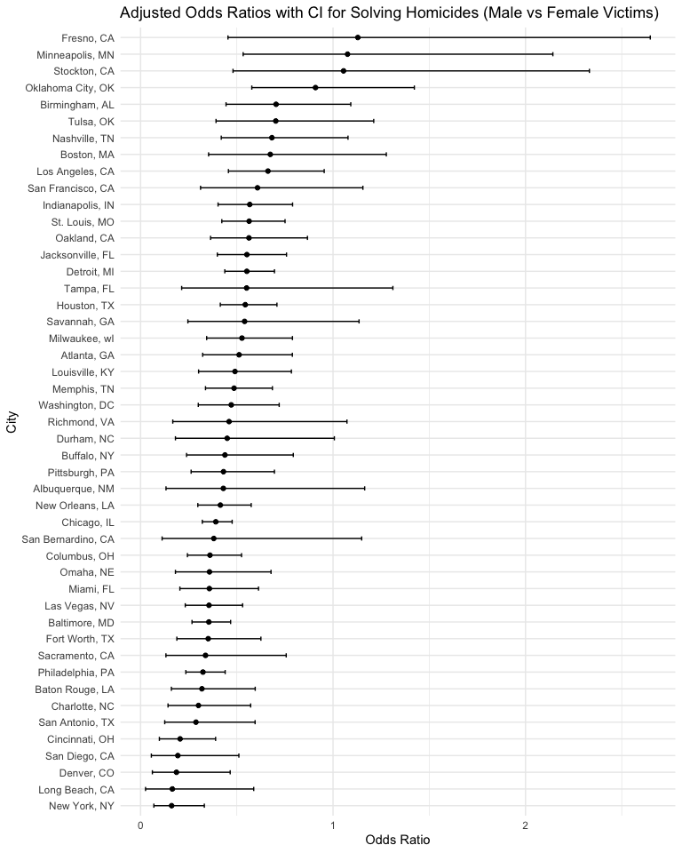
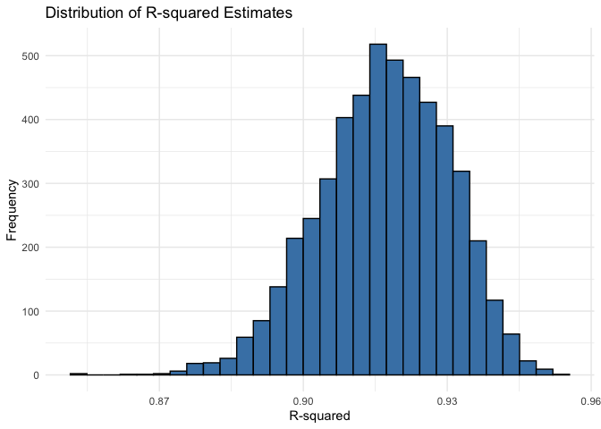
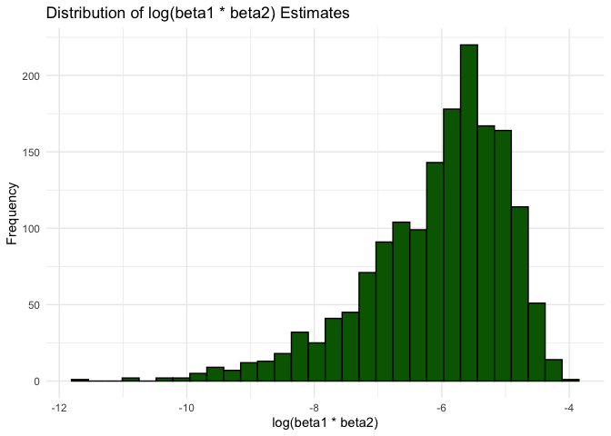

p8105_hw6_jy3360
================
Candice Yu
2023-11-20

# Problem 1

### Part a

The Washington Post has gathered data on homicides in 50 large U.S.
cities and made the data available through a GitHub repository here. You
can read their accompanying article here.

- Create a `city_state` variable (e.g. “Baltimore, MD”), and a binary
  variable indicating whether the homicide is solved.
- Omit cities Dallas, TX; Phoenix, AZ; and Kansas City, MO – these don’t
  report victim race.
- Also omit Tulsa, AL – this is a data entry mistake.
- For this problem, limit your analysis those for whom victim_race is
  white or black.
- Be sure that victim_age is numeric.

``` r
homicide_data <- read_csv("homicide-data.csv") %>%
  janitor::clean_names() %>%
  mutate(city_state = paste(city, state, sep = ", "),
         solved = as_factor(if_else(disposition %in% c("Closed without arrest", "Closed by arrest"), 1, 0)),
         victim_age = as.numeric(victim_age)) %>%
  filter(!city_state %in% c("Dallas, TX", "Phoenix, AZ", "Kansas City, MO", "Tulsa, AL"),
         victim_race %in% c("White", "Black"))
```

    ## Rows: 52179 Columns: 12
    ## ── Column specification ────────────────────────────────────────────────────────
    ## Delimiter: ","
    ## chr (9): uid, victim_last, victim_first, victim_race, victim_age, victim_sex...
    ## dbl (3): reported_date, lat, lon
    ## 
    ## ℹ Use `spec()` to retrieve the full column specification for this data.
    ## ℹ Specify the column types or set `show_col_types = FALSE` to quiet this message.

    ## Warning: There was 1 warning in `mutate()`.
    ## ℹ In argument: `victim_age = as.numeric(victim_age)`.
    ## Caused by warning:
    ## ! NAs introduced by coercion

### Part b

For the city of Baltimore, MD, use the glm function to fit a logistic
regression with resolved vs unresolved as the outcome and victim age,
sex and race as predictors.

- Save the output of glm as an R object;
- apply the broom::tidy to this object;
- and obtain the estimate and confidence interval of the adjusted odds
  ratio for solving homicides comparing male victims to female victims
  keeping all other variables fixed.

``` r
# data for Baltimore, MD
baltimore_data <- homicide_data %>%
  filter(city_state == "Baltimore, MD")

# logistic regression for Baltimore
baltimore_glm <- glm(solved ~ victim_age + victim_sex + victim_race, 
                     family = binomial, 
                     data = baltimore_data)

# save the model output and tidy it
baltimore_model_tidied <- broom::tidy(baltimore_glm)

# extract the estimate and confidence interval for male vs female victims
baltimore_coefs <- coef(summary(baltimore_glm))

male_female_or <- exp(baltimore_coefs["victim_sexMale", "Estimate"])
male_female_or_ci <- exp(confint(baltimore_glm)["victim_sexMale",])
```

    ## Waiting for profiling to be done...

The estimate of the adjusted odds ratio for solving homicides comparing
male victims to female victims keeping all other variables fixed is
0.3546711 and the confidence interval is (0.2672667, 0.4679109).

### Part c

Now run glm for each of the cities in your dataset, and extract the
adjusted odds ratio (and CI) for solving homicides comparing male
victims to female victims.

Do this within a “tidy” pipeline, making use of purrr::map, list
columns, and unnest as necessary to create a dataframe with estimated
ORs and CIs for each city.

``` r
# Assuming your data is in a dataframe called cleaned_data

# Define a function to perform glm and extract the necessary information
run_glm <- function(df) {
  glm_model = glm(solved ~ victim_age + victim_sex + victim_race, family = binomial, data = df)
  tidy_glm = broom::tidy(glm_model)
  confint_glm = confint(glm_model)
  
  # Extract the estimate, std. error, and CI for victim_sexMale
  tidy_glm %>%
    filter(term == "victim_sexMale") %>%
    mutate(
      or = exp(estimate),
      lower_ci = exp(confint_glm["victim_sexMale", "2.5 %"]),
      upper_ci = exp(confint_glm["victim_sexMale", "97.5 %"])
    )
}

# Apply the function to each subset of data for each city
city_models <- homicide_data %>%
  group_by(city_state) %>%
  nest() %>%
  mutate(model = purrr::map(data, run_glm)) %>%
  select(-data) %>%
  unnest(model)
```

    ## Waiting for profiling to be done...
    ## Waiting for profiling to be done...
    ## Waiting for profiling to be done...
    ## Waiting for profiling to be done...
    ## Waiting for profiling to be done...
    ## Waiting for profiling to be done...
    ## Waiting for profiling to be done...
    ## Waiting for profiling to be done...
    ## Waiting for profiling to be done...
    ## Waiting for profiling to be done...
    ## Waiting for profiling to be done...
    ## Waiting for profiling to be done...
    ## Waiting for profiling to be done...
    ## Waiting for profiling to be done...
    ## Waiting for profiling to be done...
    ## Waiting for profiling to be done...
    ## Waiting for profiling to be done...
    ## Waiting for profiling to be done...
    ## Waiting for profiling to be done...
    ## Waiting for profiling to be done...
    ## Waiting for profiling to be done...
    ## Waiting for profiling to be done...
    ## Waiting for profiling to be done...
    ## Waiting for profiling to be done...
    ## Waiting for profiling to be done...
    ## Waiting for profiling to be done...
    ## Waiting for profiling to be done...
    ## Waiting for profiling to be done...
    ## Waiting for profiling to be done...
    ## Waiting for profiling to be done...
    ## Waiting for profiling to be done...
    ## Waiting for profiling to be done...
    ## Waiting for profiling to be done...
    ## Waiting for profiling to be done...
    ## Waiting for profiling to be done...
    ## Waiting for profiling to be done...
    ## Waiting for profiling to be done...
    ## Waiting for profiling to be done...
    ## Waiting for profiling to be done...
    ## Waiting for profiling to be done...
    ## Waiting for profiling to be done...
    ## Waiting for profiling to be done...
    ## Waiting for profiling to be done...
    ## Waiting for profiling to be done...
    ## Waiting for profiling to be done...
    ## Waiting for profiling to be done...
    ## Waiting for profiling to be done...

    ## Warning: There were 43 warnings in `mutate()`.
    ## The first warning was:
    ## ℹ In argument: `model = purrr::map(data, run_glm)`.
    ## ℹ In group 1: `city_state = "Albuquerque, NM"`.
    ## Caused by warning:
    ## ! glm.fit: fitted probabilities numerically 0 or 1 occurred
    ## ℹ Run `dplyr::last_dplyr_warnings()` to see the 42 remaining warnings.

### Part d

Create a plot that shows the estimated ORs and CIs for each city.
Organize cities according to estimated OR, and comment on the plot.

``` r
# Create a plot of the odds ratios
ggplot(city_models, aes(x = reorder(city_state, or), y = or)) +
  geom_point() +
  geom_errorbar(aes(ymin = lower_ci, ymax = upper_ci), width = 0.25) +
  coord_flip() +  # flip the axes 
  xlab("City") +
  ylab("Odds Ratio") +
  ggtitle("Adjusted Odds Ratios with CI for Solving Homicides (Male vs Female Victims)")
```

<!-- -->

**Comments**

- The ORs for most cities are less than 1, suggesting that, after
  keeping all other variables fixed, homicides with female victims are
  more likely to be solved than those with male victims.
- The cities at the top of the plot, such as Fresno, CA, and
  Minneapolis, MN, have ORs greater than 1, indicating a relatively
  higher likelihood of solving cases with male victims in these cities.
- Some cities, like Tulsa, OK, and Nashville, TN, have confidence
  intervals that cross the OR of 1, suggesting that there is no
  statistically significant difference in the likelihood of solving
  homicides between male and female victims in those cities.
- The confidence intervals for cities like Fresno, CA, do not cross 1,
  suggesting a statistically significant difference in the likelihood of
  solving homicides with male victims compared to female victims.

# Problem 2

For this problem, we’ll use the Central Park weather data similar to
data we’ve seen elsewhere. The code chunk below (adapted from the course
website) will download these data.

``` r
weather_df = 
  rnoaa::meteo_pull_monitors(
    c("USW00094728"),
    var = c("PRCP", "TMIN", "TMAX"), 
    date_min = "2022-01-01",
    date_max = "2022-12-31") |>
  mutate(
    name = recode(id, USW00094728 = "CentralPark_NY"),
    tmin = tmin / 10,
    tmax = tmax / 10) |>
  select(name, id, everything())
```

    ## using cached file: /Users/candiceyu/Library/Caches/org.R-project.R/R/rnoaa/noaa_ghcnd/USW00094728.dly

    ## date created (size, mb): 2023-11-20 11:05:27.630047 (8.544)

    ## file min/max dates: 1869-01-01 / 2023-11-30

The boostrap is helpful when you’d like to perform inference for a
parameter/ value/ summary that doesn’t have an easy-to-write-down
distribution in the usual repeated sampling framework. We’ll focus on a
simple linear regression with `tmax` as the response with `tmin` and
`prcp` as the predictors, and are interested in the distribution of two
quantities estimated from these data:

- $\hat{r}^2$
- $\log(\hat{\beta}_1 \times \hat{\beta}_2)$

Use 5000 bootstrap samples and, for each bootstrap sample, produce
estimates of these two quantities.

- Plot the distribution of your estimates, and describe these in words.
- Using the 5000 bootstrap estimates, identify the 2.5% and 97.5%
  quantiles to provide a 95% confidence interval for $\hat{r}^2$ and
  $\log(\hat{\beta}_0 \times \hat{\beta}_1)$.

Note: broom::glance() is helpful for extracting $\hat{r}^2$ from a
fitted regression, and `broom::tidy()` (with some additional wrangling)
should help in computing $\log(\hat{\beta}_1 \times \hat{\beta}_2)$.

``` r
# define a function to perform the linear regression and extract r^2 and beta_product = log(beta1 * beta2)
analyze_sample <- function(sample_data) {
  model <- lm(tmax ~ tmin + prcp, data = sample_data)
  glance_data <- broom::glance(model)
  tidy_data <- broom::tidy(model)
  r_squared <- glance_data$r.squared
  beta_product <- exp(log(tidy_data$estimate[2]) + log(tidy_data$estimate[3]))
  return(c(r_squared, beta_product))
}

# Generate the bootstrap samples using rerun and analyze each sample
set.seed(123) 
bootstrap_samples <- rerun(5000, sample_n(weather_df, nrow(weather_df), replace = TRUE))
```

    ## Warning: `rerun()` was deprecated in purrr 1.0.0.
    ## ℹ Please use `map()` instead.
    ##   # Previously
    ##   rerun(5000, sample_n(weather_df, nrow(weather_df), replace = TRUE))
    ## 
    ##   # Now
    ##   map(1:5000, ~ sample_n(weather_df, nrow(weather_df), replace = TRUE))
    ## This warning is displayed once every 8 hours.
    ## Call `lifecycle::last_lifecycle_warnings()` to see where this warning was
    ## generated.

``` r
bootstrap_results <- map(bootstrap_samples, analyze_sample)
```

    ## Warning in log(tidy_data$estimate[3]): NaNs produced

    ## Warning in log(tidy_data$estimate[3]): NaNs produced

    ## Warning in log(tidy_data$estimate[3]): NaNs produced

    ## Warning in log(tidy_data$estimate[3]): NaNs produced

    ## Warning in log(tidy_data$estimate[3]): NaNs produced

    ## Warning in log(tidy_data$estimate[3]): NaNs produced

    ## Warning in log(tidy_data$estimate[3]): NaNs produced

    ## Warning in log(tidy_data$estimate[3]): NaNs produced

    ## Warning in log(tidy_data$estimate[3]): NaNs produced

    ## Warning in log(tidy_data$estimate[3]): NaNs produced

    ## Warning in log(tidy_data$estimate[3]): NaNs produced

    ## Warning in log(tidy_data$estimate[3]): NaNs produced

    ## Warning in log(tidy_data$estimate[3]): NaNs produced

    ## Warning in log(tidy_data$estimate[3]): NaNs produced

    ## Warning in log(tidy_data$estimate[3]): NaNs produced

    ## Warning in log(tidy_data$estimate[3]): NaNs produced

    ## Warning in log(tidy_data$estimate[3]): NaNs produced

    ## Warning in log(tidy_data$estimate[3]): NaNs produced

    ## Warning in log(tidy_data$estimate[3]): NaNs produced

    ## Warning in log(tidy_data$estimate[3]): NaNs produced

    ## Warning in log(tidy_data$estimate[3]): NaNs produced

    ## Warning in log(tidy_data$estimate[3]): NaNs produced

    ## Warning in log(tidy_data$estimate[3]): NaNs produced

    ## Warning in log(tidy_data$estimate[3]): NaNs produced

    ## Warning in log(tidy_data$estimate[3]): NaNs produced

    ## Warning in log(tidy_data$estimate[3]): NaNs produced

    ## Warning in log(tidy_data$estimate[3]): NaNs produced

    ## Warning in log(tidy_data$estimate[3]): NaNs produced

    ## Warning in log(tidy_data$estimate[3]): NaNs produced

    ## Warning in log(tidy_data$estimate[3]): NaNs produced

    ## Warning in log(tidy_data$estimate[3]): NaNs produced

    ## Warning in log(tidy_data$estimate[3]): NaNs produced

    ## Warning in log(tidy_data$estimate[3]): NaNs produced

    ## Warning in log(tidy_data$estimate[3]): NaNs produced

    ## Warning in log(tidy_data$estimate[3]): NaNs produced

    ## Warning in log(tidy_data$estimate[3]): NaNs produced

    ## Warning in log(tidy_data$estimate[3]): NaNs produced

    ## Warning in log(tidy_data$estimate[3]): NaNs produced

    ## Warning in log(tidy_data$estimate[3]): NaNs produced

    ## Warning in log(tidy_data$estimate[3]): NaNs produced

    ## Warning in log(tidy_data$estimate[3]): NaNs produced

    ## Warning in log(tidy_data$estimate[3]): NaNs produced

    ## Warning in log(tidy_data$estimate[3]): NaNs produced

    ## Warning in log(tidy_data$estimate[3]): NaNs produced

    ## Warning in log(tidy_data$estimate[3]): NaNs produced

    ## Warning in log(tidy_data$estimate[3]): NaNs produced

    ## Warning in log(tidy_data$estimate[3]): NaNs produced

    ## Warning in log(tidy_data$estimate[3]): NaNs produced

    ## Warning in log(tidy_data$estimate[3]): NaNs produced

    ## Warning in log(tidy_data$estimate[3]): NaNs produced

    ## Warning in log(tidy_data$estimate[3]): NaNs produced

    ## Warning in log(tidy_data$estimate[3]): NaNs produced

    ## Warning in log(tidy_data$estimate[3]): NaNs produced

    ## Warning in log(tidy_data$estimate[3]): NaNs produced

    ## Warning in log(tidy_data$estimate[3]): NaNs produced

    ## Warning in log(tidy_data$estimate[3]): NaNs produced

    ## Warning in log(tidy_data$estimate[3]): NaNs produced

    ## Warning in log(tidy_data$estimate[3]): NaNs produced

    ## Warning in log(tidy_data$estimate[3]): NaNs produced

    ## Warning in log(tidy_data$estimate[3]): NaNs produced

    ## Warning in log(tidy_data$estimate[3]): NaNs produced

    ## Warning in log(tidy_data$estimate[3]): NaNs produced

    ## Warning in log(tidy_data$estimate[3]): NaNs produced

    ## Warning in log(tidy_data$estimate[3]): NaNs produced

    ## Warning in log(tidy_data$estimate[3]): NaNs produced

    ## Warning in log(tidy_data$estimate[3]): NaNs produced

    ## Warning in log(tidy_data$estimate[3]): NaNs produced

    ## Warning in log(tidy_data$estimate[3]): NaNs produced

    ## Warning in log(tidy_data$estimate[3]): NaNs produced

    ## Warning in log(tidy_data$estimate[3]): NaNs produced

    ## Warning in log(tidy_data$estimate[3]): NaNs produced

    ## Warning in log(tidy_data$estimate[3]): NaNs produced

    ## Warning in log(tidy_data$estimate[3]): NaNs produced

    ## Warning in log(tidy_data$estimate[3]): NaNs produced

    ## Warning in log(tidy_data$estimate[3]): NaNs produced

    ## Warning in log(tidy_data$estimate[3]): NaNs produced

    ## Warning in log(tidy_data$estimate[3]): NaNs produced

    ## Warning in log(tidy_data$estimate[3]): NaNs produced

    ## Warning in log(tidy_data$estimate[3]): NaNs produced

    ## Warning in log(tidy_data$estimate[3]): NaNs produced

    ## Warning in log(tidy_data$estimate[3]): NaNs produced

    ## Warning in log(tidy_data$estimate[3]): NaNs produced

    ## Warning in log(tidy_data$estimate[3]): NaNs produced

    ## Warning in log(tidy_data$estimate[3]): NaNs produced

    ## Warning in log(tidy_data$estimate[3]): NaNs produced

    ## Warning in log(tidy_data$estimate[3]): NaNs produced

    ## Warning in log(tidy_data$estimate[3]): NaNs produced

    ## Warning in log(tidy_data$estimate[3]): NaNs produced

    ## Warning in log(tidy_data$estimate[3]): NaNs produced

    ## Warning in log(tidy_data$estimate[3]): NaNs produced

    ## Warning in log(tidy_data$estimate[3]): NaNs produced

    ## Warning in log(tidy_data$estimate[3]): NaNs produced

    ## Warning in log(tidy_data$estimate[3]): NaNs produced

    ## Warning in log(tidy_data$estimate[3]): NaNs produced

    ## Warning in log(tidy_data$estimate[3]): NaNs produced

    ## Warning in log(tidy_data$estimate[3]): NaNs produced

    ## Warning in log(tidy_data$estimate[3]): NaNs produced

    ## Warning in log(tidy_data$estimate[3]): NaNs produced

    ## Warning in log(tidy_data$estimate[3]): NaNs produced

    ## Warning in log(tidy_data$estimate[3]): NaNs produced

    ## Warning in log(tidy_data$estimate[3]): NaNs produced

    ## Warning in log(tidy_data$estimate[3]): NaNs produced

    ## Warning in log(tidy_data$estimate[3]): NaNs produced

    ## Warning in log(tidy_data$estimate[3]): NaNs produced

    ## Warning in log(tidy_data$estimate[3]): NaNs produced

    ## Warning in log(tidy_data$estimate[3]): NaNs produced

    ## Warning in log(tidy_data$estimate[3]): NaNs produced

    ## Warning in log(tidy_data$estimate[3]): NaNs produced

    ## Warning in log(tidy_data$estimate[3]): NaNs produced

    ## Warning in log(tidy_data$estimate[3]): NaNs produced

    ## Warning in log(tidy_data$estimate[3]): NaNs produced

    ## Warning in log(tidy_data$estimate[3]): NaNs produced

    ## Warning in log(tidy_data$estimate[3]): NaNs produced

    ## Warning in log(tidy_data$estimate[3]): NaNs produced

    ## Warning in log(tidy_data$estimate[3]): NaNs produced

    ## Warning in log(tidy_data$estimate[3]): NaNs produced

    ## Warning in log(tidy_data$estimate[3]): NaNs produced

    ## Warning in log(tidy_data$estimate[3]): NaNs produced

    ## Warning in log(tidy_data$estimate[3]): NaNs produced

    ## Warning in log(tidy_data$estimate[3]): NaNs produced

    ## Warning in log(tidy_data$estimate[3]): NaNs produced

    ## Warning in log(tidy_data$estimate[3]): NaNs produced

    ## Warning in log(tidy_data$estimate[3]): NaNs produced

    ## Warning in log(tidy_data$estimate[3]): NaNs produced

    ## Warning in log(tidy_data$estimate[3]): NaNs produced

    ## Warning in log(tidy_data$estimate[3]): NaNs produced

    ## Warning in log(tidy_data$estimate[3]): NaNs produced

    ## Warning in log(tidy_data$estimate[3]): NaNs produced

    ## Warning in log(tidy_data$estimate[3]): NaNs produced

    ## Warning in log(tidy_data$estimate[3]): NaNs produced

    ## Warning in log(tidy_data$estimate[3]): NaNs produced

    ## Warning in log(tidy_data$estimate[3]): NaNs produced

    ## Warning in log(tidy_data$estimate[3]): NaNs produced

    ## Warning in log(tidy_data$estimate[3]): NaNs produced

    ## Warning in log(tidy_data$estimate[3]): NaNs produced

    ## Warning in log(tidy_data$estimate[3]): NaNs produced

    ## Warning in log(tidy_data$estimate[3]): NaNs produced

    ## Warning in log(tidy_data$estimate[3]): NaNs produced

    ## Warning in log(tidy_data$estimate[3]): NaNs produced

    ## Warning in log(tidy_data$estimate[3]): NaNs produced

    ## Warning in log(tidy_data$estimate[3]): NaNs produced

    ## Warning in log(tidy_data$estimate[3]): NaNs produced

    ## Warning in log(tidy_data$estimate[3]): NaNs produced

    ## Warning in log(tidy_data$estimate[3]): NaNs produced

    ## Warning in log(tidy_data$estimate[3]): NaNs produced

    ## Warning in log(tidy_data$estimate[3]): NaNs produced

    ## Warning in log(tidy_data$estimate[3]): NaNs produced

    ## Warning in log(tidy_data$estimate[3]): NaNs produced

    ## Warning in log(tidy_data$estimate[3]): NaNs produced

    ## Warning in log(tidy_data$estimate[3]): NaNs produced

    ## Warning in log(tidy_data$estimate[3]): NaNs produced

    ## Warning in log(tidy_data$estimate[3]): NaNs produced

    ## Warning in log(tidy_data$estimate[3]): NaNs produced

    ## Warning in log(tidy_data$estimate[3]): NaNs produced

    ## Warning in log(tidy_data$estimate[3]): NaNs produced

    ## Warning in log(tidy_data$estimate[3]): NaNs produced

    ## Warning in log(tidy_data$estimate[3]): NaNs produced

    ## Warning in log(tidy_data$estimate[3]): NaNs produced

    ## Warning in log(tidy_data$estimate[3]): NaNs produced

    ## Warning in log(tidy_data$estimate[3]): NaNs produced

    ## Warning in log(tidy_data$estimate[3]): NaNs produced

    ## Warning in log(tidy_data$estimate[3]): NaNs produced

    ## Warning in log(tidy_data$estimate[3]): NaNs produced

    ## Warning in log(tidy_data$estimate[3]): NaNs produced

    ## Warning in log(tidy_data$estimate[3]): NaNs produced

    ## Warning in log(tidy_data$estimate[3]): NaNs produced

    ## Warning in log(tidy_data$estimate[3]): NaNs produced

    ## Warning in log(tidy_data$estimate[3]): NaNs produced

    ## Warning in log(tidy_data$estimate[3]): NaNs produced

    ## Warning in log(tidy_data$estimate[3]): NaNs produced

    ## Warning in log(tidy_data$estimate[3]): NaNs produced

    ## Warning in log(tidy_data$estimate[3]): NaNs produced

    ## Warning in log(tidy_data$estimate[3]): NaNs produced

    ## Warning in log(tidy_data$estimate[3]): NaNs produced

    ## Warning in log(tidy_data$estimate[3]): NaNs produced

    ## Warning in log(tidy_data$estimate[3]): NaNs produced

    ## Warning in log(tidy_data$estimate[3]): NaNs produced

    ## Warning in log(tidy_data$estimate[3]): NaNs produced

    ## Warning in log(tidy_data$estimate[3]): NaNs produced

    ## Warning in log(tidy_data$estimate[3]): NaNs produced

    ## Warning in log(tidy_data$estimate[3]): NaNs produced

    ## Warning in log(tidy_data$estimate[3]): NaNs produced

    ## Warning in log(tidy_data$estimate[3]): NaNs produced

    ## Warning in log(tidy_data$estimate[3]): NaNs produced

    ## Warning in log(tidy_data$estimate[3]): NaNs produced

    ## Warning in log(tidy_data$estimate[3]): NaNs produced

    ## Warning in log(tidy_data$estimate[3]): NaNs produced

    ## Warning in log(tidy_data$estimate[3]): NaNs produced

    ## Warning in log(tidy_data$estimate[3]): NaNs produced

    ## Warning in log(tidy_data$estimate[3]): NaNs produced

    ## Warning in log(tidy_data$estimate[3]): NaNs produced

    ## Warning in log(tidy_data$estimate[3]): NaNs produced

    ## Warning in log(tidy_data$estimate[3]): NaNs produced

    ## Warning in log(tidy_data$estimate[3]): NaNs produced

    ## Warning in log(tidy_data$estimate[3]): NaNs produced

    ## Warning in log(tidy_data$estimate[3]): NaNs produced

    ## Warning in log(tidy_data$estimate[3]): NaNs produced

    ## Warning in log(tidy_data$estimate[3]): NaNs produced

    ## Warning in log(tidy_data$estimate[3]): NaNs produced

    ## Warning in log(tidy_data$estimate[3]): NaNs produced

    ## Warning in log(tidy_data$estimate[3]): NaNs produced

    ## Warning in log(tidy_data$estimate[3]): NaNs produced

    ## Warning in log(tidy_data$estimate[3]): NaNs produced

    ## Warning in log(tidy_data$estimate[3]): NaNs produced

    ## Warning in log(tidy_data$estimate[3]): NaNs produced

    ## Warning in log(tidy_data$estimate[3]): NaNs produced

    ## Warning in log(tidy_data$estimate[3]): NaNs produced

    ## Warning in log(tidy_data$estimate[3]): NaNs produced

    ## Warning in log(tidy_data$estimate[3]): NaNs produced

    ## Warning in log(tidy_data$estimate[3]): NaNs produced

    ## Warning in log(tidy_data$estimate[3]): NaNs produced

    ## Warning in log(tidy_data$estimate[3]): NaNs produced

    ## Warning in log(tidy_data$estimate[3]): NaNs produced

    ## Warning in log(tidy_data$estimate[3]): NaNs produced

    ## Warning in log(tidy_data$estimate[3]): NaNs produced

    ## Warning in log(tidy_data$estimate[3]): NaNs produced

    ## Warning in log(tidy_data$estimate[3]): NaNs produced

    ## Warning in log(tidy_data$estimate[3]): NaNs produced

    ## Warning in log(tidy_data$estimate[3]): NaNs produced

    ## Warning in log(tidy_data$estimate[3]): NaNs produced

    ## Warning in log(tidy_data$estimate[3]): NaNs produced

    ## Warning in log(tidy_data$estimate[3]): NaNs produced

    ## Warning in log(tidy_data$estimate[3]): NaNs produced

    ## Warning in log(tidy_data$estimate[3]): NaNs produced

    ## Warning in log(tidy_data$estimate[3]): NaNs produced

    ## Warning in log(tidy_data$estimate[3]): NaNs produced

    ## Warning in log(tidy_data$estimate[3]): NaNs produced

    ## Warning in log(tidy_data$estimate[3]): NaNs produced

    ## Warning in log(tidy_data$estimate[3]): NaNs produced

    ## Warning in log(tidy_data$estimate[3]): NaNs produced

    ## Warning in log(tidy_data$estimate[3]): NaNs produced

    ## Warning in log(tidy_data$estimate[3]): NaNs produced

    ## Warning in log(tidy_data$estimate[3]): NaNs produced

    ## Warning in log(tidy_data$estimate[3]): NaNs produced

    ## Warning in log(tidy_data$estimate[3]): NaNs produced

    ## Warning in log(tidy_data$estimate[3]): NaNs produced

    ## Warning in log(tidy_data$estimate[3]): NaNs produced

    ## Warning in log(tidy_data$estimate[3]): NaNs produced

    ## Warning in log(tidy_data$estimate[3]): NaNs produced

    ## Warning in log(tidy_data$estimate[3]): NaNs produced

    ## Warning in log(tidy_data$estimate[3]): NaNs produced

    ## Warning in log(tidy_data$estimate[3]): NaNs produced

    ## Warning in log(tidy_data$estimate[3]): NaNs produced

    ## Warning in log(tidy_data$estimate[3]): NaNs produced

    ## Warning in log(tidy_data$estimate[3]): NaNs produced

    ## Warning in log(tidy_data$estimate[3]): NaNs produced

    ## Warning in log(tidy_data$estimate[3]): NaNs produced

    ## Warning in log(tidy_data$estimate[3]): NaNs produced

    ## Warning in log(tidy_data$estimate[3]): NaNs produced

    ## Warning in log(tidy_data$estimate[3]): NaNs produced

    ## Warning in log(tidy_data$estimate[3]): NaNs produced

    ## Warning in log(tidy_data$estimate[3]): NaNs produced

    ## Warning in log(tidy_data$estimate[3]): NaNs produced

    ## Warning in log(tidy_data$estimate[3]): NaNs produced

    ## Warning in log(tidy_data$estimate[3]): NaNs produced

    ## Warning in log(tidy_data$estimate[3]): NaNs produced

    ## Warning in log(tidy_data$estimate[3]): NaNs produced

    ## Warning in log(tidy_data$estimate[3]): NaNs produced

    ## Warning in log(tidy_data$estimate[3]): NaNs produced

    ## Warning in log(tidy_data$estimate[3]): NaNs produced

    ## Warning in log(tidy_data$estimate[3]): NaNs produced

    ## Warning in log(tidy_data$estimate[3]): NaNs produced

    ## Warning in log(tidy_data$estimate[3]): NaNs produced

    ## Warning in log(tidy_data$estimate[3]): NaNs produced

    ## Warning in log(tidy_data$estimate[3]): NaNs produced

    ## Warning in log(tidy_data$estimate[3]): NaNs produced

    ## Warning in log(tidy_data$estimate[3]): NaNs produced

    ## Warning in log(tidy_data$estimate[3]): NaNs produced

    ## Warning in log(tidy_data$estimate[3]): NaNs produced

    ## Warning in log(tidy_data$estimate[3]): NaNs produced

    ## Warning in log(tidy_data$estimate[3]): NaNs produced

    ## Warning in log(tidy_data$estimate[3]): NaNs produced

    ## Warning in log(tidy_data$estimate[3]): NaNs produced

    ## Warning in log(tidy_data$estimate[3]): NaNs produced

    ## Warning in log(tidy_data$estimate[3]): NaNs produced

    ## Warning in log(tidy_data$estimate[3]): NaNs produced

    ## Warning in log(tidy_data$estimate[3]): NaNs produced

    ## Warning in log(tidy_data$estimate[3]): NaNs produced

    ## Warning in log(tidy_data$estimate[3]): NaNs produced

    ## Warning in log(tidy_data$estimate[3]): NaNs produced

    ## Warning in log(tidy_data$estimate[3]): NaNs produced

    ## Warning in log(tidy_data$estimate[3]): NaNs produced

    ## Warning in log(tidy_data$estimate[3]): NaNs produced

    ## Warning in log(tidy_data$estimate[3]): NaNs produced

    ## Warning in log(tidy_data$estimate[3]): NaNs produced

    ## Warning in log(tidy_data$estimate[3]): NaNs produced

    ## Warning in log(tidy_data$estimate[3]): NaNs produced

    ## Warning in log(tidy_data$estimate[3]): NaNs produced

    ## Warning in log(tidy_data$estimate[3]): NaNs produced

    ## Warning in log(tidy_data$estimate[3]): NaNs produced

    ## Warning in log(tidy_data$estimate[3]): NaNs produced

    ## Warning in log(tidy_data$estimate[3]): NaNs produced

    ## Warning in log(tidy_data$estimate[3]): NaNs produced

    ## Warning in log(tidy_data$estimate[3]): NaNs produced

    ## Warning in log(tidy_data$estimate[3]): NaNs produced

    ## Warning in log(tidy_data$estimate[3]): NaNs produced

    ## Warning in log(tidy_data$estimate[3]): NaNs produced

    ## Warning in log(tidy_data$estimate[3]): NaNs produced

    ## Warning in log(tidy_data$estimate[3]): NaNs produced

    ## Warning in log(tidy_data$estimate[3]): NaNs produced

    ## Warning in log(tidy_data$estimate[3]): NaNs produced

    ## Warning in log(tidy_data$estimate[3]): NaNs produced

    ## Warning in log(tidy_data$estimate[3]): NaNs produced

    ## Warning in log(tidy_data$estimate[3]): NaNs produced

    ## Warning in log(tidy_data$estimate[3]): NaNs produced

    ## Warning in log(tidy_data$estimate[3]): NaNs produced

    ## Warning in log(tidy_data$estimate[3]): NaNs produced

    ## Warning in log(tidy_data$estimate[3]): NaNs produced

    ## Warning in log(tidy_data$estimate[3]): NaNs produced

    ## Warning in log(tidy_data$estimate[3]): NaNs produced

    ## Warning in log(tidy_data$estimate[3]): NaNs produced

    ## Warning in log(tidy_data$estimate[3]): NaNs produced

    ## Warning in log(tidy_data$estimate[3]): NaNs produced

    ## Warning in log(tidy_data$estimate[3]): NaNs produced

    ## Warning in log(tidy_data$estimate[3]): NaNs produced

    ## Warning in log(tidy_data$estimate[3]): NaNs produced

    ## Warning in log(tidy_data$estimate[3]): NaNs produced

    ## Warning in log(tidy_data$estimate[3]): NaNs produced

    ## Warning in log(tidy_data$estimate[3]): NaNs produced

    ## Warning in log(tidy_data$estimate[3]): NaNs produced

    ## Warning in log(tidy_data$estimate[3]): NaNs produced

    ## Warning in log(tidy_data$estimate[3]): NaNs produced

    ## Warning in log(tidy_data$estimate[3]): NaNs produced

    ## Warning in log(tidy_data$estimate[3]): NaNs produced

    ## Warning in log(tidy_data$estimate[3]): NaNs produced

    ## Warning in log(tidy_data$estimate[3]): NaNs produced

    ## Warning in log(tidy_data$estimate[3]): NaNs produced

    ## Warning in log(tidy_data$estimate[3]): NaNs produced

    ## Warning in log(tidy_data$estimate[3]): NaNs produced

    ## Warning in log(tidy_data$estimate[3]): NaNs produced

    ## Warning in log(tidy_data$estimate[3]): NaNs produced

    ## Warning in log(tidy_data$estimate[3]): NaNs produced

    ## Warning in log(tidy_data$estimate[3]): NaNs produced

    ## Warning in log(tidy_data$estimate[3]): NaNs produced

    ## Warning in log(tidy_data$estimate[3]): NaNs produced

    ## Warning in log(tidy_data$estimate[3]): NaNs produced

    ## Warning in log(tidy_data$estimate[3]): NaNs produced

    ## Warning in log(tidy_data$estimate[3]): NaNs produced

    ## Warning in log(tidy_data$estimate[3]): NaNs produced

    ## Warning in log(tidy_data$estimate[3]): NaNs produced

    ## Warning in log(tidy_data$estimate[3]): NaNs produced

    ## Warning in log(tidy_data$estimate[3]): NaNs produced

    ## Warning in log(tidy_data$estimate[3]): NaNs produced

    ## Warning in log(tidy_data$estimate[3]): NaNs produced

    ## Warning in log(tidy_data$estimate[3]): NaNs produced

    ## Warning in log(tidy_data$estimate[3]): NaNs produced

    ## Warning in log(tidy_data$estimate[3]): NaNs produced

    ## Warning in log(tidy_data$estimate[3]): NaNs produced

    ## Warning in log(tidy_data$estimate[3]): NaNs produced

    ## Warning in log(tidy_data$estimate[3]): NaNs produced

    ## Warning in log(tidy_data$estimate[3]): NaNs produced

    ## Warning in log(tidy_data$estimate[3]): NaNs produced

    ## Warning in log(tidy_data$estimate[3]): NaNs produced

    ## Warning in log(tidy_data$estimate[3]): NaNs produced

    ## Warning in log(tidy_data$estimate[3]): NaNs produced

    ## Warning in log(tidy_data$estimate[3]): NaNs produced

    ## Warning in log(tidy_data$estimate[3]): NaNs produced

    ## Warning in log(tidy_data$estimate[3]): NaNs produced

    ## Warning in log(tidy_data$estimate[3]): NaNs produced

    ## Warning in log(tidy_data$estimate[3]): NaNs produced

    ## Warning in log(tidy_data$estimate[3]): NaNs produced

    ## Warning in log(tidy_data$estimate[3]): NaNs produced

    ## Warning in log(tidy_data$estimate[3]): NaNs produced

    ## Warning in log(tidy_data$estimate[3]): NaNs produced

    ## Warning in log(tidy_data$estimate[3]): NaNs produced

    ## Warning in log(tidy_data$estimate[3]): NaNs produced

    ## Warning in log(tidy_data$estimate[3]): NaNs produced

    ## Warning in log(tidy_data$estimate[3]): NaNs produced

    ## Warning in log(tidy_data$estimate[3]): NaNs produced

    ## Warning in log(tidy_data$estimate[3]): NaNs produced

    ## Warning in log(tidy_data$estimate[3]): NaNs produced

    ## Warning in log(tidy_data$estimate[3]): NaNs produced

    ## Warning in log(tidy_data$estimate[3]): NaNs produced

    ## Warning in log(tidy_data$estimate[3]): NaNs produced

    ## Warning in log(tidy_data$estimate[3]): NaNs produced

    ## Warning in log(tidy_data$estimate[3]): NaNs produced

    ## Warning in log(tidy_data$estimate[3]): NaNs produced

    ## Warning in log(tidy_data$estimate[3]): NaNs produced

    ## Warning in log(tidy_data$estimate[3]): NaNs produced

    ## Warning in log(tidy_data$estimate[3]): NaNs produced

    ## Warning in log(tidy_data$estimate[3]): NaNs produced

    ## Warning in log(tidy_data$estimate[3]): NaNs produced

    ## Warning in log(tidy_data$estimate[3]): NaNs produced

    ## Warning in log(tidy_data$estimate[3]): NaNs produced

    ## Warning in log(tidy_data$estimate[3]): NaNs produced

    ## Warning in log(tidy_data$estimate[3]): NaNs produced

    ## Warning in log(tidy_data$estimate[3]): NaNs produced

    ## Warning in log(tidy_data$estimate[3]): NaNs produced

    ## Warning in log(tidy_data$estimate[3]): NaNs produced

    ## Warning in log(tidy_data$estimate[3]): NaNs produced

    ## Warning in log(tidy_data$estimate[3]): NaNs produced

    ## Warning in log(tidy_data$estimate[3]): NaNs produced

    ## Warning in log(tidy_data$estimate[3]): NaNs produced

    ## Warning in log(tidy_data$estimate[3]): NaNs produced

    ## Warning in log(tidy_data$estimate[3]): NaNs produced

    ## Warning in log(tidy_data$estimate[3]): NaNs produced

    ## Warning in log(tidy_data$estimate[3]): NaNs produced

    ## Warning in log(tidy_data$estimate[3]): NaNs produced

    ## Warning in log(tidy_data$estimate[3]): NaNs produced

    ## Warning in log(tidy_data$estimate[3]): NaNs produced

    ## Warning in log(tidy_data$estimate[3]): NaNs produced

    ## Warning in log(tidy_data$estimate[3]): NaNs produced

    ## Warning in log(tidy_data$estimate[3]): NaNs produced

    ## Warning in log(tidy_data$estimate[3]): NaNs produced

    ## Warning in log(tidy_data$estimate[3]): NaNs produced

    ## Warning in log(tidy_data$estimate[3]): NaNs produced

    ## Warning in log(tidy_data$estimate[3]): NaNs produced

    ## Warning in log(tidy_data$estimate[3]): NaNs produced

    ## Warning in log(tidy_data$estimate[3]): NaNs produced

    ## Warning in log(tidy_data$estimate[3]): NaNs produced

    ## Warning in log(tidy_data$estimate[3]): NaNs produced

    ## Warning in log(tidy_data$estimate[3]): NaNs produced

    ## Warning in log(tidy_data$estimate[3]): NaNs produced

    ## Warning in log(tidy_data$estimate[3]): NaNs produced

    ## Warning in log(tidy_data$estimate[3]): NaNs produced

    ## Warning in log(tidy_data$estimate[3]): NaNs produced

    ## Warning in log(tidy_data$estimate[3]): NaNs produced

    ## Warning in log(tidy_data$estimate[3]): NaNs produced

    ## Warning in log(tidy_data$estimate[3]): NaNs produced

    ## Warning in log(tidy_data$estimate[3]): NaNs produced

    ## Warning in log(tidy_data$estimate[3]): NaNs produced

    ## Warning in log(tidy_data$estimate[3]): NaNs produced

    ## Warning in log(tidy_data$estimate[3]): NaNs produced

    ## Warning in log(tidy_data$estimate[3]): NaNs produced

    ## Warning in log(tidy_data$estimate[3]): NaNs produced

    ## Warning in log(tidy_data$estimate[3]): NaNs produced

    ## Warning in log(tidy_data$estimate[3]): NaNs produced

    ## Warning in log(tidy_data$estimate[3]): NaNs produced

    ## Warning in log(tidy_data$estimate[3]): NaNs produced

    ## Warning in log(tidy_data$estimate[3]): NaNs produced

    ## Warning in log(tidy_data$estimate[3]): NaNs produced

    ## Warning in log(tidy_data$estimate[3]): NaNs produced

    ## Warning in log(tidy_data$estimate[3]): NaNs produced

    ## Warning in log(tidy_data$estimate[3]): NaNs produced

    ## Warning in log(tidy_data$estimate[3]): NaNs produced

    ## Warning in log(tidy_data$estimate[3]): NaNs produced

    ## Warning in log(tidy_data$estimate[3]): NaNs produced

    ## Warning in log(tidy_data$estimate[3]): NaNs produced

    ## Warning in log(tidy_data$estimate[3]): NaNs produced

    ## Warning in log(tidy_data$estimate[3]): NaNs produced

    ## Warning in log(tidy_data$estimate[3]): NaNs produced

    ## Warning in log(tidy_data$estimate[3]): NaNs produced

    ## Warning in log(tidy_data$estimate[3]): NaNs produced

    ## Warning in log(tidy_data$estimate[3]): NaNs produced

    ## Warning in log(tidy_data$estimate[3]): NaNs produced

    ## Warning in log(tidy_data$estimate[3]): NaNs produced

    ## Warning in log(tidy_data$estimate[3]): NaNs produced

    ## Warning in log(tidy_data$estimate[3]): NaNs produced

    ## Warning in log(tidy_data$estimate[3]): NaNs produced

    ## Warning in log(tidy_data$estimate[3]): NaNs produced

    ## Warning in log(tidy_data$estimate[3]): NaNs produced

    ## Warning in log(tidy_data$estimate[3]): NaNs produced

    ## Warning in log(tidy_data$estimate[3]): NaNs produced

    ## Warning in log(tidy_data$estimate[3]): NaNs produced

    ## Warning in log(tidy_data$estimate[3]): NaNs produced

    ## Warning in log(tidy_data$estimate[3]): NaNs produced

    ## Warning in log(tidy_data$estimate[3]): NaNs produced

    ## Warning in log(tidy_data$estimate[3]): NaNs produced

    ## Warning in log(tidy_data$estimate[3]): NaNs produced

    ## Warning in log(tidy_data$estimate[3]): NaNs produced

    ## Warning in log(tidy_data$estimate[3]): NaNs produced

    ## Warning in log(tidy_data$estimate[3]): NaNs produced

    ## Warning in log(tidy_data$estimate[3]): NaNs produced

    ## Warning in log(tidy_data$estimate[3]): NaNs produced

    ## Warning in log(tidy_data$estimate[3]): NaNs produced

    ## Warning in log(tidy_data$estimate[3]): NaNs produced

    ## Warning in log(tidy_data$estimate[3]): NaNs produced

    ## Warning in log(tidy_data$estimate[3]): NaNs produced

    ## Warning in log(tidy_data$estimate[3]): NaNs produced

    ## Warning in log(tidy_data$estimate[3]): NaNs produced

    ## Warning in log(tidy_data$estimate[3]): NaNs produced

    ## Warning in log(tidy_data$estimate[3]): NaNs produced

    ## Warning in log(tidy_data$estimate[3]): NaNs produced

    ## Warning in log(tidy_data$estimate[3]): NaNs produced

    ## Warning in log(tidy_data$estimate[3]): NaNs produced

    ## Warning in log(tidy_data$estimate[3]): NaNs produced

    ## Warning in log(tidy_data$estimate[3]): NaNs produced

    ## Warning in log(tidy_data$estimate[3]): NaNs produced

    ## Warning in log(tidy_data$estimate[3]): NaNs produced

    ## Warning in log(tidy_data$estimate[3]): NaNs produced

    ## Warning in log(tidy_data$estimate[3]): NaNs produced

    ## Warning in log(tidy_data$estimate[3]): NaNs produced

    ## Warning in log(tidy_data$estimate[3]): NaNs produced

    ## Warning in log(tidy_data$estimate[3]): NaNs produced

    ## Warning in log(tidy_data$estimate[3]): NaNs produced

    ## Warning in log(tidy_data$estimate[3]): NaNs produced

    ## Warning in log(tidy_data$estimate[3]): NaNs produced

    ## Warning in log(tidy_data$estimate[3]): NaNs produced

    ## Warning in log(tidy_data$estimate[3]): NaNs produced

    ## Warning in log(tidy_data$estimate[3]): NaNs produced

    ## Warning in log(tidy_data$estimate[3]): NaNs produced

    ## Warning in log(tidy_data$estimate[3]): NaNs produced

    ## Warning in log(tidy_data$estimate[3]): NaNs produced

    ## Warning in log(tidy_data$estimate[3]): NaNs produced

    ## Warning in log(tidy_data$estimate[3]): NaNs produced

    ## Warning in log(tidy_data$estimate[3]): NaNs produced

    ## Warning in log(tidy_data$estimate[3]): NaNs produced

    ## Warning in log(tidy_data$estimate[3]): NaNs produced

    ## Warning in log(tidy_data$estimate[3]): NaNs produced

    ## Warning in log(tidy_data$estimate[3]): NaNs produced

    ## Warning in log(tidy_data$estimate[3]): NaNs produced

    ## Warning in log(tidy_data$estimate[3]): NaNs produced

    ## Warning in log(tidy_data$estimate[3]): NaNs produced

    ## Warning in log(tidy_data$estimate[3]): NaNs produced

    ## Warning in log(tidy_data$estimate[3]): NaNs produced

    ## Warning in log(tidy_data$estimate[3]): NaNs produced

    ## Warning in log(tidy_data$estimate[3]): NaNs produced

    ## Warning in log(tidy_data$estimate[3]): NaNs produced

    ## Warning in log(tidy_data$estimate[3]): NaNs produced

    ## Warning in log(tidy_data$estimate[3]): NaNs produced

    ## Warning in log(tidy_data$estimate[3]): NaNs produced

    ## Warning in log(tidy_data$estimate[3]): NaNs produced

    ## Warning in log(tidy_data$estimate[3]): NaNs produced

    ## Warning in log(tidy_data$estimate[3]): NaNs produced

    ## Warning in log(tidy_data$estimate[3]): NaNs produced

    ## Warning in log(tidy_data$estimate[3]): NaNs produced

    ## Warning in log(tidy_data$estimate[3]): NaNs produced

    ## Warning in log(tidy_data$estimate[3]): NaNs produced

    ## Warning in log(tidy_data$estimate[3]): NaNs produced

    ## Warning in log(tidy_data$estimate[3]): NaNs produced

    ## Warning in log(tidy_data$estimate[3]): NaNs produced

    ## Warning in log(tidy_data$estimate[3]): NaNs produced

    ## Warning in log(tidy_data$estimate[3]): NaNs produced

    ## Warning in log(tidy_data$estimate[3]): NaNs produced

    ## Warning in log(tidy_data$estimate[3]): NaNs produced

    ## Warning in log(tidy_data$estimate[3]): NaNs produced

    ## Warning in log(tidy_data$estimate[3]): NaNs produced

    ## Warning in log(tidy_data$estimate[3]): NaNs produced

    ## Warning in log(tidy_data$estimate[3]): NaNs produced

    ## Warning in log(tidy_data$estimate[3]): NaNs produced

    ## Warning in log(tidy_data$estimate[3]): NaNs produced

    ## Warning in log(tidy_data$estimate[3]): NaNs produced

    ## Warning in log(tidy_data$estimate[3]): NaNs produced

    ## Warning in log(tidy_data$estimate[3]): NaNs produced

    ## Warning in log(tidy_data$estimate[3]): NaNs produced

    ## Warning in log(tidy_data$estimate[3]): NaNs produced

    ## Warning in log(tidy_data$estimate[3]): NaNs produced

    ## Warning in log(tidy_data$estimate[3]): NaNs produced

    ## Warning in log(tidy_data$estimate[3]): NaNs produced

    ## Warning in log(tidy_data$estimate[3]): NaNs produced

    ## Warning in log(tidy_data$estimate[3]): NaNs produced

    ## Warning in log(tidy_data$estimate[3]): NaNs produced

    ## Warning in log(tidy_data$estimate[3]): NaNs produced

    ## Warning in log(tidy_data$estimate[3]): NaNs produced

    ## Warning in log(tidy_data$estimate[3]): NaNs produced

    ## Warning in log(tidy_data$estimate[3]): NaNs produced

    ## Warning in log(tidy_data$estimate[3]): NaNs produced

    ## Warning in log(tidy_data$estimate[3]): NaNs produced

    ## Warning in log(tidy_data$estimate[3]): NaNs produced

    ## Warning in log(tidy_data$estimate[3]): NaNs produced

    ## Warning in log(tidy_data$estimate[3]): NaNs produced

    ## Warning in log(tidy_data$estimate[3]): NaNs produced

    ## Warning in log(tidy_data$estimate[3]): NaNs produced

    ## Warning in log(tidy_data$estimate[3]): NaNs produced

    ## Warning in log(tidy_data$estimate[3]): NaNs produced

    ## Warning in log(tidy_data$estimate[3]): NaNs produced

    ## Warning in log(tidy_data$estimate[3]): NaNs produced

    ## Warning in log(tidy_data$estimate[3]): NaNs produced

    ## Warning in log(tidy_data$estimate[3]): NaNs produced

    ## Warning in log(tidy_data$estimate[3]): NaNs produced

    ## Warning in log(tidy_data$estimate[3]): NaNs produced

    ## Warning in log(tidy_data$estimate[3]): NaNs produced

    ## Warning in log(tidy_data$estimate[3]): NaNs produced

    ## Warning in log(tidy_data$estimate[3]): NaNs produced

    ## Warning in log(tidy_data$estimate[3]): NaNs produced

    ## Warning in log(tidy_data$estimate[3]): NaNs produced

    ## Warning in log(tidy_data$estimate[3]): NaNs produced

    ## Warning in log(tidy_data$estimate[3]): NaNs produced

    ## Warning in log(tidy_data$estimate[3]): NaNs produced

    ## Warning in log(tidy_data$estimate[3]): NaNs produced

    ## Warning in log(tidy_data$estimate[3]): NaNs produced

    ## Warning in log(tidy_data$estimate[3]): NaNs produced

    ## Warning in log(tidy_data$estimate[3]): NaNs produced

    ## Warning in log(tidy_data$estimate[3]): NaNs produced

    ## Warning in log(tidy_data$estimate[3]): NaNs produced

    ## Warning in log(tidy_data$estimate[3]): NaNs produced

    ## Warning in log(tidy_data$estimate[3]): NaNs produced

    ## Warning in log(tidy_data$estimate[3]): NaNs produced

    ## Warning in log(tidy_data$estimate[3]): NaNs produced

    ## Warning in log(tidy_data$estimate[3]): NaNs produced

    ## Warning in log(tidy_data$estimate[3]): NaNs produced

    ## Warning in log(tidy_data$estimate[3]): NaNs produced

    ## Warning in log(tidy_data$estimate[3]): NaNs produced

    ## Warning in log(tidy_data$estimate[3]): NaNs produced

    ## Warning in log(tidy_data$estimate[3]): NaNs produced

    ## Warning in log(tidy_data$estimate[3]): NaNs produced

    ## Warning in log(tidy_data$estimate[3]): NaNs produced

    ## Warning in log(tidy_data$estimate[3]): NaNs produced

    ## Warning in log(tidy_data$estimate[3]): NaNs produced

    ## Warning in log(tidy_data$estimate[3]): NaNs produced

    ## Warning in log(tidy_data$estimate[3]): NaNs produced

    ## Warning in log(tidy_data$estimate[3]): NaNs produced

    ## Warning in log(tidy_data$estimate[3]): NaNs produced

    ## Warning in log(tidy_data$estimate[3]): NaNs produced

    ## Warning in log(tidy_data$estimate[3]): NaNs produced

    ## Warning in log(tidy_data$estimate[3]): NaNs produced

    ## Warning in log(tidy_data$estimate[3]): NaNs produced

    ## Warning in log(tidy_data$estimate[3]): NaNs produced

    ## Warning in log(tidy_data$estimate[3]): NaNs produced

    ## Warning in log(tidy_data$estimate[3]): NaNs produced

    ## Warning in log(tidy_data$estimate[3]): NaNs produced

    ## Warning in log(tidy_data$estimate[3]): NaNs produced

    ## Warning in log(tidy_data$estimate[3]): NaNs produced

    ## Warning in log(tidy_data$estimate[3]): NaNs produced

    ## Warning in log(tidy_data$estimate[3]): NaNs produced

    ## Warning in log(tidy_data$estimate[3]): NaNs produced

    ## Warning in log(tidy_data$estimate[3]): NaNs produced

    ## Warning in log(tidy_data$estimate[3]): NaNs produced

    ## Warning in log(tidy_data$estimate[3]): NaNs produced

    ## Warning in log(tidy_data$estimate[3]): NaNs produced

    ## Warning in log(tidy_data$estimate[3]): NaNs produced

    ## Warning in log(tidy_data$estimate[3]): NaNs produced

    ## Warning in log(tidy_data$estimate[3]): NaNs produced

    ## Warning in log(tidy_data$estimate[3]): NaNs produced

    ## Warning in log(tidy_data$estimate[3]): NaNs produced

    ## Warning in log(tidy_data$estimate[3]): NaNs produced

    ## Warning in log(tidy_data$estimate[3]): NaNs produced

    ## Warning in log(tidy_data$estimate[3]): NaNs produced

    ## Warning in log(tidy_data$estimate[3]): NaNs produced

    ## Warning in log(tidy_data$estimate[3]): NaNs produced

    ## Warning in log(tidy_data$estimate[3]): NaNs produced

    ## Warning in log(tidy_data$estimate[3]): NaNs produced

    ## Warning in log(tidy_data$estimate[3]): NaNs produced

    ## Warning in log(tidy_data$estimate[3]): NaNs produced

    ## Warning in log(tidy_data$estimate[3]): NaNs produced

    ## Warning in log(tidy_data$estimate[3]): NaNs produced

    ## Warning in log(tidy_data$estimate[3]): NaNs produced

    ## Warning in log(tidy_data$estimate[3]): NaNs produced

    ## Warning in log(tidy_data$estimate[3]): NaNs produced

    ## Warning in log(tidy_data$estimate[3]): NaNs produced

    ## Warning in log(tidy_data$estimate[3]): NaNs produced

    ## Warning in log(tidy_data$estimate[3]): NaNs produced

    ## Warning in log(tidy_data$estimate[3]): NaNs produced

    ## Warning in log(tidy_data$estimate[3]): NaNs produced

    ## Warning in log(tidy_data$estimate[3]): NaNs produced

    ## Warning in log(tidy_data$estimate[3]): NaNs produced

    ## Warning in log(tidy_data$estimate[3]): NaNs produced

    ## Warning in log(tidy_data$estimate[3]): NaNs produced

    ## Warning in log(tidy_data$estimate[3]): NaNs produced

    ## Warning in log(tidy_data$estimate[3]): NaNs produced

    ## Warning in log(tidy_data$estimate[3]): NaNs produced

    ## Warning in log(tidy_data$estimate[3]): NaNs produced

    ## Warning in log(tidy_data$estimate[3]): NaNs produced

    ## Warning in log(tidy_data$estimate[3]): NaNs produced

    ## Warning in log(tidy_data$estimate[3]): NaNs produced

    ## Warning in log(tidy_data$estimate[3]): NaNs produced

    ## Warning in log(tidy_data$estimate[3]): NaNs produced

    ## Warning in log(tidy_data$estimate[3]): NaNs produced

    ## Warning in log(tidy_data$estimate[3]): NaNs produced

    ## Warning in log(tidy_data$estimate[3]): NaNs produced

    ## Warning in log(tidy_data$estimate[3]): NaNs produced

    ## Warning in log(tidy_data$estimate[3]): NaNs produced

    ## Warning in log(tidy_data$estimate[3]): NaNs produced

    ## Warning in log(tidy_data$estimate[3]): NaNs produced

    ## Warning in log(tidy_data$estimate[3]): NaNs produced

    ## Warning in log(tidy_data$estimate[3]): NaNs produced

    ## Warning in log(tidy_data$estimate[3]): NaNs produced

    ## Warning in log(tidy_data$estimate[3]): NaNs produced

    ## Warning in log(tidy_data$estimate[3]): NaNs produced

    ## Warning in log(tidy_data$estimate[3]): NaNs produced

    ## Warning in log(tidy_data$estimate[3]): NaNs produced

    ## Warning in log(tidy_data$estimate[3]): NaNs produced

    ## Warning in log(tidy_data$estimate[3]): NaNs produced

    ## Warning in log(tidy_data$estimate[3]): NaNs produced

    ## Warning in log(tidy_data$estimate[3]): NaNs produced

    ## Warning in log(tidy_data$estimate[3]): NaNs produced

    ## Warning in log(tidy_data$estimate[3]): NaNs produced

    ## Warning in log(tidy_data$estimate[3]): NaNs produced

    ## Warning in log(tidy_data$estimate[3]): NaNs produced

    ## Warning in log(tidy_data$estimate[3]): NaNs produced

    ## Warning in log(tidy_data$estimate[3]): NaNs produced

    ## Warning in log(tidy_data$estimate[3]): NaNs produced

    ## Warning in log(tidy_data$estimate[3]): NaNs produced

    ## Warning in log(tidy_data$estimate[3]): NaNs produced

    ## Warning in log(tidy_data$estimate[3]): NaNs produced

    ## Warning in log(tidy_data$estimate[3]): NaNs produced

    ## Warning in log(tidy_data$estimate[3]): NaNs produced

    ## Warning in log(tidy_data$estimate[3]): NaNs produced

    ## Warning in log(tidy_data$estimate[3]): NaNs produced

    ## Warning in log(tidy_data$estimate[3]): NaNs produced

    ## Warning in log(tidy_data$estimate[3]): NaNs produced

    ## Warning in log(tidy_data$estimate[3]): NaNs produced

    ## Warning in log(tidy_data$estimate[3]): NaNs produced

    ## Warning in log(tidy_data$estimate[3]): NaNs produced

    ## Warning in log(tidy_data$estimate[3]): NaNs produced

    ## Warning in log(tidy_data$estimate[3]): NaNs produced

    ## Warning in log(tidy_data$estimate[3]): NaNs produced

    ## Warning in log(tidy_data$estimate[3]): NaNs produced

    ## Warning in log(tidy_data$estimate[3]): NaNs produced

    ## Warning in log(tidy_data$estimate[3]): NaNs produced

    ## Warning in log(tidy_data$estimate[3]): NaNs produced

    ## Warning in log(tidy_data$estimate[3]): NaNs produced

    ## Warning in log(tidy_data$estimate[3]): NaNs produced

    ## Warning in log(tidy_data$estimate[3]): NaNs produced

    ## Warning in log(tidy_data$estimate[3]): NaNs produced

    ## Warning in log(tidy_data$estimate[3]): NaNs produced

    ## Warning in log(tidy_data$estimate[3]): NaNs produced

    ## Warning in log(tidy_data$estimate[3]): NaNs produced

    ## Warning in log(tidy_data$estimate[3]): NaNs produced

    ## Warning in log(tidy_data$estimate[3]): NaNs produced

    ## Warning in log(tidy_data$estimate[3]): NaNs produced

    ## Warning in log(tidy_data$estimate[3]): NaNs produced

    ## Warning in log(tidy_data$estimate[3]): NaNs produced

    ## Warning in log(tidy_data$estimate[3]): NaNs produced

    ## Warning in log(tidy_data$estimate[3]): NaNs produced

    ## Warning in log(tidy_data$estimate[3]): NaNs produced

    ## Warning in log(tidy_data$estimate[3]): NaNs produced

    ## Warning in log(tidy_data$estimate[3]): NaNs produced

    ## Warning in log(tidy_data$estimate[3]): NaNs produced

    ## Warning in log(tidy_data$estimate[3]): NaNs produced

    ## Warning in log(tidy_data$estimate[3]): NaNs produced

    ## Warning in log(tidy_data$estimate[3]): NaNs produced

    ## Warning in log(tidy_data$estimate[3]): NaNs produced

    ## Warning in log(tidy_data$estimate[3]): NaNs produced

    ## Warning in log(tidy_data$estimate[3]): NaNs produced

    ## Warning in log(tidy_data$estimate[3]): NaNs produced

    ## Warning in log(tidy_data$estimate[3]): NaNs produced

    ## Warning in log(tidy_data$estimate[3]): NaNs produced

    ## Warning in log(tidy_data$estimate[3]): NaNs produced

    ## Warning in log(tidy_data$estimate[3]): NaNs produced

    ## Warning in log(tidy_data$estimate[3]): NaNs produced

    ## Warning in log(tidy_data$estimate[3]): NaNs produced

    ## Warning in log(tidy_data$estimate[3]): NaNs produced

    ## Warning in log(tidy_data$estimate[3]): NaNs produced

    ## Warning in log(tidy_data$estimate[3]): NaNs produced

    ## Warning in log(tidy_data$estimate[3]): NaNs produced

    ## Warning in log(tidy_data$estimate[3]): NaNs produced

    ## Warning in log(tidy_data$estimate[3]): NaNs produced

    ## Warning in log(tidy_data$estimate[3]): NaNs produced

    ## Warning in log(tidy_data$estimate[3]): NaNs produced

    ## Warning in log(tidy_data$estimate[3]): NaNs produced

    ## Warning in log(tidy_data$estimate[3]): NaNs produced

    ## Warning in log(tidy_data$estimate[3]): NaNs produced

    ## Warning in log(tidy_data$estimate[3]): NaNs produced

    ## Warning in log(tidy_data$estimate[3]): NaNs produced

    ## Warning in log(tidy_data$estimate[3]): NaNs produced

    ## Warning in log(tidy_data$estimate[3]): NaNs produced

    ## Warning in log(tidy_data$estimate[3]): NaNs produced

    ## Warning in log(tidy_data$estimate[3]): NaNs produced

    ## Warning in log(tidy_data$estimate[3]): NaNs produced

    ## Warning in log(tidy_data$estimate[3]): NaNs produced

    ## Warning in log(tidy_data$estimate[3]): NaNs produced

    ## Warning in log(tidy_data$estimate[3]): NaNs produced

    ## Warning in log(tidy_data$estimate[3]): NaNs produced

    ## Warning in log(tidy_data$estimate[3]): NaNs produced

    ## Warning in log(tidy_data$estimate[3]): NaNs produced

    ## Warning in log(tidy_data$estimate[3]): NaNs produced

    ## Warning in log(tidy_data$estimate[3]): NaNs produced

    ## Warning in log(tidy_data$estimate[3]): NaNs produced

    ## Warning in log(tidy_data$estimate[3]): NaNs produced

    ## Warning in log(tidy_data$estimate[3]): NaNs produced

    ## Warning in log(tidy_data$estimate[3]): NaNs produced

    ## Warning in log(tidy_data$estimate[3]): NaNs produced

    ## Warning in log(tidy_data$estimate[3]): NaNs produced

    ## Warning in log(tidy_data$estimate[3]): NaNs produced

    ## Warning in log(tidy_data$estimate[3]): NaNs produced

    ## Warning in log(tidy_data$estimate[3]): NaNs produced

    ## Warning in log(tidy_data$estimate[3]): NaNs produced

    ## Warning in log(tidy_data$estimate[3]): NaNs produced

    ## Warning in log(tidy_data$estimate[3]): NaNs produced

    ## Warning in log(tidy_data$estimate[3]): NaNs produced

    ## Warning in log(tidy_data$estimate[3]): NaNs produced

    ## Warning in log(tidy_data$estimate[3]): NaNs produced

    ## Warning in log(tidy_data$estimate[3]): NaNs produced

    ## Warning in log(tidy_data$estimate[3]): NaNs produced

    ## Warning in log(tidy_data$estimate[3]): NaNs produced

    ## Warning in log(tidy_data$estimate[3]): NaNs produced

    ## Warning in log(tidy_data$estimate[3]): NaNs produced

    ## Warning in log(tidy_data$estimate[3]): NaNs produced

    ## Warning in log(tidy_data$estimate[3]): NaNs produced

    ## Warning in log(tidy_data$estimate[3]): NaNs produced

    ## Warning in log(tidy_data$estimate[3]): NaNs produced

    ## Warning in log(tidy_data$estimate[3]): NaNs produced

    ## Warning in log(tidy_data$estimate[3]): NaNs produced

    ## Warning in log(tidy_data$estimate[3]): NaNs produced

    ## Warning in log(tidy_data$estimate[3]): NaNs produced

    ## Warning in log(tidy_data$estimate[3]): NaNs produced

    ## Warning in log(tidy_data$estimate[3]): NaNs produced

    ## Warning in log(tidy_data$estimate[3]): NaNs produced

    ## Warning in log(tidy_data$estimate[3]): NaNs produced

    ## Warning in log(tidy_data$estimate[3]): NaNs produced

    ## Warning in log(tidy_data$estimate[3]): NaNs produced

    ## Warning in log(tidy_data$estimate[3]): NaNs produced

    ## Warning in log(tidy_data$estimate[3]): NaNs produced

    ## Warning in log(tidy_data$estimate[3]): NaNs produced

    ## Warning in log(tidy_data$estimate[3]): NaNs produced

    ## Warning in log(tidy_data$estimate[3]): NaNs produced

    ## Warning in log(tidy_data$estimate[3]): NaNs produced

    ## Warning in log(tidy_data$estimate[3]): NaNs produced

    ## Warning in log(tidy_data$estimate[3]): NaNs produced

    ## Warning in log(tidy_data$estimate[3]): NaNs produced

    ## Warning in log(tidy_data$estimate[3]): NaNs produced

    ## Warning in log(tidy_data$estimate[3]): NaNs produced

    ## Warning in log(tidy_data$estimate[3]): NaNs produced

    ## Warning in log(tidy_data$estimate[3]): NaNs produced

    ## Warning in log(tidy_data$estimate[3]): NaNs produced

    ## Warning in log(tidy_data$estimate[3]): NaNs produced

    ## Warning in log(tidy_data$estimate[3]): NaNs produced

    ## Warning in log(tidy_data$estimate[3]): NaNs produced

    ## Warning in log(tidy_data$estimate[3]): NaNs produced

    ## Warning in log(tidy_data$estimate[3]): NaNs produced

    ## Warning in log(tidy_data$estimate[3]): NaNs produced

    ## Warning in log(tidy_data$estimate[3]): NaNs produced

    ## Warning in log(tidy_data$estimate[3]): NaNs produced

    ## Warning in log(tidy_data$estimate[3]): NaNs produced

    ## Warning in log(tidy_data$estimate[3]): NaNs produced

    ## Warning in log(tidy_data$estimate[3]): NaNs produced

    ## Warning in log(tidy_data$estimate[3]): NaNs produced

    ## Warning in log(tidy_data$estimate[3]): NaNs produced

    ## Warning in log(tidy_data$estimate[3]): NaNs produced

    ## Warning in log(tidy_data$estimate[3]): NaNs produced

    ## Warning in log(tidy_data$estimate[3]): NaNs produced

    ## Warning in log(tidy_data$estimate[3]): NaNs produced

    ## Warning in log(tidy_data$estimate[3]): NaNs produced

    ## Warning in log(tidy_data$estimate[3]): NaNs produced

    ## Warning in log(tidy_data$estimate[3]): NaNs produced

    ## Warning in log(tidy_data$estimate[3]): NaNs produced

    ## Warning in log(tidy_data$estimate[3]): NaNs produced

    ## Warning in log(tidy_data$estimate[3]): NaNs produced

    ## Warning in log(tidy_data$estimate[3]): NaNs produced

    ## Warning in log(tidy_data$estimate[3]): NaNs produced

    ## Warning in log(tidy_data$estimate[3]): NaNs produced

    ## Warning in log(tidy_data$estimate[3]): NaNs produced

    ## Warning in log(tidy_data$estimate[3]): NaNs produced

    ## Warning in log(tidy_data$estimate[3]): NaNs produced

    ## Warning in log(tidy_data$estimate[3]): NaNs produced

    ## Warning in log(tidy_data$estimate[3]): NaNs produced

    ## Warning in log(tidy_data$estimate[3]): NaNs produced

    ## Warning in log(tidy_data$estimate[3]): NaNs produced

    ## Warning in log(tidy_data$estimate[3]): NaNs produced

    ## Warning in log(tidy_data$estimate[3]): NaNs produced

    ## Warning in log(tidy_data$estimate[3]): NaNs produced

    ## Warning in log(tidy_data$estimate[3]): NaNs produced

    ## Warning in log(tidy_data$estimate[3]): NaNs produced

    ## Warning in log(tidy_data$estimate[3]): NaNs produced

    ## Warning in log(tidy_data$estimate[3]): NaNs produced

    ## Warning in log(tidy_data$estimate[3]): NaNs produced

    ## Warning in log(tidy_data$estimate[3]): NaNs produced

    ## Warning in log(tidy_data$estimate[3]): NaNs produced

    ## Warning in log(tidy_data$estimate[3]): NaNs produced

    ## Warning in log(tidy_data$estimate[3]): NaNs produced

    ## Warning in log(tidy_data$estimate[3]): NaNs produced

    ## Warning in log(tidy_data$estimate[3]): NaNs produced

    ## Warning in log(tidy_data$estimate[3]): NaNs produced

    ## Warning in log(tidy_data$estimate[3]): NaNs produced

    ## Warning in log(tidy_data$estimate[3]): NaNs produced

    ## Warning in log(tidy_data$estimate[3]): NaNs produced

    ## Warning in log(tidy_data$estimate[3]): NaNs produced

    ## Warning in log(tidy_data$estimate[3]): NaNs produced

    ## Warning in log(tidy_data$estimate[3]): NaNs produced

    ## Warning in log(tidy_data$estimate[3]): NaNs produced

    ## Warning in log(tidy_data$estimate[3]): NaNs produced

    ## Warning in log(tidy_data$estimate[3]): NaNs produced

    ## Warning in log(tidy_data$estimate[3]): NaNs produced

    ## Warning in log(tidy_data$estimate[3]): NaNs produced

    ## Warning in log(tidy_data$estimate[3]): NaNs produced

    ## Warning in log(tidy_data$estimate[3]): NaNs produced

    ## Warning in log(tidy_data$estimate[3]): NaNs produced

    ## Warning in log(tidy_data$estimate[3]): NaNs produced

    ## Warning in log(tidy_data$estimate[3]): NaNs produced

    ## Warning in log(tidy_data$estimate[3]): NaNs produced

    ## Warning in log(tidy_data$estimate[3]): NaNs produced

    ## Warning in log(tidy_data$estimate[3]): NaNs produced

    ## Warning in log(tidy_data$estimate[3]): NaNs produced

    ## Warning in log(tidy_data$estimate[3]): NaNs produced

    ## Warning in log(tidy_data$estimate[3]): NaNs produced

    ## Warning in log(tidy_data$estimate[3]): NaNs produced

    ## Warning in log(tidy_data$estimate[3]): NaNs produced

    ## Warning in log(tidy_data$estimate[3]): NaNs produced

    ## Warning in log(tidy_data$estimate[3]): NaNs produced

    ## Warning in log(tidy_data$estimate[3]): NaNs produced

    ## Warning in log(tidy_data$estimate[3]): NaNs produced

    ## Warning in log(tidy_data$estimate[3]): NaNs produced

    ## Warning in log(tidy_data$estimate[3]): NaNs produced

    ## Warning in log(tidy_data$estimate[3]): NaNs produced

    ## Warning in log(tidy_data$estimate[3]): NaNs produced

    ## Warning in log(tidy_data$estimate[3]): NaNs produced

    ## Warning in log(tidy_data$estimate[3]): NaNs produced

    ## Warning in log(tidy_data$estimate[3]): NaNs produced

    ## Warning in log(tidy_data$estimate[3]): NaNs produced

    ## Warning in log(tidy_data$estimate[3]): NaNs produced

    ## Warning in log(tidy_data$estimate[3]): NaNs produced

    ## Warning in log(tidy_data$estimate[3]): NaNs produced

    ## Warning in log(tidy_data$estimate[3]): NaNs produced

    ## Warning in log(tidy_data$estimate[3]): NaNs produced

    ## Warning in log(tidy_data$estimate[3]): NaNs produced

    ## Warning in log(tidy_data$estimate[3]): NaNs produced

    ## Warning in log(tidy_data$estimate[3]): NaNs produced

    ## Warning in log(tidy_data$estimate[3]): NaNs produced

    ## Warning in log(tidy_data$estimate[3]): NaNs produced

    ## Warning in log(tidy_data$estimate[3]): NaNs produced

    ## Warning in log(tidy_data$estimate[3]): NaNs produced

    ## Warning in log(tidy_data$estimate[3]): NaNs produced

    ## Warning in log(tidy_data$estimate[3]): NaNs produced

    ## Warning in log(tidy_data$estimate[3]): NaNs produced

    ## Warning in log(tidy_data$estimate[3]): NaNs produced

    ## Warning in log(tidy_data$estimate[3]): NaNs produced

    ## Warning in log(tidy_data$estimate[3]): NaNs produced

    ## Warning in log(tidy_data$estimate[3]): NaNs produced

    ## Warning in log(tidy_data$estimate[3]): NaNs produced

    ## Warning in log(tidy_data$estimate[3]): NaNs produced

    ## Warning in log(tidy_data$estimate[3]): NaNs produced

    ## Warning in log(tidy_data$estimate[3]): NaNs produced

    ## Warning in log(tidy_data$estimate[3]): NaNs produced

    ## Warning in log(tidy_data$estimate[3]): NaNs produced

    ## Warning in log(tidy_data$estimate[3]): NaNs produced

    ## Warning in log(tidy_data$estimate[3]): NaNs produced

    ## Warning in log(tidy_data$estimate[3]): NaNs produced

    ## Warning in log(tidy_data$estimate[3]): NaNs produced

    ## Warning in log(tidy_data$estimate[3]): NaNs produced

    ## Warning in log(tidy_data$estimate[3]): NaNs produced

    ## Warning in log(tidy_data$estimate[3]): NaNs produced

    ## Warning in log(tidy_data$estimate[3]): NaNs produced

    ## Warning in log(tidy_data$estimate[3]): NaNs produced

    ## Warning in log(tidy_data$estimate[3]): NaNs produced

    ## Warning in log(tidy_data$estimate[3]): NaNs produced

    ## Warning in log(tidy_data$estimate[3]): NaNs produced

    ## Warning in log(tidy_data$estimate[3]): NaNs produced

    ## Warning in log(tidy_data$estimate[3]): NaNs produced

    ## Warning in log(tidy_data$estimate[3]): NaNs produced

    ## Warning in log(tidy_data$estimate[3]): NaNs produced

    ## Warning in log(tidy_data$estimate[3]): NaNs produced

    ## Warning in log(tidy_data$estimate[3]): NaNs produced

    ## Warning in log(tidy_data$estimate[3]): NaNs produced

    ## Warning in log(tidy_data$estimate[3]): NaNs produced

    ## Warning in log(tidy_data$estimate[3]): NaNs produced

    ## Warning in log(tidy_data$estimate[3]): NaNs produced

    ## Warning in log(tidy_data$estimate[3]): NaNs produced

    ## Warning in log(tidy_data$estimate[3]): NaNs produced

    ## Warning in log(tidy_data$estimate[3]): NaNs produced

    ## Warning in log(tidy_data$estimate[3]): NaNs produced

    ## Warning in log(tidy_data$estimate[3]): NaNs produced

    ## Warning in log(tidy_data$estimate[3]): NaNs produced

    ## Warning in log(tidy_data$estimate[3]): NaNs produced

    ## Warning in log(tidy_data$estimate[3]): NaNs produced

    ## Warning in log(tidy_data$estimate[3]): NaNs produced

    ## Warning in log(tidy_data$estimate[3]): NaNs produced

    ## Warning in log(tidy_data$estimate[3]): NaNs produced

    ## Warning in log(tidy_data$estimate[3]): NaNs produced

    ## Warning in log(tidy_data$estimate[3]): NaNs produced

    ## Warning in log(tidy_data$estimate[3]): NaNs produced

    ## Warning in log(tidy_data$estimate[3]): NaNs produced

    ## Warning in log(tidy_data$estimate[3]): NaNs produced

    ## Warning in log(tidy_data$estimate[3]): NaNs produced

    ## Warning in log(tidy_data$estimate[3]): NaNs produced

    ## Warning in log(tidy_data$estimate[3]): NaNs produced

    ## Warning in log(tidy_data$estimate[3]): NaNs produced

    ## Warning in log(tidy_data$estimate[3]): NaNs produced

    ## Warning in log(tidy_data$estimate[3]): NaNs produced

    ## Warning in log(tidy_data$estimate[3]): NaNs produced

    ## Warning in log(tidy_data$estimate[3]): NaNs produced

    ## Warning in log(tidy_data$estimate[3]): NaNs produced

    ## Warning in log(tidy_data$estimate[3]): NaNs produced

    ## Warning in log(tidy_data$estimate[3]): NaNs produced

    ## Warning in log(tidy_data$estimate[3]): NaNs produced

    ## Warning in log(tidy_data$estimate[3]): NaNs produced

    ## Warning in log(tidy_data$estimate[3]): NaNs produced

    ## Warning in log(tidy_data$estimate[3]): NaNs produced

    ## Warning in log(tidy_data$estimate[3]): NaNs produced

    ## Warning in log(tidy_data$estimate[3]): NaNs produced

    ## Warning in log(tidy_data$estimate[3]): NaNs produced

    ## Warning in log(tidy_data$estimate[3]): NaNs produced

    ## Warning in log(tidy_data$estimate[3]): NaNs produced

    ## Warning in log(tidy_data$estimate[3]): NaNs produced

    ## Warning in log(tidy_data$estimate[3]): NaNs produced

    ## Warning in log(tidy_data$estimate[3]): NaNs produced

    ## Warning in log(tidy_data$estimate[3]): NaNs produced

    ## Warning in log(tidy_data$estimate[3]): NaNs produced

    ## Warning in log(tidy_data$estimate[3]): NaNs produced

    ## Warning in log(tidy_data$estimate[3]): NaNs produced

    ## Warning in log(tidy_data$estimate[3]): NaNs produced

    ## Warning in log(tidy_data$estimate[3]): NaNs produced

    ## Warning in log(tidy_data$estimate[3]): NaNs produced

    ## Warning in log(tidy_data$estimate[3]): NaNs produced

    ## Warning in log(tidy_data$estimate[3]): NaNs produced

    ## Warning in log(tidy_data$estimate[3]): NaNs produced

    ## Warning in log(tidy_data$estimate[3]): NaNs produced

    ## Warning in log(tidy_data$estimate[3]): NaNs produced

    ## Warning in log(tidy_data$estimate[3]): NaNs produced

    ## Warning in log(tidy_data$estimate[3]): NaNs produced

    ## Warning in log(tidy_data$estimate[3]): NaNs produced

    ## Warning in log(tidy_data$estimate[3]): NaNs produced

    ## Warning in log(tidy_data$estimate[3]): NaNs produced

    ## Warning in log(tidy_data$estimate[3]): NaNs produced

    ## Warning in log(tidy_data$estimate[3]): NaNs produced

    ## Warning in log(tidy_data$estimate[3]): NaNs produced

    ## Warning in log(tidy_data$estimate[3]): NaNs produced

    ## Warning in log(tidy_data$estimate[3]): NaNs produced

    ## Warning in log(tidy_data$estimate[3]): NaNs produced

    ## Warning in log(tidy_data$estimate[3]): NaNs produced

    ## Warning in log(tidy_data$estimate[3]): NaNs produced

    ## Warning in log(tidy_data$estimate[3]): NaNs produced

    ## Warning in log(tidy_data$estimate[3]): NaNs produced

    ## Warning in log(tidy_data$estimate[3]): NaNs produced

    ## Warning in log(tidy_data$estimate[3]): NaNs produced

    ## Warning in log(tidy_data$estimate[3]): NaNs produced

    ## Warning in log(tidy_data$estimate[3]): NaNs produced

    ## Warning in log(tidy_data$estimate[3]): NaNs produced

    ## Warning in log(tidy_data$estimate[3]): NaNs produced

    ## Warning in log(tidy_data$estimate[3]): NaNs produced

    ## Warning in log(tidy_data$estimate[3]): NaNs produced

    ## Warning in log(tidy_data$estimate[3]): NaNs produced

    ## Warning in log(tidy_data$estimate[3]): NaNs produced

    ## Warning in log(tidy_data$estimate[3]): NaNs produced

    ## Warning in log(tidy_data$estimate[3]): NaNs produced

    ## Warning in log(tidy_data$estimate[3]): NaNs produced

    ## Warning in log(tidy_data$estimate[3]): NaNs produced

    ## Warning in log(tidy_data$estimate[3]): NaNs produced

    ## Warning in log(tidy_data$estimate[3]): NaNs produced

    ## Warning in log(tidy_data$estimate[3]): NaNs produced

    ## Warning in log(tidy_data$estimate[3]): NaNs produced

    ## Warning in log(tidy_data$estimate[3]): NaNs produced

    ## Warning in log(tidy_data$estimate[3]): NaNs produced

    ## Warning in log(tidy_data$estimate[3]): NaNs produced

    ## Warning in log(tidy_data$estimate[3]): NaNs produced

    ## Warning in log(tidy_data$estimate[3]): NaNs produced

    ## Warning in log(tidy_data$estimate[3]): NaNs produced

    ## Warning in log(tidy_data$estimate[3]): NaNs produced

    ## Warning in log(tidy_data$estimate[3]): NaNs produced

    ## Warning in log(tidy_data$estimate[3]): NaNs produced

    ## Warning in log(tidy_data$estimate[3]): NaNs produced

    ## Warning in log(tidy_data$estimate[3]): NaNs produced

    ## Warning in log(tidy_data$estimate[3]): NaNs produced

    ## Warning in log(tidy_data$estimate[3]): NaNs produced

    ## Warning in log(tidy_data$estimate[3]): NaNs produced

    ## Warning in log(tidy_data$estimate[3]): NaNs produced

    ## Warning in log(tidy_data$estimate[3]): NaNs produced

    ## Warning in log(tidy_data$estimate[3]): NaNs produced

    ## Warning in log(tidy_data$estimate[3]): NaNs produced

    ## Warning in log(tidy_data$estimate[3]): NaNs produced

    ## Warning in log(tidy_data$estimate[3]): NaNs produced

    ## Warning in log(tidy_data$estimate[3]): NaNs produced

    ## Warning in log(tidy_data$estimate[3]): NaNs produced

    ## Warning in log(tidy_data$estimate[3]): NaNs produced

    ## Warning in log(tidy_data$estimate[3]): NaNs produced

    ## Warning in log(tidy_data$estimate[3]): NaNs produced

    ## Warning in log(tidy_data$estimate[3]): NaNs produced

    ## Warning in log(tidy_data$estimate[3]): NaNs produced

    ## Warning in log(tidy_data$estimate[3]): NaNs produced

    ## Warning in log(tidy_data$estimate[3]): NaNs produced

    ## Warning in log(tidy_data$estimate[3]): NaNs produced

    ## Warning in log(tidy_data$estimate[3]): NaNs produced

    ## Warning in log(tidy_data$estimate[3]): NaNs produced

    ## Warning in log(tidy_data$estimate[3]): NaNs produced

    ## Warning in log(tidy_data$estimate[3]): NaNs produced

    ## Warning in log(tidy_data$estimate[3]): NaNs produced

    ## Warning in log(tidy_data$estimate[3]): NaNs produced

    ## Warning in log(tidy_data$estimate[3]): NaNs produced

    ## Warning in log(tidy_data$estimate[3]): NaNs produced

    ## Warning in log(tidy_data$estimate[3]): NaNs produced

    ## Warning in log(tidy_data$estimate[3]): NaNs produced

    ## Warning in log(tidy_data$estimate[3]): NaNs produced

    ## Warning in log(tidy_data$estimate[3]): NaNs produced

    ## Warning in log(tidy_data$estimate[3]): NaNs produced

    ## Warning in log(tidy_data$estimate[3]): NaNs produced

    ## Warning in log(tidy_data$estimate[3]): NaNs produced

    ## Warning in log(tidy_data$estimate[3]): NaNs produced

    ## Warning in log(tidy_data$estimate[3]): NaNs produced

    ## Warning in log(tidy_data$estimate[3]): NaNs produced

    ## Warning in log(tidy_data$estimate[3]): NaNs produced

    ## Warning in log(tidy_data$estimate[3]): NaNs produced

    ## Warning in log(tidy_data$estimate[3]): NaNs produced

    ## Warning in log(tidy_data$estimate[3]): NaNs produced

    ## Warning in log(tidy_data$estimate[3]): NaNs produced

    ## Warning in log(tidy_data$estimate[3]): NaNs produced

    ## Warning in log(tidy_data$estimate[3]): NaNs produced

    ## Warning in log(tidy_data$estimate[3]): NaNs produced

    ## Warning in log(tidy_data$estimate[3]): NaNs produced

    ## Warning in log(tidy_data$estimate[3]): NaNs produced

    ## Warning in log(tidy_data$estimate[3]): NaNs produced

    ## Warning in log(tidy_data$estimate[3]): NaNs produced

    ## Warning in log(tidy_data$estimate[3]): NaNs produced

    ## Warning in log(tidy_data$estimate[3]): NaNs produced

    ## Warning in log(tidy_data$estimate[3]): NaNs produced

    ## Warning in log(tidy_data$estimate[3]): NaNs produced

    ## Warning in log(tidy_data$estimate[3]): NaNs produced

    ## Warning in log(tidy_data$estimate[3]): NaNs produced

    ## Warning in log(tidy_data$estimate[3]): NaNs produced

    ## Warning in log(tidy_data$estimate[3]): NaNs produced

    ## Warning in log(tidy_data$estimate[3]): NaNs produced

    ## Warning in log(tidy_data$estimate[3]): NaNs produced

    ## Warning in log(tidy_data$estimate[3]): NaNs produced

    ## Warning in log(tidy_data$estimate[3]): NaNs produced

    ## Warning in log(tidy_data$estimate[3]): NaNs produced

    ## Warning in log(tidy_data$estimate[3]): NaNs produced

    ## Warning in log(tidy_data$estimate[3]): NaNs produced

    ## Warning in log(tidy_data$estimate[3]): NaNs produced

    ## Warning in log(tidy_data$estimate[3]): NaNs produced

    ## Warning in log(tidy_data$estimate[3]): NaNs produced

    ## Warning in log(tidy_data$estimate[3]): NaNs produced

    ## Warning in log(tidy_data$estimate[3]): NaNs produced

    ## Warning in log(tidy_data$estimate[3]): NaNs produced

    ## Warning in log(tidy_data$estimate[3]): NaNs produced

    ## Warning in log(tidy_data$estimate[3]): NaNs produced

    ## Warning in log(tidy_data$estimate[3]): NaNs produced

    ## Warning in log(tidy_data$estimate[3]): NaNs produced

    ## Warning in log(tidy_data$estimate[3]): NaNs produced

    ## Warning in log(tidy_data$estimate[3]): NaNs produced

    ## Warning in log(tidy_data$estimate[3]): NaNs produced

    ## Warning in log(tidy_data$estimate[3]): NaNs produced

    ## Warning in log(tidy_data$estimate[3]): NaNs produced

    ## Warning in log(tidy_data$estimate[3]): NaNs produced

    ## Warning in log(tidy_data$estimate[3]): NaNs produced

    ## Warning in log(tidy_data$estimate[3]): NaNs produced

    ## Warning in log(tidy_data$estimate[3]): NaNs produced

    ## Warning in log(tidy_data$estimate[3]): NaNs produced

    ## Warning in log(tidy_data$estimate[3]): NaNs produced

    ## Warning in log(tidy_data$estimate[3]): NaNs produced

    ## Warning in log(tidy_data$estimate[3]): NaNs produced

    ## Warning in log(tidy_data$estimate[3]): NaNs produced

    ## Warning in log(tidy_data$estimate[3]): NaNs produced

    ## Warning in log(tidy_data$estimate[3]): NaNs produced

    ## Warning in log(tidy_data$estimate[3]): NaNs produced

    ## Warning in log(tidy_data$estimate[3]): NaNs produced

    ## Warning in log(tidy_data$estimate[3]): NaNs produced

    ## Warning in log(tidy_data$estimate[3]): NaNs produced

    ## Warning in log(tidy_data$estimate[3]): NaNs produced

    ## Warning in log(tidy_data$estimate[3]): NaNs produced

    ## Warning in log(tidy_data$estimate[3]): NaNs produced

    ## Warning in log(tidy_data$estimate[3]): NaNs produced

    ## Warning in log(tidy_data$estimate[3]): NaNs produced

    ## Warning in log(tidy_data$estimate[3]): NaNs produced

    ## Warning in log(tidy_data$estimate[3]): NaNs produced

    ## Warning in log(tidy_data$estimate[3]): NaNs produced

    ## Warning in log(tidy_data$estimate[3]): NaNs produced

    ## Warning in log(tidy_data$estimate[3]): NaNs produced

    ## Warning in log(tidy_data$estimate[3]): NaNs produced

    ## Warning in log(tidy_data$estimate[3]): NaNs produced

    ## Warning in log(tidy_data$estimate[3]): NaNs produced

    ## Warning in log(tidy_data$estimate[3]): NaNs produced

    ## Warning in log(tidy_data$estimate[3]): NaNs produced

    ## Warning in log(tidy_data$estimate[3]): NaNs produced

    ## Warning in log(tidy_data$estimate[3]): NaNs produced

    ## Warning in log(tidy_data$estimate[3]): NaNs produced

    ## Warning in log(tidy_data$estimate[3]): NaNs produced

    ## Warning in log(tidy_data$estimate[3]): NaNs produced

    ## Warning in log(tidy_data$estimate[3]): NaNs produced

    ## Warning in log(tidy_data$estimate[3]): NaNs produced

    ## Warning in log(tidy_data$estimate[3]): NaNs produced

    ## Warning in log(tidy_data$estimate[3]): NaNs produced

    ## Warning in log(tidy_data$estimate[3]): NaNs produced

    ## Warning in log(tidy_data$estimate[3]): NaNs produced

    ## Warning in log(tidy_data$estimate[3]): NaNs produced

    ## Warning in log(tidy_data$estimate[3]): NaNs produced

    ## Warning in log(tidy_data$estimate[3]): NaNs produced

    ## Warning in log(tidy_data$estimate[3]): NaNs produced

    ## Warning in log(tidy_data$estimate[3]): NaNs produced

    ## Warning in log(tidy_data$estimate[3]): NaNs produced

    ## Warning in log(tidy_data$estimate[3]): NaNs produced

    ## Warning in log(tidy_data$estimate[3]): NaNs produced

    ## Warning in log(tidy_data$estimate[3]): NaNs produced

    ## Warning in log(tidy_data$estimate[3]): NaNs produced

    ## Warning in log(tidy_data$estimate[3]): NaNs produced

    ## Warning in log(tidy_data$estimate[3]): NaNs produced

    ## Warning in log(tidy_data$estimate[3]): NaNs produced

    ## Warning in log(tidy_data$estimate[3]): NaNs produced

    ## Warning in log(tidy_data$estimate[3]): NaNs produced

    ## Warning in log(tidy_data$estimate[3]): NaNs produced

    ## Warning in log(tidy_data$estimate[3]): NaNs produced

    ## Warning in log(tidy_data$estimate[3]): NaNs produced

    ## Warning in log(tidy_data$estimate[3]): NaNs produced

    ## Warning in log(tidy_data$estimate[3]): NaNs produced

    ## Warning in log(tidy_data$estimate[3]): NaNs produced

    ## Warning in log(tidy_data$estimate[3]): NaNs produced

    ## Warning in log(tidy_data$estimate[3]): NaNs produced

    ## Warning in log(tidy_data$estimate[3]): NaNs produced

    ## Warning in log(tidy_data$estimate[3]): NaNs produced

    ## Warning in log(tidy_data$estimate[3]): NaNs produced

    ## Warning in log(tidy_data$estimate[3]): NaNs produced

    ## Warning in log(tidy_data$estimate[3]): NaNs produced

    ## Warning in log(tidy_data$estimate[3]): NaNs produced

    ## Warning in log(tidy_data$estimate[3]): NaNs produced

    ## Warning in log(tidy_data$estimate[3]): NaNs produced

    ## Warning in log(tidy_data$estimate[3]): NaNs produced

    ## Warning in log(tidy_data$estimate[3]): NaNs produced

    ## Warning in log(tidy_data$estimate[3]): NaNs produced

    ## Warning in log(tidy_data$estimate[3]): NaNs produced

    ## Warning in log(tidy_data$estimate[3]): NaNs produced

    ## Warning in log(tidy_data$estimate[3]): NaNs produced

    ## Warning in log(tidy_data$estimate[3]): NaNs produced

    ## Warning in log(tidy_data$estimate[3]): NaNs produced

    ## Warning in log(tidy_data$estimate[3]): NaNs produced

    ## Warning in log(tidy_data$estimate[3]): NaNs produced

    ## Warning in log(tidy_data$estimate[3]): NaNs produced

    ## Warning in log(tidy_data$estimate[3]): NaNs produced

    ## Warning in log(tidy_data$estimate[3]): NaNs produced

    ## Warning in log(tidy_data$estimate[3]): NaNs produced

    ## Warning in log(tidy_data$estimate[3]): NaNs produced

    ## Warning in log(tidy_data$estimate[3]): NaNs produced

    ## Warning in log(tidy_data$estimate[3]): NaNs produced

    ## Warning in log(tidy_data$estimate[3]): NaNs produced

    ## Warning in log(tidy_data$estimate[3]): NaNs produced

    ## Warning in log(tidy_data$estimate[3]): NaNs produced

    ## Warning in log(tidy_data$estimate[3]): NaNs produced

    ## Warning in log(tidy_data$estimate[3]): NaNs produced

    ## Warning in log(tidy_data$estimate[3]): NaNs produced

    ## Warning in log(tidy_data$estimate[3]): NaNs produced

    ## Warning in log(tidy_data$estimate[3]): NaNs produced

    ## Warning in log(tidy_data$estimate[3]): NaNs produced

    ## Warning in log(tidy_data$estimate[3]): NaNs produced

    ## Warning in log(tidy_data$estimate[3]): NaNs produced

    ## Warning in log(tidy_data$estimate[3]): NaNs produced

    ## Warning in log(tidy_data$estimate[3]): NaNs produced

    ## Warning in log(tidy_data$estimate[3]): NaNs produced

    ## Warning in log(tidy_data$estimate[3]): NaNs produced

    ## Warning in log(tidy_data$estimate[3]): NaNs produced

    ## Warning in log(tidy_data$estimate[3]): NaNs produced

    ## Warning in log(tidy_data$estimate[3]): NaNs produced

    ## Warning in log(tidy_data$estimate[3]): NaNs produced

    ## Warning in log(tidy_data$estimate[3]): NaNs produced

    ## Warning in log(tidy_data$estimate[3]): NaNs produced

    ## Warning in log(tidy_data$estimate[3]): NaNs produced

    ## Warning in log(tidy_data$estimate[3]): NaNs produced

    ## Warning in log(tidy_data$estimate[3]): NaNs produced

    ## Warning in log(tidy_data$estimate[3]): NaNs produced

    ## Warning in log(tidy_data$estimate[3]): NaNs produced

    ## Warning in log(tidy_data$estimate[3]): NaNs produced

    ## Warning in log(tidy_data$estimate[3]): NaNs produced

    ## Warning in log(tidy_data$estimate[3]): NaNs produced

    ## Warning in log(tidy_data$estimate[3]): NaNs produced

    ## Warning in log(tidy_data$estimate[3]): NaNs produced

    ## Warning in log(tidy_data$estimate[3]): NaNs produced

    ## Warning in log(tidy_data$estimate[3]): NaNs produced

    ## Warning in log(tidy_data$estimate[3]): NaNs produced

    ## Warning in log(tidy_data$estimate[3]): NaNs produced

    ## Warning in log(tidy_data$estimate[3]): NaNs produced

    ## Warning in log(tidy_data$estimate[3]): NaNs produced

    ## Warning in log(tidy_data$estimate[3]): NaNs produced

    ## Warning in log(tidy_data$estimate[3]): NaNs produced

    ## Warning in log(tidy_data$estimate[3]): NaNs produced

    ## Warning in log(tidy_data$estimate[3]): NaNs produced

    ## Warning in log(tidy_data$estimate[3]): NaNs produced

    ## Warning in log(tidy_data$estimate[3]): NaNs produced

    ## Warning in log(tidy_data$estimate[3]): NaNs produced

    ## Warning in log(tidy_data$estimate[3]): NaNs produced

    ## Warning in log(tidy_data$estimate[3]): NaNs produced

    ## Warning in log(tidy_data$estimate[3]): NaNs produced

    ## Warning in log(tidy_data$estimate[3]): NaNs produced

    ## Warning in log(tidy_data$estimate[3]): NaNs produced

    ## Warning in log(tidy_data$estimate[3]): NaNs produced

    ## Warning in log(tidy_data$estimate[3]): NaNs produced

    ## Warning in log(tidy_data$estimate[3]): NaNs produced

    ## Warning in log(tidy_data$estimate[3]): NaNs produced

    ## Warning in log(tidy_data$estimate[3]): NaNs produced

    ## Warning in log(tidy_data$estimate[3]): NaNs produced

    ## Warning in log(tidy_data$estimate[3]): NaNs produced

    ## Warning in log(tidy_data$estimate[3]): NaNs produced

    ## Warning in log(tidy_data$estimate[3]): NaNs produced

    ## Warning in log(tidy_data$estimate[3]): NaNs produced

    ## Warning in log(tidy_data$estimate[3]): NaNs produced

    ## Warning in log(tidy_data$estimate[3]): NaNs produced

    ## Warning in log(tidy_data$estimate[3]): NaNs produced

    ## Warning in log(tidy_data$estimate[3]): NaNs produced

    ## Warning in log(tidy_data$estimate[3]): NaNs produced

    ## Warning in log(tidy_data$estimate[3]): NaNs produced

    ## Warning in log(tidy_data$estimate[3]): NaNs produced

    ## Warning in log(tidy_data$estimate[3]): NaNs produced

    ## Warning in log(tidy_data$estimate[3]): NaNs produced

    ## Warning in log(tidy_data$estimate[3]): NaNs produced

    ## Warning in log(tidy_data$estimate[3]): NaNs produced

    ## Warning in log(tidy_data$estimate[3]): NaNs produced

    ## Warning in log(tidy_data$estimate[3]): NaNs produced

    ## Warning in log(tidy_data$estimate[3]): NaNs produced

    ## Warning in log(tidy_data$estimate[3]): NaNs produced

    ## Warning in log(tidy_data$estimate[3]): NaNs produced

    ## Warning in log(tidy_data$estimate[3]): NaNs produced

    ## Warning in log(tidy_data$estimate[3]): NaNs produced

    ## Warning in log(tidy_data$estimate[3]): NaNs produced

    ## Warning in log(tidy_data$estimate[3]): NaNs produced

    ## Warning in log(tidy_data$estimate[3]): NaNs produced

    ## Warning in log(tidy_data$estimate[3]): NaNs produced

    ## Warning in log(tidy_data$estimate[3]): NaNs produced

    ## Warning in log(tidy_data$estimate[3]): NaNs produced

    ## Warning in log(tidy_data$estimate[3]): NaNs produced

    ## Warning in log(tidy_data$estimate[3]): NaNs produced

    ## Warning in log(tidy_data$estimate[3]): NaNs produced

    ## Warning in log(tidy_data$estimate[3]): NaNs produced

    ## Warning in log(tidy_data$estimate[3]): NaNs produced

    ## Warning in log(tidy_data$estimate[3]): NaNs produced

    ## Warning in log(tidy_data$estimate[3]): NaNs produced

    ## Warning in log(tidy_data$estimate[3]): NaNs produced

    ## Warning in log(tidy_data$estimate[3]): NaNs produced

    ## Warning in log(tidy_data$estimate[3]): NaNs produced

    ## Warning in log(tidy_data$estimate[3]): NaNs produced

    ## Warning in log(tidy_data$estimate[3]): NaNs produced

    ## Warning in log(tidy_data$estimate[3]): NaNs produced

    ## Warning in log(tidy_data$estimate[3]): NaNs produced

    ## Warning in log(tidy_data$estimate[3]): NaNs produced

    ## Warning in log(tidy_data$estimate[3]): NaNs produced

    ## Warning in log(tidy_data$estimate[3]): NaNs produced

    ## Warning in log(tidy_data$estimate[3]): NaNs produced

    ## Warning in log(tidy_data$estimate[3]): NaNs produced

    ## Warning in log(tidy_data$estimate[3]): NaNs produced

    ## Warning in log(tidy_data$estimate[3]): NaNs produced

    ## Warning in log(tidy_data$estimate[3]): NaNs produced

    ## Warning in log(tidy_data$estimate[3]): NaNs produced

    ## Warning in log(tidy_data$estimate[3]): NaNs produced

    ## Warning in log(tidy_data$estimate[3]): NaNs produced

    ## Warning in log(tidy_data$estimate[3]): NaNs produced

    ## Warning in log(tidy_data$estimate[3]): NaNs produced

    ## Warning in log(tidy_data$estimate[3]): NaNs produced

    ## Warning in log(tidy_data$estimate[3]): NaNs produced

    ## Warning in log(tidy_data$estimate[3]): NaNs produced

    ## Warning in log(tidy_data$estimate[3]): NaNs produced

    ## Warning in log(tidy_data$estimate[3]): NaNs produced

    ## Warning in log(tidy_data$estimate[3]): NaNs produced

    ## Warning in log(tidy_data$estimate[3]): NaNs produced

    ## Warning in log(tidy_data$estimate[3]): NaNs produced

    ## Warning in log(tidy_data$estimate[3]): NaNs produced

    ## Warning in log(tidy_data$estimate[3]): NaNs produced

    ## Warning in log(tidy_data$estimate[3]): NaNs produced

    ## Warning in log(tidy_data$estimate[3]): NaNs produced

    ## Warning in log(tidy_data$estimate[3]): NaNs produced

    ## Warning in log(tidy_data$estimate[3]): NaNs produced

    ## Warning in log(tidy_data$estimate[3]): NaNs produced

    ## Warning in log(tidy_data$estimate[3]): NaNs produced

    ## Warning in log(tidy_data$estimate[3]): NaNs produced

    ## Warning in log(tidy_data$estimate[3]): NaNs produced

    ## Warning in log(tidy_data$estimate[3]): NaNs produced

    ## Warning in log(tidy_data$estimate[3]): NaNs produced

    ## Warning in log(tidy_data$estimate[3]): NaNs produced

    ## Warning in log(tidy_data$estimate[3]): NaNs produced

    ## Warning in log(tidy_data$estimate[3]): NaNs produced

    ## Warning in log(tidy_data$estimate[3]): NaNs produced

    ## Warning in log(tidy_data$estimate[3]): NaNs produced

    ## Warning in log(tidy_data$estimate[3]): NaNs produced

    ## Warning in log(tidy_data$estimate[3]): NaNs produced

    ## Warning in log(tidy_data$estimate[3]): NaNs produced

    ## Warning in log(tidy_data$estimate[3]): NaNs produced

    ## Warning in log(tidy_data$estimate[3]): NaNs produced

    ## Warning in log(tidy_data$estimate[3]): NaNs produced

    ## Warning in log(tidy_data$estimate[3]): NaNs produced

    ## Warning in log(tidy_data$estimate[3]): NaNs produced

    ## Warning in log(tidy_data$estimate[3]): NaNs produced

    ## Warning in log(tidy_data$estimate[3]): NaNs produced

    ## Warning in log(tidy_data$estimate[3]): NaNs produced

    ## Warning in log(tidy_data$estimate[3]): NaNs produced

    ## Warning in log(tidy_data$estimate[3]): NaNs produced

    ## Warning in log(tidy_data$estimate[3]): NaNs produced

    ## Warning in log(tidy_data$estimate[3]): NaNs produced

    ## Warning in log(tidy_data$estimate[3]): NaNs produced

    ## Warning in log(tidy_data$estimate[3]): NaNs produced

    ## Warning in log(tidy_data$estimate[3]): NaNs produced

    ## Warning in log(tidy_data$estimate[3]): NaNs produced

    ## Warning in log(tidy_data$estimate[3]): NaNs produced

    ## Warning in log(tidy_data$estimate[3]): NaNs produced

    ## Warning in log(tidy_data$estimate[3]): NaNs produced

    ## Warning in log(tidy_data$estimate[3]): NaNs produced

    ## Warning in log(tidy_data$estimate[3]): NaNs produced

    ## Warning in log(tidy_data$estimate[3]): NaNs produced

    ## Warning in log(tidy_data$estimate[3]): NaNs produced

    ## Warning in log(tidy_data$estimate[3]): NaNs produced

    ## Warning in log(tidy_data$estimate[3]): NaNs produced

    ## Warning in log(tidy_data$estimate[3]): NaNs produced

    ## Warning in log(tidy_data$estimate[3]): NaNs produced

    ## Warning in log(tidy_data$estimate[3]): NaNs produced

    ## Warning in log(tidy_data$estimate[3]): NaNs produced

    ## Warning in log(tidy_data$estimate[3]): NaNs produced

    ## Warning in log(tidy_data$estimate[3]): NaNs produced

    ## Warning in log(tidy_data$estimate[3]): NaNs produced

    ## Warning in log(tidy_data$estimate[3]): NaNs produced

    ## Warning in log(tidy_data$estimate[3]): NaNs produced

    ## Warning in log(tidy_data$estimate[3]): NaNs produced

    ## Warning in log(tidy_data$estimate[3]): NaNs produced

    ## Warning in log(tidy_data$estimate[3]): NaNs produced

    ## Warning in log(tidy_data$estimate[3]): NaNs produced

    ## Warning in log(tidy_data$estimate[3]): NaNs produced

    ## Warning in log(tidy_data$estimate[3]): NaNs produced

    ## Warning in log(tidy_data$estimate[3]): NaNs produced

    ## Warning in log(tidy_data$estimate[3]): NaNs produced

    ## Warning in log(tidy_data$estimate[3]): NaNs produced

    ## Warning in log(tidy_data$estimate[3]): NaNs produced

    ## Warning in log(tidy_data$estimate[3]): NaNs produced

    ## Warning in log(tidy_data$estimate[3]): NaNs produced

    ## Warning in log(tidy_data$estimate[3]): NaNs produced

    ## Warning in log(tidy_data$estimate[3]): NaNs produced

    ## Warning in log(tidy_data$estimate[3]): NaNs produced

    ## Warning in log(tidy_data$estimate[3]): NaNs produced

    ## Warning in log(tidy_data$estimate[3]): NaNs produced

    ## Warning in log(tidy_data$estimate[3]): NaNs produced

    ## Warning in log(tidy_data$estimate[3]): NaNs produced

    ## Warning in log(tidy_data$estimate[3]): NaNs produced

    ## Warning in log(tidy_data$estimate[3]): NaNs produced

    ## Warning in log(tidy_data$estimate[3]): NaNs produced

    ## Warning in log(tidy_data$estimate[3]): NaNs produced

    ## Warning in log(tidy_data$estimate[3]): NaNs produced

    ## Warning in log(tidy_data$estimate[3]): NaNs produced

    ## Warning in log(tidy_data$estimate[3]): NaNs produced

    ## Warning in log(tidy_data$estimate[3]): NaNs produced

    ## Warning in log(tidy_data$estimate[3]): NaNs produced

    ## Warning in log(tidy_data$estimate[3]): NaNs produced

    ## Warning in log(tidy_data$estimate[3]): NaNs produced

    ## Warning in log(tidy_data$estimate[3]): NaNs produced

    ## Warning in log(tidy_data$estimate[3]): NaNs produced

    ## Warning in log(tidy_data$estimate[3]): NaNs produced

    ## Warning in log(tidy_data$estimate[3]): NaNs produced

    ## Warning in log(tidy_data$estimate[3]): NaNs produced

    ## Warning in log(tidy_data$estimate[3]): NaNs produced

    ## Warning in log(tidy_data$estimate[3]): NaNs produced

    ## Warning in log(tidy_data$estimate[3]): NaNs produced

    ## Warning in log(tidy_data$estimate[3]): NaNs produced

    ## Warning in log(tidy_data$estimate[3]): NaNs produced

    ## Warning in log(tidy_data$estimate[3]): NaNs produced

    ## Warning in log(tidy_data$estimate[3]): NaNs produced

    ## Warning in log(tidy_data$estimate[3]): NaNs produced

    ## Warning in log(tidy_data$estimate[3]): NaNs produced

    ## Warning in log(tidy_data$estimate[3]): NaNs produced

    ## Warning in log(tidy_data$estimate[3]): NaNs produced

    ## Warning in log(tidy_data$estimate[3]): NaNs produced

    ## Warning in log(tidy_data$estimate[3]): NaNs produced

    ## Warning in log(tidy_data$estimate[3]): NaNs produced

    ## Warning in log(tidy_data$estimate[3]): NaNs produced

    ## Warning in log(tidy_data$estimate[3]): NaNs produced

    ## Warning in log(tidy_data$estimate[3]): NaNs produced

    ## Warning in log(tidy_data$estimate[3]): NaNs produced

    ## Warning in log(tidy_data$estimate[3]): NaNs produced

    ## Warning in log(tidy_data$estimate[3]): NaNs produced

    ## Warning in log(tidy_data$estimate[3]): NaNs produced

    ## Warning in log(tidy_data$estimate[3]): NaNs produced

    ## Warning in log(tidy_data$estimate[3]): NaNs produced

    ## Warning in log(tidy_data$estimate[3]): NaNs produced

    ## Warning in log(tidy_data$estimate[3]): NaNs produced

    ## Warning in log(tidy_data$estimate[3]): NaNs produced

    ## Warning in log(tidy_data$estimate[3]): NaNs produced

    ## Warning in log(tidy_data$estimate[3]): NaNs produced

    ## Warning in log(tidy_data$estimate[3]): NaNs produced

    ## Warning in log(tidy_data$estimate[3]): NaNs produced

    ## Warning in log(tidy_data$estimate[3]): NaNs produced

    ## Warning in log(tidy_data$estimate[3]): NaNs produced

    ## Warning in log(tidy_data$estimate[3]): NaNs produced

    ## Warning in log(tidy_data$estimate[3]): NaNs produced

    ## Warning in log(tidy_data$estimate[3]): NaNs produced

    ## Warning in log(tidy_data$estimate[3]): NaNs produced

    ## Warning in log(tidy_data$estimate[3]): NaNs produced

    ## Warning in log(tidy_data$estimate[3]): NaNs produced

    ## Warning in log(tidy_data$estimate[3]): NaNs produced

    ## Warning in log(tidy_data$estimate[3]): NaNs produced

    ## Warning in log(tidy_data$estimate[3]): NaNs produced

    ## Warning in log(tidy_data$estimate[3]): NaNs produced

    ## Warning in log(tidy_data$estimate[3]): NaNs produced

    ## Warning in log(tidy_data$estimate[3]): NaNs produced

    ## Warning in log(tidy_data$estimate[3]): NaNs produced

    ## Warning in log(tidy_data$estimate[3]): NaNs produced

    ## Warning in log(tidy_data$estimate[3]): NaNs produced

    ## Warning in log(tidy_data$estimate[3]): NaNs produced

    ## Warning in log(tidy_data$estimate[3]): NaNs produced

    ## Warning in log(tidy_data$estimate[3]): NaNs produced

    ## Warning in log(tidy_data$estimate[3]): NaNs produced

    ## Warning in log(tidy_data$estimate[3]): NaNs produced

    ## Warning in log(tidy_data$estimate[3]): NaNs produced

    ## Warning in log(tidy_data$estimate[3]): NaNs produced

    ## Warning in log(tidy_data$estimate[3]): NaNs produced

    ## Warning in log(tidy_data$estimate[3]): NaNs produced

    ## Warning in log(tidy_data$estimate[3]): NaNs produced

    ## Warning in log(tidy_data$estimate[3]): NaNs produced

    ## Warning in log(tidy_data$estimate[3]): NaNs produced

    ## Warning in log(tidy_data$estimate[3]): NaNs produced

    ## Warning in log(tidy_data$estimate[3]): NaNs produced

    ## Warning in log(tidy_data$estimate[3]): NaNs produced

    ## Warning in log(tidy_data$estimate[3]): NaNs produced

    ## Warning in log(tidy_data$estimate[3]): NaNs produced

    ## Warning in log(tidy_data$estimate[3]): NaNs produced

    ## Warning in log(tidy_data$estimate[3]): NaNs produced

    ## Warning in log(tidy_data$estimate[3]): NaNs produced

    ## Warning in log(tidy_data$estimate[3]): NaNs produced

    ## Warning in log(tidy_data$estimate[3]): NaNs produced

    ## Warning in log(tidy_data$estimate[3]): NaNs produced

    ## Warning in log(tidy_data$estimate[3]): NaNs produced

    ## Warning in log(tidy_data$estimate[3]): NaNs produced

    ## Warning in log(tidy_data$estimate[3]): NaNs produced

    ## Warning in log(tidy_data$estimate[3]): NaNs produced

    ## Warning in log(tidy_data$estimate[3]): NaNs produced

    ## Warning in log(tidy_data$estimate[3]): NaNs produced

    ## Warning in log(tidy_data$estimate[3]): NaNs produced

    ## Warning in log(tidy_data$estimate[3]): NaNs produced

    ## Warning in log(tidy_data$estimate[3]): NaNs produced

    ## Warning in log(tidy_data$estimate[3]): NaNs produced

    ## Warning in log(tidy_data$estimate[3]): NaNs produced

    ## Warning in log(tidy_data$estimate[3]): NaNs produced

    ## Warning in log(tidy_data$estimate[3]): NaNs produced

    ## Warning in log(tidy_data$estimate[3]): NaNs produced

    ## Warning in log(tidy_data$estimate[3]): NaNs produced

    ## Warning in log(tidy_data$estimate[3]): NaNs produced

    ## Warning in log(tidy_data$estimate[3]): NaNs produced

    ## Warning in log(tidy_data$estimate[3]): NaNs produced

    ## Warning in log(tidy_data$estimate[3]): NaNs produced

    ## Warning in log(tidy_data$estimate[3]): NaNs produced

    ## Warning in log(tidy_data$estimate[3]): NaNs produced

    ## Warning in log(tidy_data$estimate[3]): NaNs produced

    ## Warning in log(tidy_data$estimate[3]): NaNs produced

    ## Warning in log(tidy_data$estimate[3]): NaNs produced

    ## Warning in log(tidy_data$estimate[3]): NaNs produced

    ## Warning in log(tidy_data$estimate[3]): NaNs produced

    ## Warning in log(tidy_data$estimate[3]): NaNs produced

    ## Warning in log(tidy_data$estimate[3]): NaNs produced

    ## Warning in log(tidy_data$estimate[3]): NaNs produced

    ## Warning in log(tidy_data$estimate[3]): NaNs produced

    ## Warning in log(tidy_data$estimate[3]): NaNs produced

    ## Warning in log(tidy_data$estimate[3]): NaNs produced

    ## Warning in log(tidy_data$estimate[3]): NaNs produced

    ## Warning in log(tidy_data$estimate[3]): NaNs produced

    ## Warning in log(tidy_data$estimate[3]): NaNs produced

    ## Warning in log(tidy_data$estimate[3]): NaNs produced

    ## Warning in log(tidy_data$estimate[3]): NaNs produced

    ## Warning in log(tidy_data$estimate[3]): NaNs produced

    ## Warning in log(tidy_data$estimate[3]): NaNs produced

    ## Warning in log(tidy_data$estimate[3]): NaNs produced

    ## Warning in log(tidy_data$estimate[3]): NaNs produced

    ## Warning in log(tidy_data$estimate[3]): NaNs produced

    ## Warning in log(tidy_data$estimate[3]): NaNs produced

    ## Warning in log(tidy_data$estimate[3]): NaNs produced

    ## Warning in log(tidy_data$estimate[3]): NaNs produced

    ## Warning in log(tidy_data$estimate[3]): NaNs produced

    ## Warning in log(tidy_data$estimate[3]): NaNs produced

    ## Warning in log(tidy_data$estimate[3]): NaNs produced

    ## Warning in log(tidy_data$estimate[3]): NaNs produced

    ## Warning in log(tidy_data$estimate[3]): NaNs produced

    ## Warning in log(tidy_data$estimate[3]): NaNs produced

    ## Warning in log(tidy_data$estimate[3]): NaNs produced

    ## Warning in log(tidy_data$estimate[3]): NaNs produced

    ## Warning in log(tidy_data$estimate[3]): NaNs produced

    ## Warning in log(tidy_data$estimate[3]): NaNs produced

    ## Warning in log(tidy_data$estimate[3]): NaNs produced

    ## Warning in log(tidy_data$estimate[3]): NaNs produced

    ## Warning in log(tidy_data$estimate[3]): NaNs produced

    ## Warning in log(tidy_data$estimate[3]): NaNs produced

    ## Warning in log(tidy_data$estimate[3]): NaNs produced

    ## Warning in log(tidy_data$estimate[3]): NaNs produced

    ## Warning in log(tidy_data$estimate[3]): NaNs produced

    ## Warning in log(tidy_data$estimate[3]): NaNs produced

    ## Warning in log(tidy_data$estimate[3]): NaNs produced

    ## Warning in log(tidy_data$estimate[3]): NaNs produced

    ## Warning in log(tidy_data$estimate[3]): NaNs produced

    ## Warning in log(tidy_data$estimate[3]): NaNs produced

    ## Warning in log(tidy_data$estimate[3]): NaNs produced

    ## Warning in log(tidy_data$estimate[3]): NaNs produced

    ## Warning in log(tidy_data$estimate[3]): NaNs produced

    ## Warning in log(tidy_data$estimate[3]): NaNs produced

    ## Warning in log(tidy_data$estimate[3]): NaNs produced

    ## Warning in log(tidy_data$estimate[3]): NaNs produced

    ## Warning in log(tidy_data$estimate[3]): NaNs produced

    ## Warning in log(tidy_data$estimate[3]): NaNs produced

    ## Warning in log(tidy_data$estimate[3]): NaNs produced

    ## Warning in log(tidy_data$estimate[3]): NaNs produced

    ## Warning in log(tidy_data$estimate[3]): NaNs produced

    ## Warning in log(tidy_data$estimate[3]): NaNs produced

    ## Warning in log(tidy_data$estimate[3]): NaNs produced

    ## Warning in log(tidy_data$estimate[3]): NaNs produced

    ## Warning in log(tidy_data$estimate[3]): NaNs produced

    ## Warning in log(tidy_data$estimate[3]): NaNs produced

    ## Warning in log(tidy_data$estimate[3]): NaNs produced

    ## Warning in log(tidy_data$estimate[3]): NaNs produced

    ## Warning in log(tidy_data$estimate[3]): NaNs produced

    ## Warning in log(tidy_data$estimate[3]): NaNs produced

    ## Warning in log(tidy_data$estimate[3]): NaNs produced

    ## Warning in log(tidy_data$estimate[3]): NaNs produced

    ## Warning in log(tidy_data$estimate[3]): NaNs produced

    ## Warning in log(tidy_data$estimate[3]): NaNs produced

    ## Warning in log(tidy_data$estimate[3]): NaNs produced

    ## Warning in log(tidy_data$estimate[3]): NaNs produced

    ## Warning in log(tidy_data$estimate[3]): NaNs produced

    ## Warning in log(tidy_data$estimate[3]): NaNs produced

    ## Warning in log(tidy_data$estimate[3]): NaNs produced

    ## Warning in log(tidy_data$estimate[3]): NaNs produced

    ## Warning in log(tidy_data$estimate[3]): NaNs produced

    ## Warning in log(tidy_data$estimate[3]): NaNs produced

    ## Warning in log(tidy_data$estimate[3]): NaNs produced

    ## Warning in log(tidy_data$estimate[3]): NaNs produced

    ## Warning in log(tidy_data$estimate[3]): NaNs produced

    ## Warning in log(tidy_data$estimate[3]): NaNs produced

    ## Warning in log(tidy_data$estimate[3]): NaNs produced

    ## Warning in log(tidy_data$estimate[3]): NaNs produced

    ## Warning in log(tidy_data$estimate[3]): NaNs produced

    ## Warning in log(tidy_data$estimate[3]): NaNs produced

    ## Warning in log(tidy_data$estimate[3]): NaNs produced

    ## Warning in log(tidy_data$estimate[3]): NaNs produced

    ## Warning in log(tidy_data$estimate[3]): NaNs produced

    ## Warning in log(tidy_data$estimate[3]): NaNs produced

    ## Warning in log(tidy_data$estimate[3]): NaNs produced

    ## Warning in log(tidy_data$estimate[3]): NaNs produced

    ## Warning in log(tidy_data$estimate[3]): NaNs produced

    ## Warning in log(tidy_data$estimate[3]): NaNs produced

    ## Warning in log(tidy_data$estimate[3]): NaNs produced

    ## Warning in log(tidy_data$estimate[3]): NaNs produced

    ## Warning in log(tidy_data$estimate[3]): NaNs produced

    ## Warning in log(tidy_data$estimate[3]): NaNs produced

    ## Warning in log(tidy_data$estimate[3]): NaNs produced

    ## Warning in log(tidy_data$estimate[3]): NaNs produced

    ## Warning in log(tidy_data$estimate[3]): NaNs produced

    ## Warning in log(tidy_data$estimate[3]): NaNs produced

    ## Warning in log(tidy_data$estimate[3]): NaNs produced

    ## Warning in log(tidy_data$estimate[3]): NaNs produced

    ## Warning in log(tidy_data$estimate[3]): NaNs produced

    ## Warning in log(tidy_data$estimate[3]): NaNs produced

    ## Warning in log(tidy_data$estimate[3]): NaNs produced

    ## Warning in log(tidy_data$estimate[3]): NaNs produced

    ## Warning in log(tidy_data$estimate[3]): NaNs produced

    ## Warning in log(tidy_data$estimate[3]): NaNs produced

    ## Warning in log(tidy_data$estimate[3]): NaNs produced

    ## Warning in log(tidy_data$estimate[3]): NaNs produced

    ## Warning in log(tidy_data$estimate[3]): NaNs produced

    ## Warning in log(tidy_data$estimate[3]): NaNs produced

    ## Warning in log(tidy_data$estimate[3]): NaNs produced

    ## Warning in log(tidy_data$estimate[3]): NaNs produced

    ## Warning in log(tidy_data$estimate[3]): NaNs produced

    ## Warning in log(tidy_data$estimate[3]): NaNs produced

    ## Warning in log(tidy_data$estimate[3]): NaNs produced

    ## Warning in log(tidy_data$estimate[3]): NaNs produced

    ## Warning in log(tidy_data$estimate[3]): NaNs produced

    ## Warning in log(tidy_data$estimate[3]): NaNs produced

    ## Warning in log(tidy_data$estimate[3]): NaNs produced

    ## Warning in log(tidy_data$estimate[3]): NaNs produced

    ## Warning in log(tidy_data$estimate[3]): NaNs produced

    ## Warning in log(tidy_data$estimate[3]): NaNs produced

    ## Warning in log(tidy_data$estimate[3]): NaNs produced

    ## Warning in log(tidy_data$estimate[3]): NaNs produced

    ## Warning in log(tidy_data$estimate[3]): NaNs produced

    ## Warning in log(tidy_data$estimate[3]): NaNs produced

    ## Warning in log(tidy_data$estimate[3]): NaNs produced

    ## Warning in log(tidy_data$estimate[3]): NaNs produced

    ## Warning in log(tidy_data$estimate[3]): NaNs produced

    ## Warning in log(tidy_data$estimate[3]): NaNs produced

    ## Warning in log(tidy_data$estimate[3]): NaNs produced

    ## Warning in log(tidy_data$estimate[3]): NaNs produced

    ## Warning in log(tidy_data$estimate[3]): NaNs produced

    ## Warning in log(tidy_data$estimate[3]): NaNs produced

    ## Warning in log(tidy_data$estimate[3]): NaNs produced

    ## Warning in log(tidy_data$estimate[3]): NaNs produced

    ## Warning in log(tidy_data$estimate[3]): NaNs produced

    ## Warning in log(tidy_data$estimate[3]): NaNs produced

    ## Warning in log(tidy_data$estimate[3]): NaNs produced

    ## Warning in log(tidy_data$estimate[3]): NaNs produced

    ## Warning in log(tidy_data$estimate[3]): NaNs produced

    ## Warning in log(tidy_data$estimate[3]): NaNs produced

    ## Warning in log(tidy_data$estimate[3]): NaNs produced

    ## Warning in log(tidy_data$estimate[3]): NaNs produced

    ## Warning in log(tidy_data$estimate[3]): NaNs produced

    ## Warning in log(tidy_data$estimate[3]): NaNs produced

    ## Warning in log(tidy_data$estimate[3]): NaNs produced

    ## Warning in log(tidy_data$estimate[3]): NaNs produced

    ## Warning in log(tidy_data$estimate[3]): NaNs produced

    ## Warning in log(tidy_data$estimate[3]): NaNs produced

    ## Warning in log(tidy_data$estimate[3]): NaNs produced

    ## Warning in log(tidy_data$estimate[3]): NaNs produced

    ## Warning in log(tidy_data$estimate[3]): NaNs produced

    ## Warning in log(tidy_data$estimate[3]): NaNs produced

    ## Warning in log(tidy_data$estimate[3]): NaNs produced

    ## Warning in log(tidy_data$estimate[3]): NaNs produced

    ## Warning in log(tidy_data$estimate[3]): NaNs produced

    ## Warning in log(tidy_data$estimate[3]): NaNs produced

    ## Warning in log(tidy_data$estimate[3]): NaNs produced

    ## Warning in log(tidy_data$estimate[3]): NaNs produced

    ## Warning in log(tidy_data$estimate[3]): NaNs produced

    ## Warning in log(tidy_data$estimate[3]): NaNs produced

    ## Warning in log(tidy_data$estimate[3]): NaNs produced

    ## Warning in log(tidy_data$estimate[3]): NaNs produced

    ## Warning in log(tidy_data$estimate[3]): NaNs produced

    ## Warning in log(tidy_data$estimate[3]): NaNs produced

    ## Warning in log(tidy_data$estimate[3]): NaNs produced

    ## Warning in log(tidy_data$estimate[3]): NaNs produced

    ## Warning in log(tidy_data$estimate[3]): NaNs produced

    ## Warning in log(tidy_data$estimate[3]): NaNs produced

    ## Warning in log(tidy_data$estimate[3]): NaNs produced

    ## Warning in log(tidy_data$estimate[3]): NaNs produced

    ## Warning in log(tidy_data$estimate[3]): NaNs produced

    ## Warning in log(tidy_data$estimate[3]): NaNs produced

    ## Warning in log(tidy_data$estimate[3]): NaNs produced

    ## Warning in log(tidy_data$estimate[3]): NaNs produced

    ## Warning in log(tidy_data$estimate[3]): NaNs produced

    ## Warning in log(tidy_data$estimate[3]): NaNs produced

    ## Warning in log(tidy_data$estimate[3]): NaNs produced

    ## Warning in log(tidy_data$estimate[3]): NaNs produced

    ## Warning in log(tidy_data$estimate[3]): NaNs produced

    ## Warning in log(tidy_data$estimate[3]): NaNs produced

    ## Warning in log(tidy_data$estimate[3]): NaNs produced

    ## Warning in log(tidy_data$estimate[3]): NaNs produced

    ## Warning in log(tidy_data$estimate[3]): NaNs produced

    ## Warning in log(tidy_data$estimate[3]): NaNs produced

    ## Warning in log(tidy_data$estimate[3]): NaNs produced

    ## Warning in log(tidy_data$estimate[3]): NaNs produced

    ## Warning in log(tidy_data$estimate[3]): NaNs produced

    ## Warning in log(tidy_data$estimate[3]): NaNs produced

    ## Warning in log(tidy_data$estimate[3]): NaNs produced

    ## Warning in log(tidy_data$estimate[3]): NaNs produced

    ## Warning in log(tidy_data$estimate[3]): NaNs produced

    ## Warning in log(tidy_data$estimate[3]): NaNs produced

    ## Warning in log(tidy_data$estimate[3]): NaNs produced

    ## Warning in log(tidy_data$estimate[3]): NaNs produced

    ## Warning in log(tidy_data$estimate[3]): NaNs produced

    ## Warning in log(tidy_data$estimate[3]): NaNs produced

    ## Warning in log(tidy_data$estimate[3]): NaNs produced

    ## Warning in log(tidy_data$estimate[3]): NaNs produced

    ## Warning in log(tidy_data$estimate[3]): NaNs produced

    ## Warning in log(tidy_data$estimate[3]): NaNs produced

    ## Warning in log(tidy_data$estimate[3]): NaNs produced

    ## Warning in log(tidy_data$estimate[3]): NaNs produced

    ## Warning in log(tidy_data$estimate[3]): NaNs produced

    ## Warning in log(tidy_data$estimate[3]): NaNs produced

    ## Warning in log(tidy_data$estimate[3]): NaNs produced

    ## Warning in log(tidy_data$estimate[3]): NaNs produced

    ## Warning in log(tidy_data$estimate[3]): NaNs produced

    ## Warning in log(tidy_data$estimate[3]): NaNs produced

    ## Warning in log(tidy_data$estimate[3]): NaNs produced

    ## Warning in log(tidy_data$estimate[3]): NaNs produced

    ## Warning in log(tidy_data$estimate[3]): NaNs produced

    ## Warning in log(tidy_data$estimate[3]): NaNs produced

    ## Warning in log(tidy_data$estimate[3]): NaNs produced

    ## Warning in log(tidy_data$estimate[3]): NaNs produced

    ## Warning in log(tidy_data$estimate[3]): NaNs produced

    ## Warning in log(tidy_data$estimate[3]): NaNs produced

    ## Warning in log(tidy_data$estimate[3]): NaNs produced

    ## Warning in log(tidy_data$estimate[3]): NaNs produced

    ## Warning in log(tidy_data$estimate[3]): NaNs produced

    ## Warning in log(tidy_data$estimate[3]): NaNs produced

    ## Warning in log(tidy_data$estimate[3]): NaNs produced

    ## Warning in log(tidy_data$estimate[3]): NaNs produced

    ## Warning in log(tidy_data$estimate[3]): NaNs produced

    ## Warning in log(tidy_data$estimate[3]): NaNs produced

    ## Warning in log(tidy_data$estimate[3]): NaNs produced

    ## Warning in log(tidy_data$estimate[3]): NaNs produced

    ## Warning in log(tidy_data$estimate[3]): NaNs produced

    ## Warning in log(tidy_data$estimate[3]): NaNs produced

    ## Warning in log(tidy_data$estimate[3]): NaNs produced

    ## Warning in log(tidy_data$estimate[3]): NaNs produced

    ## Warning in log(tidy_data$estimate[3]): NaNs produced

    ## Warning in log(tidy_data$estimate[3]): NaNs produced

    ## Warning in log(tidy_data$estimate[3]): NaNs produced

    ## Warning in log(tidy_data$estimate[3]): NaNs produced

    ## Warning in log(tidy_data$estimate[3]): NaNs produced

    ## Warning in log(tidy_data$estimate[3]): NaNs produced

    ## Warning in log(tidy_data$estimate[3]): NaNs produced

    ## Warning in log(tidy_data$estimate[3]): NaNs produced

    ## Warning in log(tidy_data$estimate[3]): NaNs produced

    ## Warning in log(tidy_data$estimate[3]): NaNs produced

    ## Warning in log(tidy_data$estimate[3]): NaNs produced

    ## Warning in log(tidy_data$estimate[3]): NaNs produced

    ## Warning in log(tidy_data$estimate[3]): NaNs produced

    ## Warning in log(tidy_data$estimate[3]): NaNs produced

    ## Warning in log(tidy_data$estimate[3]): NaNs produced

    ## Warning in log(tidy_data$estimate[3]): NaNs produced

    ## Warning in log(tidy_data$estimate[3]): NaNs produced

    ## Warning in log(tidy_data$estimate[3]): NaNs produced

    ## Warning in log(tidy_data$estimate[3]): NaNs produced

    ## Warning in log(tidy_data$estimate[3]): NaNs produced

    ## Warning in log(tidy_data$estimate[3]): NaNs produced

    ## Warning in log(tidy_data$estimate[3]): NaNs produced

    ## Warning in log(tidy_data$estimate[3]): NaNs produced

    ## Warning in log(tidy_data$estimate[3]): NaNs produced

    ## Warning in log(tidy_data$estimate[3]): NaNs produced

    ## Warning in log(tidy_data$estimate[3]): NaNs produced

    ## Warning in log(tidy_data$estimate[3]): NaNs produced

    ## Warning in log(tidy_data$estimate[3]): NaNs produced

    ## Warning in log(tidy_data$estimate[3]): NaNs produced

    ## Warning in log(tidy_data$estimate[3]): NaNs produced

    ## Warning in log(tidy_data$estimate[3]): NaNs produced

    ## Warning in log(tidy_data$estimate[3]): NaNs produced

    ## Warning in log(tidy_data$estimate[3]): NaNs produced

    ## Warning in log(tidy_data$estimate[3]): NaNs produced

    ## Warning in log(tidy_data$estimate[3]): NaNs produced

    ## Warning in log(tidy_data$estimate[3]): NaNs produced

    ## Warning in log(tidy_data$estimate[3]): NaNs produced

    ## Warning in log(tidy_data$estimate[3]): NaNs produced

    ## Warning in log(tidy_data$estimate[3]): NaNs produced

    ## Warning in log(tidy_data$estimate[3]): NaNs produced

    ## Warning in log(tidy_data$estimate[3]): NaNs produced

    ## Warning in log(tidy_data$estimate[3]): NaNs produced

    ## Warning in log(tidy_data$estimate[3]): NaNs produced

    ## Warning in log(tidy_data$estimate[3]): NaNs produced

    ## Warning in log(tidy_data$estimate[3]): NaNs produced

    ## Warning in log(tidy_data$estimate[3]): NaNs produced

    ## Warning in log(tidy_data$estimate[3]): NaNs produced

    ## Warning in log(tidy_data$estimate[3]): NaNs produced

    ## Warning in log(tidy_data$estimate[3]): NaNs produced

    ## Warning in log(tidy_data$estimate[3]): NaNs produced

    ## Warning in log(tidy_data$estimate[3]): NaNs produced

    ## Warning in log(tidy_data$estimate[3]): NaNs produced

    ## Warning in log(tidy_data$estimate[3]): NaNs produced

    ## Warning in log(tidy_data$estimate[3]): NaNs produced

    ## Warning in log(tidy_data$estimate[3]): NaNs produced

    ## Warning in log(tidy_data$estimate[3]): NaNs produced

    ## Warning in log(tidy_data$estimate[3]): NaNs produced

    ## Warning in log(tidy_data$estimate[3]): NaNs produced

    ## Warning in log(tidy_data$estimate[3]): NaNs produced

    ## Warning in log(tidy_data$estimate[3]): NaNs produced

    ## Warning in log(tidy_data$estimate[3]): NaNs produced

    ## Warning in log(tidy_data$estimate[3]): NaNs produced

    ## Warning in log(tidy_data$estimate[3]): NaNs produced

    ## Warning in log(tidy_data$estimate[3]): NaNs produced

    ## Warning in log(tidy_data$estimate[3]): NaNs produced

    ## Warning in log(tidy_data$estimate[3]): NaNs produced

    ## Warning in log(tidy_data$estimate[3]): NaNs produced

    ## Warning in log(tidy_data$estimate[3]): NaNs produced

    ## Warning in log(tidy_data$estimate[3]): NaNs produced

    ## Warning in log(tidy_data$estimate[3]): NaNs produced

    ## Warning in log(tidy_data$estimate[3]): NaNs produced

    ## Warning in log(tidy_data$estimate[3]): NaNs produced

    ## Warning in log(tidy_data$estimate[3]): NaNs produced

    ## Warning in log(tidy_data$estimate[3]): NaNs produced

    ## Warning in log(tidy_data$estimate[3]): NaNs produced

    ## Warning in log(tidy_data$estimate[3]): NaNs produced

    ## Warning in log(tidy_data$estimate[3]): NaNs produced

    ## Warning in log(tidy_data$estimate[3]): NaNs produced

    ## Warning in log(tidy_data$estimate[3]): NaNs produced

    ## Warning in log(tidy_data$estimate[3]): NaNs produced

    ## Warning in log(tidy_data$estimate[3]): NaNs produced

    ## Warning in log(tidy_data$estimate[3]): NaNs produced

    ## Warning in log(tidy_data$estimate[3]): NaNs produced

    ## Warning in log(tidy_data$estimate[3]): NaNs produced

    ## Warning in log(tidy_data$estimate[3]): NaNs produced

    ## Warning in log(tidy_data$estimate[3]): NaNs produced

    ## Warning in log(tidy_data$estimate[3]): NaNs produced

    ## Warning in log(tidy_data$estimate[3]): NaNs produced

    ## Warning in log(tidy_data$estimate[3]): NaNs produced

    ## Warning in log(tidy_data$estimate[3]): NaNs produced

    ## Warning in log(tidy_data$estimate[3]): NaNs produced

    ## Warning in log(tidy_data$estimate[3]): NaNs produced

    ## Warning in log(tidy_data$estimate[3]): NaNs produced

    ## Warning in log(tidy_data$estimate[3]): NaNs produced

    ## Warning in log(tidy_data$estimate[3]): NaNs produced

    ## Warning in log(tidy_data$estimate[3]): NaNs produced

    ## Warning in log(tidy_data$estimate[3]): NaNs produced

    ## Warning in log(tidy_data$estimate[3]): NaNs produced

    ## Warning in log(tidy_data$estimate[3]): NaNs produced

    ## Warning in log(tidy_data$estimate[3]): NaNs produced

    ## Warning in log(tidy_data$estimate[3]): NaNs produced

    ## Warning in log(tidy_data$estimate[3]): NaNs produced

    ## Warning in log(tidy_data$estimate[3]): NaNs produced

    ## Warning in log(tidy_data$estimate[3]): NaNs produced

    ## Warning in log(tidy_data$estimate[3]): NaNs produced

    ## Warning in log(tidy_data$estimate[3]): NaNs produced

    ## Warning in log(tidy_data$estimate[3]): NaNs produced

    ## Warning in log(tidy_data$estimate[3]): NaNs produced

    ## Warning in log(tidy_data$estimate[3]): NaNs produced

    ## Warning in log(tidy_data$estimate[3]): NaNs produced

    ## Warning in log(tidy_data$estimate[3]): NaNs produced

    ## Warning in log(tidy_data$estimate[3]): NaNs produced

    ## Warning in log(tidy_data$estimate[3]): NaNs produced

    ## Warning in log(tidy_data$estimate[3]): NaNs produced

    ## Warning in log(tidy_data$estimate[3]): NaNs produced

    ## Warning in log(tidy_data$estimate[3]): NaNs produced

    ## Warning in log(tidy_data$estimate[3]): NaNs produced

    ## Warning in log(tidy_data$estimate[3]): NaNs produced

    ## Warning in log(tidy_data$estimate[3]): NaNs produced

    ## Warning in log(tidy_data$estimate[3]): NaNs produced

    ## Warning in log(tidy_data$estimate[3]): NaNs produced

    ## Warning in log(tidy_data$estimate[3]): NaNs produced

    ## Warning in log(tidy_data$estimate[3]): NaNs produced

    ## Warning in log(tidy_data$estimate[3]): NaNs produced

    ## Warning in log(tidy_data$estimate[3]): NaNs produced

    ## Warning in log(tidy_data$estimate[3]): NaNs produced

    ## Warning in log(tidy_data$estimate[3]): NaNs produced

    ## Warning in log(tidy_data$estimate[3]): NaNs produced

    ## Warning in log(tidy_data$estimate[3]): NaNs produced

    ## Warning in log(tidy_data$estimate[3]): NaNs produced

    ## Warning in log(tidy_data$estimate[3]): NaNs produced

    ## Warning in log(tidy_data$estimate[3]): NaNs produced

    ## Warning in log(tidy_data$estimate[3]): NaNs produced

    ## Warning in log(tidy_data$estimate[3]): NaNs produced

    ## Warning in log(tidy_data$estimate[3]): NaNs produced

    ## Warning in log(tidy_data$estimate[3]): NaNs produced

    ## Warning in log(tidy_data$estimate[3]): NaNs produced

    ## Warning in log(tidy_data$estimate[3]): NaNs produced

    ## Warning in log(tidy_data$estimate[3]): NaNs produced

    ## Warning in log(tidy_data$estimate[3]): NaNs produced

    ## Warning in log(tidy_data$estimate[3]): NaNs produced

    ## Warning in log(tidy_data$estimate[3]): NaNs produced

    ## Warning in log(tidy_data$estimate[3]): NaNs produced

    ## Warning in log(tidy_data$estimate[3]): NaNs produced

    ## Warning in log(tidy_data$estimate[3]): NaNs produced

    ## Warning in log(tidy_data$estimate[3]): NaNs produced

    ## Warning in log(tidy_data$estimate[3]): NaNs produced

    ## Warning in log(tidy_data$estimate[3]): NaNs produced

    ## Warning in log(tidy_data$estimate[3]): NaNs produced

    ## Warning in log(tidy_data$estimate[3]): NaNs produced

    ## Warning in log(tidy_data$estimate[3]): NaNs produced

    ## Warning in log(tidy_data$estimate[3]): NaNs produced

    ## Warning in log(tidy_data$estimate[3]): NaNs produced

    ## Warning in log(tidy_data$estimate[3]): NaNs produced

    ## Warning in log(tidy_data$estimate[3]): NaNs produced

    ## Warning in log(tidy_data$estimate[3]): NaNs produced

    ## Warning in log(tidy_data$estimate[3]): NaNs produced

    ## Warning in log(tidy_data$estimate[3]): NaNs produced

    ## Warning in log(tidy_data$estimate[3]): NaNs produced

    ## Warning in log(tidy_data$estimate[3]): NaNs produced

    ## Warning in log(tidy_data$estimate[3]): NaNs produced

    ## Warning in log(tidy_data$estimate[3]): NaNs produced

    ## Warning in log(tidy_data$estimate[3]): NaNs produced

    ## Warning in log(tidy_data$estimate[3]): NaNs produced

    ## Warning in log(tidy_data$estimate[3]): NaNs produced

    ## Warning in log(tidy_data$estimate[3]): NaNs produced

    ## Warning in log(tidy_data$estimate[3]): NaNs produced

    ## Warning in log(tidy_data$estimate[3]): NaNs produced

    ## Warning in log(tidy_data$estimate[3]): NaNs produced

    ## Warning in log(tidy_data$estimate[3]): NaNs produced

    ## Warning in log(tidy_data$estimate[3]): NaNs produced

    ## Warning in log(tidy_data$estimate[3]): NaNs produced

    ## Warning in log(tidy_data$estimate[3]): NaNs produced

    ## Warning in log(tidy_data$estimate[3]): NaNs produced

    ## Warning in log(tidy_data$estimate[3]): NaNs produced

    ## Warning in log(tidy_data$estimate[3]): NaNs produced

    ## Warning in log(tidy_data$estimate[3]): NaNs produced

    ## Warning in log(tidy_data$estimate[3]): NaNs produced

    ## Warning in log(tidy_data$estimate[3]): NaNs produced

    ## Warning in log(tidy_data$estimate[3]): NaNs produced

    ## Warning in log(tidy_data$estimate[3]): NaNs produced

    ## Warning in log(tidy_data$estimate[3]): NaNs produced

    ## Warning in log(tidy_data$estimate[3]): NaNs produced

    ## Warning in log(tidy_data$estimate[3]): NaNs produced

    ## Warning in log(tidy_data$estimate[3]): NaNs produced

    ## Warning in log(tidy_data$estimate[3]): NaNs produced

    ## Warning in log(tidy_data$estimate[3]): NaNs produced

    ## Warning in log(tidy_data$estimate[3]): NaNs produced

    ## Warning in log(tidy_data$estimate[3]): NaNs produced

    ## Warning in log(tidy_data$estimate[3]): NaNs produced

    ## Warning in log(tidy_data$estimate[3]): NaNs produced

    ## Warning in log(tidy_data$estimate[3]): NaNs produced

    ## Warning in log(tidy_data$estimate[3]): NaNs produced

    ## Warning in log(tidy_data$estimate[3]): NaNs produced

    ## Warning in log(tidy_data$estimate[3]): NaNs produced

    ## Warning in log(tidy_data$estimate[3]): NaNs produced

    ## Warning in log(tidy_data$estimate[3]): NaNs produced

    ## Warning in log(tidy_data$estimate[3]): NaNs produced

    ## Warning in log(tidy_data$estimate[3]): NaNs produced

    ## Warning in log(tidy_data$estimate[3]): NaNs produced

    ## Warning in log(tidy_data$estimate[3]): NaNs produced

    ## Warning in log(tidy_data$estimate[3]): NaNs produced

    ## Warning in log(tidy_data$estimate[3]): NaNs produced

    ## Warning in log(tidy_data$estimate[3]): NaNs produced

    ## Warning in log(tidy_data$estimate[3]): NaNs produced

    ## Warning in log(tidy_data$estimate[3]): NaNs produced

    ## Warning in log(tidy_data$estimate[3]): NaNs produced

    ## Warning in log(tidy_data$estimate[3]): NaNs produced

    ## Warning in log(tidy_data$estimate[3]): NaNs produced

    ## Warning in log(tidy_data$estimate[3]): NaNs produced

    ## Warning in log(tidy_data$estimate[3]): NaNs produced

    ## Warning in log(tidy_data$estimate[3]): NaNs produced

    ## Warning in log(tidy_data$estimate[3]): NaNs produced

    ## Warning in log(tidy_data$estimate[3]): NaNs produced

    ## Warning in log(tidy_data$estimate[3]): NaNs produced

    ## Warning in log(tidy_data$estimate[3]): NaNs produced

    ## Warning in log(tidy_data$estimate[3]): NaNs produced

    ## Warning in log(tidy_data$estimate[3]): NaNs produced

    ## Warning in log(tidy_data$estimate[3]): NaNs produced

    ## Warning in log(tidy_data$estimate[3]): NaNs produced

    ## Warning in log(tidy_data$estimate[3]): NaNs produced

    ## Warning in log(tidy_data$estimate[3]): NaNs produced

    ## Warning in log(tidy_data$estimate[3]): NaNs produced

    ## Warning in log(tidy_data$estimate[3]): NaNs produced

    ## Warning in log(tidy_data$estimate[3]): NaNs produced

    ## Warning in log(tidy_data$estimate[3]): NaNs produced

    ## Warning in log(tidy_data$estimate[3]): NaNs produced

    ## Warning in log(tidy_data$estimate[3]): NaNs produced

    ## Warning in log(tidy_data$estimate[3]): NaNs produced

    ## Warning in log(tidy_data$estimate[3]): NaNs produced

    ## Warning in log(tidy_data$estimate[3]): NaNs produced

    ## Warning in log(tidy_data$estimate[3]): NaNs produced

    ## Warning in log(tidy_data$estimate[3]): NaNs produced

    ## Warning in log(tidy_data$estimate[3]): NaNs produced

    ## Warning in log(tidy_data$estimate[3]): NaNs produced

    ## Warning in log(tidy_data$estimate[3]): NaNs produced

    ## Warning in log(tidy_data$estimate[3]): NaNs produced

    ## Warning in log(tidy_data$estimate[3]): NaNs produced

    ## Warning in log(tidy_data$estimate[3]): NaNs produced

    ## Warning in log(tidy_data$estimate[3]): NaNs produced

    ## Warning in log(tidy_data$estimate[3]): NaNs produced

    ## Warning in log(tidy_data$estimate[3]): NaNs produced

    ## Warning in log(tidy_data$estimate[3]): NaNs produced

    ## Warning in log(tidy_data$estimate[3]): NaNs produced

    ## Warning in log(tidy_data$estimate[3]): NaNs produced

    ## Warning in log(tidy_data$estimate[3]): NaNs produced

    ## Warning in log(tidy_data$estimate[3]): NaNs produced

    ## Warning in log(tidy_data$estimate[3]): NaNs produced

    ## Warning in log(tidy_data$estimate[3]): NaNs produced

    ## Warning in log(tidy_data$estimate[3]): NaNs produced

    ## Warning in log(tidy_data$estimate[3]): NaNs produced

    ## Warning in log(tidy_data$estimate[3]): NaNs produced

    ## Warning in log(tidy_data$estimate[3]): NaNs produced

    ## Warning in log(tidy_data$estimate[3]): NaNs produced

    ## Warning in log(tidy_data$estimate[3]): NaNs produced

    ## Warning in log(tidy_data$estimate[3]): NaNs produced

    ## Warning in log(tidy_data$estimate[3]): NaNs produced

    ## Warning in log(tidy_data$estimate[3]): NaNs produced

    ## Warning in log(tidy_data$estimate[3]): NaNs produced

    ## Warning in log(tidy_data$estimate[3]): NaNs produced

    ## Warning in log(tidy_data$estimate[3]): NaNs produced

    ## Warning in log(tidy_data$estimate[3]): NaNs produced

    ## Warning in log(tidy_data$estimate[3]): NaNs produced

    ## Warning in log(tidy_data$estimate[3]): NaNs produced

    ## Warning in log(tidy_data$estimate[3]): NaNs produced

    ## Warning in log(tidy_data$estimate[3]): NaNs produced

    ## Warning in log(tidy_data$estimate[3]): NaNs produced

    ## Warning in log(tidy_data$estimate[3]): NaNs produced

    ## Warning in log(tidy_data$estimate[3]): NaNs produced

    ## Warning in log(tidy_data$estimate[3]): NaNs produced

    ## Warning in log(tidy_data$estimate[3]): NaNs produced

    ## Warning in log(tidy_data$estimate[3]): NaNs produced

    ## Warning in log(tidy_data$estimate[3]): NaNs produced

    ## Warning in log(tidy_data$estimate[3]): NaNs produced

    ## Warning in log(tidy_data$estimate[3]): NaNs produced

    ## Warning in log(tidy_data$estimate[3]): NaNs produced

    ## Warning in log(tidy_data$estimate[3]): NaNs produced

    ## Warning in log(tidy_data$estimate[3]): NaNs produced

    ## Warning in log(tidy_data$estimate[3]): NaNs produced

    ## Warning in log(tidy_data$estimate[3]): NaNs produced

    ## Warning in log(tidy_data$estimate[3]): NaNs produced

    ## Warning in log(tidy_data$estimate[3]): NaNs produced

    ## Warning in log(tidy_data$estimate[3]): NaNs produced

    ## Warning in log(tidy_data$estimate[3]): NaNs produced

    ## Warning in log(tidy_data$estimate[3]): NaNs produced

    ## Warning in log(tidy_data$estimate[3]): NaNs produced

    ## Warning in log(tidy_data$estimate[3]): NaNs produced

    ## Warning in log(tidy_data$estimate[3]): NaNs produced

    ## Warning in log(tidy_data$estimate[3]): NaNs produced

    ## Warning in log(tidy_data$estimate[3]): NaNs produced

    ## Warning in log(tidy_data$estimate[3]): NaNs produced

    ## Warning in log(tidy_data$estimate[3]): NaNs produced

    ## Warning in log(tidy_data$estimate[3]): NaNs produced

    ## Warning in log(tidy_data$estimate[3]): NaNs produced

    ## Warning in log(tidy_data$estimate[3]): NaNs produced

    ## Warning in log(tidy_data$estimate[3]): NaNs produced

    ## Warning in log(tidy_data$estimate[3]): NaNs produced

    ## Warning in log(tidy_data$estimate[3]): NaNs produced

    ## Warning in log(tidy_data$estimate[3]): NaNs produced

    ## Warning in log(tidy_data$estimate[3]): NaNs produced

    ## Warning in log(tidy_data$estimate[3]): NaNs produced

    ## Warning in log(tidy_data$estimate[3]): NaNs produced

    ## Warning in log(tidy_data$estimate[3]): NaNs produced

    ## Warning in log(tidy_data$estimate[3]): NaNs produced

    ## Warning in log(tidy_data$estimate[3]): NaNs produced

    ## Warning in log(tidy_data$estimate[3]): NaNs produced

    ## Warning in log(tidy_data$estimate[3]): NaNs produced

    ## Warning in log(tidy_data$estimate[3]): NaNs produced

    ## Warning in log(tidy_data$estimate[3]): NaNs produced

    ## Warning in log(tidy_data$estimate[3]): NaNs produced

    ## Warning in log(tidy_data$estimate[3]): NaNs produced

    ## Warning in log(tidy_data$estimate[3]): NaNs produced

    ## Warning in log(tidy_data$estimate[3]): NaNs produced

    ## Warning in log(tidy_data$estimate[3]): NaNs produced

    ## Warning in log(tidy_data$estimate[3]): NaNs produced

    ## Warning in log(tidy_data$estimate[3]): NaNs produced

    ## Warning in log(tidy_data$estimate[3]): NaNs produced

    ## Warning in log(tidy_data$estimate[3]): NaNs produced

    ## Warning in log(tidy_data$estimate[3]): NaNs produced

    ## Warning in log(tidy_data$estimate[3]): NaNs produced

    ## Warning in log(tidy_data$estimate[3]): NaNs produced

    ## Warning in log(tidy_data$estimate[3]): NaNs produced

    ## Warning in log(tidy_data$estimate[3]): NaNs produced

    ## Warning in log(tidy_data$estimate[3]): NaNs produced

    ## Warning in log(tidy_data$estimate[3]): NaNs produced

    ## Warning in log(tidy_data$estimate[3]): NaNs produced

    ## Warning in log(tidy_data$estimate[3]): NaNs produced

    ## Warning in log(tidy_data$estimate[3]): NaNs produced

    ## Warning in log(tidy_data$estimate[3]): NaNs produced

    ## Warning in log(tidy_data$estimate[3]): NaNs produced

    ## Warning in log(tidy_data$estimate[3]): NaNs produced

    ## Warning in log(tidy_data$estimate[3]): NaNs produced

    ## Warning in log(tidy_data$estimate[3]): NaNs produced

    ## Warning in log(tidy_data$estimate[3]): NaNs produced

    ## Warning in log(tidy_data$estimate[3]): NaNs produced

    ## Warning in log(tidy_data$estimate[3]): NaNs produced

    ## Warning in log(tidy_data$estimate[3]): NaNs produced

    ## Warning in log(tidy_data$estimate[3]): NaNs produced

    ## Warning in log(tidy_data$estimate[3]): NaNs produced

    ## Warning in log(tidy_data$estimate[3]): NaNs produced

    ## Warning in log(tidy_data$estimate[3]): NaNs produced

    ## Warning in log(tidy_data$estimate[3]): NaNs produced

    ## Warning in log(tidy_data$estimate[3]): NaNs produced

    ## Warning in log(tidy_data$estimate[3]): NaNs produced

    ## Warning in log(tidy_data$estimate[3]): NaNs produced

    ## Warning in log(tidy_data$estimate[3]): NaNs produced

    ## Warning in log(tidy_data$estimate[3]): NaNs produced

    ## Warning in log(tidy_data$estimate[3]): NaNs produced

    ## Warning in log(tidy_data$estimate[3]): NaNs produced

    ## Warning in log(tidy_data$estimate[3]): NaNs produced

    ## Warning in log(tidy_data$estimate[3]): NaNs produced

    ## Warning in log(tidy_data$estimate[3]): NaNs produced

    ## Warning in log(tidy_data$estimate[3]): NaNs produced

    ## Warning in log(tidy_data$estimate[3]): NaNs produced

    ## Warning in log(tidy_data$estimate[3]): NaNs produced

    ## Warning in log(tidy_data$estimate[3]): NaNs produced

    ## Warning in log(tidy_data$estimate[3]): NaNs produced

    ## Warning in log(tidy_data$estimate[3]): NaNs produced

    ## Warning in log(tidy_data$estimate[3]): NaNs produced

    ## Warning in log(tidy_data$estimate[3]): NaNs produced

    ## Warning in log(tidy_data$estimate[3]): NaNs produced

    ## Warning in log(tidy_data$estimate[3]): NaNs produced

    ## Warning in log(tidy_data$estimate[3]): NaNs produced

    ## Warning in log(tidy_data$estimate[3]): NaNs produced

    ## Warning in log(tidy_data$estimate[3]): NaNs produced

    ## Warning in log(tidy_data$estimate[3]): NaNs produced

    ## Warning in log(tidy_data$estimate[3]): NaNs produced

    ## Warning in log(tidy_data$estimate[3]): NaNs produced

    ## Warning in log(tidy_data$estimate[3]): NaNs produced

    ## Warning in log(tidy_data$estimate[3]): NaNs produced

    ## Warning in log(tidy_data$estimate[3]): NaNs produced

    ## Warning in log(tidy_data$estimate[3]): NaNs produced

    ## Warning in log(tidy_data$estimate[3]): NaNs produced

    ## Warning in log(tidy_data$estimate[3]): NaNs produced

    ## Warning in log(tidy_data$estimate[3]): NaNs produced

    ## Warning in log(tidy_data$estimate[3]): NaNs produced

    ## Warning in log(tidy_data$estimate[3]): NaNs produced

    ## Warning in log(tidy_data$estimate[3]): NaNs produced

    ## Warning in log(tidy_data$estimate[3]): NaNs produced

    ## Warning in log(tidy_data$estimate[3]): NaNs produced

    ## Warning in log(tidy_data$estimate[3]): NaNs produced

    ## Warning in log(tidy_data$estimate[3]): NaNs produced

    ## Warning in log(tidy_data$estimate[3]): NaNs produced

    ## Warning in log(tidy_data$estimate[3]): NaNs produced

    ## Warning in log(tidy_data$estimate[3]): NaNs produced

    ## Warning in log(tidy_data$estimate[3]): NaNs produced

    ## Warning in log(tidy_data$estimate[3]): NaNs produced

    ## Warning in log(tidy_data$estimate[3]): NaNs produced

    ## Warning in log(tidy_data$estimate[3]): NaNs produced

    ## Warning in log(tidy_data$estimate[3]): NaNs produced

    ## Warning in log(tidy_data$estimate[3]): NaNs produced

    ## Warning in log(tidy_data$estimate[3]): NaNs produced

    ## Warning in log(tidy_data$estimate[3]): NaNs produced

    ## Warning in log(tidy_data$estimate[3]): NaNs produced

    ## Warning in log(tidy_data$estimate[3]): NaNs produced

    ## Warning in log(tidy_data$estimate[3]): NaNs produced

    ## Warning in log(tidy_data$estimate[3]): NaNs produced

    ## Warning in log(tidy_data$estimate[3]): NaNs produced

    ## Warning in log(tidy_data$estimate[3]): NaNs produced

    ## Warning in log(tidy_data$estimate[3]): NaNs produced

    ## Warning in log(tidy_data$estimate[3]): NaNs produced

    ## Warning in log(tidy_data$estimate[3]): NaNs produced

    ## Warning in log(tidy_data$estimate[3]): NaNs produced

    ## Warning in log(tidy_data$estimate[3]): NaNs produced

    ## Warning in log(tidy_data$estimate[3]): NaNs produced

    ## Warning in log(tidy_data$estimate[3]): NaNs produced

    ## Warning in log(tidy_data$estimate[3]): NaNs produced

    ## Warning in log(tidy_data$estimate[3]): NaNs produced

    ## Warning in log(tidy_data$estimate[3]): NaNs produced

    ## Warning in log(tidy_data$estimate[3]): NaNs produced

    ## Warning in log(tidy_data$estimate[3]): NaNs produced

    ## Warning in log(tidy_data$estimate[3]): NaNs produced

    ## Warning in log(tidy_data$estimate[3]): NaNs produced

    ## Warning in log(tidy_data$estimate[3]): NaNs produced

    ## Warning in log(tidy_data$estimate[3]): NaNs produced

    ## Warning in log(tidy_data$estimate[3]): NaNs produced

    ## Warning in log(tidy_data$estimate[3]): NaNs produced

    ## Warning in log(tidy_data$estimate[3]): NaNs produced

    ## Warning in log(tidy_data$estimate[3]): NaNs produced

    ## Warning in log(tidy_data$estimate[3]): NaNs produced

    ## Warning in log(tidy_data$estimate[3]): NaNs produced

    ## Warning in log(tidy_data$estimate[3]): NaNs produced

    ## Warning in log(tidy_data$estimate[3]): NaNs produced

    ## Warning in log(tidy_data$estimate[3]): NaNs produced

    ## Warning in log(tidy_data$estimate[3]): NaNs produced

    ## Warning in log(tidy_data$estimate[3]): NaNs produced

    ## Warning in log(tidy_data$estimate[3]): NaNs produced

    ## Warning in log(tidy_data$estimate[3]): NaNs produced

    ## Warning in log(tidy_data$estimate[3]): NaNs produced

    ## Warning in log(tidy_data$estimate[3]): NaNs produced

    ## Warning in log(tidy_data$estimate[3]): NaNs produced

    ## Warning in log(tidy_data$estimate[3]): NaNs produced

    ## Warning in log(tidy_data$estimate[3]): NaNs produced

    ## Warning in log(tidy_data$estimate[3]): NaNs produced

    ## Warning in log(tidy_data$estimate[3]): NaNs produced

    ## Warning in log(tidy_data$estimate[3]): NaNs produced

    ## Warning in log(tidy_data$estimate[3]): NaNs produced

    ## Warning in log(tidy_data$estimate[3]): NaNs produced

    ## Warning in log(tidy_data$estimate[3]): NaNs produced

    ## Warning in log(tidy_data$estimate[3]): NaNs produced

    ## Warning in log(tidy_data$estimate[3]): NaNs produced

    ## Warning in log(tidy_data$estimate[3]): NaNs produced

    ## Warning in log(tidy_data$estimate[3]): NaNs produced

    ## Warning in log(tidy_data$estimate[3]): NaNs produced

    ## Warning in log(tidy_data$estimate[3]): NaNs produced

    ## Warning in log(tidy_data$estimate[3]): NaNs produced

    ## Warning in log(tidy_data$estimate[3]): NaNs produced

    ## Warning in log(tidy_data$estimate[3]): NaNs produced

    ## Warning in log(tidy_data$estimate[3]): NaNs produced

    ## Warning in log(tidy_data$estimate[3]): NaNs produced

    ## Warning in log(tidy_data$estimate[3]): NaNs produced

    ## Warning in log(tidy_data$estimate[3]): NaNs produced

    ## Warning in log(tidy_data$estimate[3]): NaNs produced

    ## Warning in log(tidy_data$estimate[3]): NaNs produced

    ## Warning in log(tidy_data$estimate[3]): NaNs produced

    ## Warning in log(tidy_data$estimate[3]): NaNs produced

    ## Warning in log(tidy_data$estimate[3]): NaNs produced

    ## Warning in log(tidy_data$estimate[3]): NaNs produced

    ## Warning in log(tidy_data$estimate[3]): NaNs produced

    ## Warning in log(tidy_data$estimate[3]): NaNs produced

    ## Warning in log(tidy_data$estimate[3]): NaNs produced

    ## Warning in log(tidy_data$estimate[3]): NaNs produced

    ## Warning in log(tidy_data$estimate[3]): NaNs produced

    ## Warning in log(tidy_data$estimate[3]): NaNs produced

    ## Warning in log(tidy_data$estimate[3]): NaNs produced

    ## Warning in log(tidy_data$estimate[3]): NaNs produced

    ## Warning in log(tidy_data$estimate[3]): NaNs produced

    ## Warning in log(tidy_data$estimate[3]): NaNs produced

    ## Warning in log(tidy_data$estimate[3]): NaNs produced

    ## Warning in log(tidy_data$estimate[3]): NaNs produced

    ## Warning in log(tidy_data$estimate[3]): NaNs produced

    ## Warning in log(tidy_data$estimate[3]): NaNs produced

    ## Warning in log(tidy_data$estimate[3]): NaNs produced

    ## Warning in log(tidy_data$estimate[3]): NaNs produced

    ## Warning in log(tidy_data$estimate[3]): NaNs produced

    ## Warning in log(tidy_data$estimate[3]): NaNs produced

    ## Warning in log(tidy_data$estimate[3]): NaNs produced

    ## Warning in log(tidy_data$estimate[3]): NaNs produced

    ## Warning in log(tidy_data$estimate[3]): NaNs produced

    ## Warning in log(tidy_data$estimate[3]): NaNs produced

    ## Warning in log(tidy_data$estimate[3]): NaNs produced

    ## Warning in log(tidy_data$estimate[3]): NaNs produced

    ## Warning in log(tidy_data$estimate[3]): NaNs produced

    ## Warning in log(tidy_data$estimate[3]): NaNs produced

    ## Warning in log(tidy_data$estimate[3]): NaNs produced

    ## Warning in log(tidy_data$estimate[3]): NaNs produced

    ## Warning in log(tidy_data$estimate[3]): NaNs produced

    ## Warning in log(tidy_data$estimate[3]): NaNs produced

    ## Warning in log(tidy_data$estimate[3]): NaNs produced

    ## Warning in log(tidy_data$estimate[3]): NaNs produced

    ## Warning in log(tidy_data$estimate[3]): NaNs produced

    ## Warning in log(tidy_data$estimate[3]): NaNs produced

    ## Warning in log(tidy_data$estimate[3]): NaNs produced

    ## Warning in log(tidy_data$estimate[3]): NaNs produced

    ## Warning in log(tidy_data$estimate[3]): NaNs produced

    ## Warning in log(tidy_data$estimate[3]): NaNs produced

    ## Warning in log(tidy_data$estimate[3]): NaNs produced

    ## Warning in log(tidy_data$estimate[3]): NaNs produced

    ## Warning in log(tidy_data$estimate[3]): NaNs produced

    ## Warning in log(tidy_data$estimate[3]): NaNs produced

    ## Warning in log(tidy_data$estimate[3]): NaNs produced

    ## Warning in log(tidy_data$estimate[3]): NaNs produced

    ## Warning in log(tidy_data$estimate[3]): NaNs produced

    ## Warning in log(tidy_data$estimate[3]): NaNs produced

    ## Warning in log(tidy_data$estimate[3]): NaNs produced

    ## Warning in log(tidy_data$estimate[3]): NaNs produced

    ## Warning in log(tidy_data$estimate[3]): NaNs produced

    ## Warning in log(tidy_data$estimate[3]): NaNs produced

    ## Warning in log(tidy_data$estimate[3]): NaNs produced

    ## Warning in log(tidy_data$estimate[3]): NaNs produced

    ## Warning in log(tidy_data$estimate[3]): NaNs produced

    ## Warning in log(tidy_data$estimate[3]): NaNs produced

    ## Warning in log(tidy_data$estimate[3]): NaNs produced

    ## Warning in log(tidy_data$estimate[3]): NaNs produced

    ## Warning in log(tidy_data$estimate[3]): NaNs produced

    ## Warning in log(tidy_data$estimate[3]): NaNs produced

    ## Warning in log(tidy_data$estimate[3]): NaNs produced

    ## Warning in log(tidy_data$estimate[3]): NaNs produced

    ## Warning in log(tidy_data$estimate[3]): NaNs produced

    ## Warning in log(tidy_data$estimate[3]): NaNs produced

    ## Warning in log(tidy_data$estimate[3]): NaNs produced

    ## Warning in log(tidy_data$estimate[3]): NaNs produced

    ## Warning in log(tidy_data$estimate[3]): NaNs produced

    ## Warning in log(tidy_data$estimate[3]): NaNs produced

    ## Warning in log(tidy_data$estimate[3]): NaNs produced

    ## Warning in log(tidy_data$estimate[3]): NaNs produced

    ## Warning in log(tidy_data$estimate[3]): NaNs produced

    ## Warning in log(tidy_data$estimate[3]): NaNs produced

    ## Warning in log(tidy_data$estimate[3]): NaNs produced

    ## Warning in log(tidy_data$estimate[3]): NaNs produced

    ## Warning in log(tidy_data$estimate[3]): NaNs produced

    ## Warning in log(tidy_data$estimate[3]): NaNs produced

    ## Warning in log(tidy_data$estimate[3]): NaNs produced

    ## Warning in log(tidy_data$estimate[3]): NaNs produced

    ## Warning in log(tidy_data$estimate[3]): NaNs produced

    ## Warning in log(tidy_data$estimate[3]): NaNs produced

    ## Warning in log(tidy_data$estimate[3]): NaNs produced

    ## Warning in log(tidy_data$estimate[3]): NaNs produced

    ## Warning in log(tidy_data$estimate[3]): NaNs produced

    ## Warning in log(tidy_data$estimate[3]): NaNs produced

    ## Warning in log(tidy_data$estimate[3]): NaNs produced

    ## Warning in log(tidy_data$estimate[3]): NaNs produced

    ## Warning in log(tidy_data$estimate[3]): NaNs produced

    ## Warning in log(tidy_data$estimate[3]): NaNs produced

    ## Warning in log(tidy_data$estimate[3]): NaNs produced

    ## Warning in log(tidy_data$estimate[3]): NaNs produced

    ## Warning in log(tidy_data$estimate[3]): NaNs produced

    ## Warning in log(tidy_data$estimate[3]): NaNs produced

    ## Warning in log(tidy_data$estimate[3]): NaNs produced

    ## Warning in log(tidy_data$estimate[3]): NaNs produced

    ## Warning in log(tidy_data$estimate[3]): NaNs produced

    ## Warning in log(tidy_data$estimate[3]): NaNs produced

    ## Warning in log(tidy_data$estimate[3]): NaNs produced

    ## Warning in log(tidy_data$estimate[3]): NaNs produced

    ## Warning in log(tidy_data$estimate[3]): NaNs produced

    ## Warning in log(tidy_data$estimate[3]): NaNs produced

    ## Warning in log(tidy_data$estimate[3]): NaNs produced

    ## Warning in log(tidy_data$estimate[3]): NaNs produced

    ## Warning in log(tidy_data$estimate[3]): NaNs produced

    ## Warning in log(tidy_data$estimate[3]): NaNs produced

    ## Warning in log(tidy_data$estimate[3]): NaNs produced

    ## Warning in log(tidy_data$estimate[3]): NaNs produced

    ## Warning in log(tidy_data$estimate[3]): NaNs produced

    ## Warning in log(tidy_data$estimate[3]): NaNs produced

    ## Warning in log(tidy_data$estimate[3]): NaNs produced

    ## Warning in log(tidy_data$estimate[3]): NaNs produced

    ## Warning in log(tidy_data$estimate[3]): NaNs produced

    ## Warning in log(tidy_data$estimate[3]): NaNs produced

    ## Warning in log(tidy_data$estimate[3]): NaNs produced

    ## Warning in log(tidy_data$estimate[3]): NaNs produced

    ## Warning in log(tidy_data$estimate[3]): NaNs produced

    ## Warning in log(tidy_data$estimate[3]): NaNs produced

    ## Warning in log(tidy_data$estimate[3]): NaNs produced

    ## Warning in log(tidy_data$estimate[3]): NaNs produced

    ## Warning in log(tidy_data$estimate[3]): NaNs produced

    ## Warning in log(tidy_data$estimate[3]): NaNs produced

    ## Warning in log(tidy_data$estimate[3]): NaNs produced

    ## Warning in log(tidy_data$estimate[3]): NaNs produced

    ## Warning in log(tidy_data$estimate[3]): NaNs produced

    ## Warning in log(tidy_data$estimate[3]): NaNs produced

    ## Warning in log(tidy_data$estimate[3]): NaNs produced

    ## Warning in log(tidy_data$estimate[3]): NaNs produced

    ## Warning in log(tidy_data$estimate[3]): NaNs produced

    ## Warning in log(tidy_data$estimate[3]): NaNs produced

    ## Warning in log(tidy_data$estimate[3]): NaNs produced

    ## Warning in log(tidy_data$estimate[3]): NaNs produced

    ## Warning in log(tidy_data$estimate[3]): NaNs produced

    ## Warning in log(tidy_data$estimate[3]): NaNs produced

    ## Warning in log(tidy_data$estimate[3]): NaNs produced

    ## Warning in log(tidy_data$estimate[3]): NaNs produced

    ## Warning in log(tidy_data$estimate[3]): NaNs produced

    ## Warning in log(tidy_data$estimate[3]): NaNs produced

    ## Warning in log(tidy_data$estimate[3]): NaNs produced

    ## Warning in log(tidy_data$estimate[3]): NaNs produced

    ## Warning in log(tidy_data$estimate[3]): NaNs produced

    ## Warning in log(tidy_data$estimate[3]): NaNs produced

    ## Warning in log(tidy_data$estimate[3]): NaNs produced

    ## Warning in log(tidy_data$estimate[3]): NaNs produced

    ## Warning in log(tidy_data$estimate[3]): NaNs produced

    ## Warning in log(tidy_data$estimate[3]): NaNs produced

    ## Warning in log(tidy_data$estimate[3]): NaNs produced

    ## Warning in log(tidy_data$estimate[3]): NaNs produced

    ## Warning in log(tidy_data$estimate[3]): NaNs produced

    ## Warning in log(tidy_data$estimate[3]): NaNs produced

    ## Warning in log(tidy_data$estimate[3]): NaNs produced

    ## Warning in log(tidy_data$estimate[3]): NaNs produced

    ## Warning in log(tidy_data$estimate[3]): NaNs produced

    ## Warning in log(tidy_data$estimate[3]): NaNs produced

    ## Warning in log(tidy_data$estimate[3]): NaNs produced

    ## Warning in log(tidy_data$estimate[3]): NaNs produced

    ## Warning in log(tidy_data$estimate[3]): NaNs produced

    ## Warning in log(tidy_data$estimate[3]): NaNs produced

    ## Warning in log(tidy_data$estimate[3]): NaNs produced

    ## Warning in log(tidy_data$estimate[3]): NaNs produced

    ## Warning in log(tidy_data$estimate[3]): NaNs produced

    ## Warning in log(tidy_data$estimate[3]): NaNs produced

    ## Warning in log(tidy_data$estimate[3]): NaNs produced

    ## Warning in log(tidy_data$estimate[3]): NaNs produced

    ## Warning in log(tidy_data$estimate[3]): NaNs produced

    ## Warning in log(tidy_data$estimate[3]): NaNs produced

    ## Warning in log(tidy_data$estimate[3]): NaNs produced

    ## Warning in log(tidy_data$estimate[3]): NaNs produced

    ## Warning in log(tidy_data$estimate[3]): NaNs produced

    ## Warning in log(tidy_data$estimate[3]): NaNs produced

    ## Warning in log(tidy_data$estimate[3]): NaNs produced

    ## Warning in log(tidy_data$estimate[3]): NaNs produced

    ## Warning in log(tidy_data$estimate[3]): NaNs produced

    ## Warning in log(tidy_data$estimate[3]): NaNs produced

    ## Warning in log(tidy_data$estimate[3]): NaNs produced

    ## Warning in log(tidy_data$estimate[3]): NaNs produced

    ## Warning in log(tidy_data$estimate[3]): NaNs produced

    ## Warning in log(tidy_data$estimate[3]): NaNs produced

    ## Warning in log(tidy_data$estimate[3]): NaNs produced

    ## Warning in log(tidy_data$estimate[3]): NaNs produced

    ## Warning in log(tidy_data$estimate[3]): NaNs produced

    ## Warning in log(tidy_data$estimate[3]): NaNs produced

    ## Warning in log(tidy_data$estimate[3]): NaNs produced

    ## Warning in log(tidy_data$estimate[3]): NaNs produced

    ## Warning in log(tidy_data$estimate[3]): NaNs produced

    ## Warning in log(tidy_data$estimate[3]): NaNs produced

    ## Warning in log(tidy_data$estimate[3]): NaNs produced

    ## Warning in log(tidy_data$estimate[3]): NaNs produced

    ## Warning in log(tidy_data$estimate[3]): NaNs produced

    ## Warning in log(tidy_data$estimate[3]): NaNs produced

    ## Warning in log(tidy_data$estimate[3]): NaNs produced

    ## Warning in log(tidy_data$estimate[3]): NaNs produced

    ## Warning in log(tidy_data$estimate[3]): NaNs produced

    ## Warning in log(tidy_data$estimate[3]): NaNs produced

    ## Warning in log(tidy_data$estimate[3]): NaNs produced

    ## Warning in log(tidy_data$estimate[3]): NaNs produced

    ## Warning in log(tidy_data$estimate[3]): NaNs produced

    ## Warning in log(tidy_data$estimate[3]): NaNs produced

    ## Warning in log(tidy_data$estimate[3]): NaNs produced

    ## Warning in log(tidy_data$estimate[3]): NaNs produced

    ## Warning in log(tidy_data$estimate[3]): NaNs produced

    ## Warning in log(tidy_data$estimate[3]): NaNs produced

    ## Warning in log(tidy_data$estimate[3]): NaNs produced

    ## Warning in log(tidy_data$estimate[3]): NaNs produced

    ## Warning in log(tidy_data$estimate[3]): NaNs produced

    ## Warning in log(tidy_data$estimate[3]): NaNs produced

    ## Warning in log(tidy_data$estimate[3]): NaNs produced

    ## Warning in log(tidy_data$estimate[3]): NaNs produced

    ## Warning in log(tidy_data$estimate[3]): NaNs produced

    ## Warning in log(tidy_data$estimate[3]): NaNs produced

    ## Warning in log(tidy_data$estimate[3]): NaNs produced

    ## Warning in log(tidy_data$estimate[3]): NaNs produced

    ## Warning in log(tidy_data$estimate[3]): NaNs produced

    ## Warning in log(tidy_data$estimate[3]): NaNs produced

    ## Warning in log(tidy_data$estimate[3]): NaNs produced

    ## Warning in log(tidy_data$estimate[3]): NaNs produced

    ## Warning in log(tidy_data$estimate[3]): NaNs produced

    ## Warning in log(tidy_data$estimate[3]): NaNs produced

    ## Warning in log(tidy_data$estimate[3]): NaNs produced

    ## Warning in log(tidy_data$estimate[3]): NaNs produced

    ## Warning in log(tidy_data$estimate[3]): NaNs produced

    ## Warning in log(tidy_data$estimate[3]): NaNs produced

    ## Warning in log(tidy_data$estimate[3]): NaNs produced

    ## Warning in log(tidy_data$estimate[3]): NaNs produced

    ## Warning in log(tidy_data$estimate[3]): NaNs produced

    ## Warning in log(tidy_data$estimate[3]): NaNs produced

    ## Warning in log(tidy_data$estimate[3]): NaNs produced

    ## Warning in log(tidy_data$estimate[3]): NaNs produced

    ## Warning in log(tidy_data$estimate[3]): NaNs produced

    ## Warning in log(tidy_data$estimate[3]): NaNs produced

    ## Warning in log(tidy_data$estimate[3]): NaNs produced

    ## Warning in log(tidy_data$estimate[3]): NaNs produced

    ## Warning in log(tidy_data$estimate[3]): NaNs produced

    ## Warning in log(tidy_data$estimate[3]): NaNs produced

    ## Warning in log(tidy_data$estimate[3]): NaNs produced

    ## Warning in log(tidy_data$estimate[3]): NaNs produced

    ## Warning in log(tidy_data$estimate[3]): NaNs produced

    ## Warning in log(tidy_data$estimate[3]): NaNs produced

    ## Warning in log(tidy_data$estimate[3]): NaNs produced

    ## Warning in log(tidy_data$estimate[3]): NaNs produced

    ## Warning in log(tidy_data$estimate[3]): NaNs produced

    ## Warning in log(tidy_data$estimate[3]): NaNs produced

    ## Warning in log(tidy_data$estimate[3]): NaNs produced

    ## Warning in log(tidy_data$estimate[3]): NaNs produced

    ## Warning in log(tidy_data$estimate[3]): NaNs produced

    ## Warning in log(tidy_data$estimate[3]): NaNs produced

    ## Warning in log(tidy_data$estimate[3]): NaNs produced

    ## Warning in log(tidy_data$estimate[3]): NaNs produced

    ## Warning in log(tidy_data$estimate[3]): NaNs produced

    ## Warning in log(tidy_data$estimate[3]): NaNs produced

    ## Warning in log(tidy_data$estimate[3]): NaNs produced

    ## Warning in log(tidy_data$estimate[3]): NaNs produced

    ## Warning in log(tidy_data$estimate[3]): NaNs produced

    ## Warning in log(tidy_data$estimate[3]): NaNs produced

    ## Warning in log(tidy_data$estimate[3]): NaNs produced

    ## Warning in log(tidy_data$estimate[3]): NaNs produced

    ## Warning in log(tidy_data$estimate[3]): NaNs produced

    ## Warning in log(tidy_data$estimate[3]): NaNs produced

    ## Warning in log(tidy_data$estimate[3]): NaNs produced

    ## Warning in log(tidy_data$estimate[3]): NaNs produced

    ## Warning in log(tidy_data$estimate[3]): NaNs produced

    ## Warning in log(tidy_data$estimate[3]): NaNs produced

    ## Warning in log(tidy_data$estimate[3]): NaNs produced

    ## Warning in log(tidy_data$estimate[3]): NaNs produced

    ## Warning in log(tidy_data$estimate[3]): NaNs produced

    ## Warning in log(tidy_data$estimate[3]): NaNs produced

    ## Warning in log(tidy_data$estimate[3]): NaNs produced

    ## Warning in log(tidy_data$estimate[3]): NaNs produced

    ## Warning in log(tidy_data$estimate[3]): NaNs produced

    ## Warning in log(tidy_data$estimate[3]): NaNs produced

    ## Warning in log(tidy_data$estimate[3]): NaNs produced

    ## Warning in log(tidy_data$estimate[3]): NaNs produced

    ## Warning in log(tidy_data$estimate[3]): NaNs produced

    ## Warning in log(tidy_data$estimate[3]): NaNs produced

    ## Warning in log(tidy_data$estimate[3]): NaNs produced

    ## Warning in log(tidy_data$estimate[3]): NaNs produced

    ## Warning in log(tidy_data$estimate[3]): NaNs produced

    ## Warning in log(tidy_data$estimate[3]): NaNs produced

    ## Warning in log(tidy_data$estimate[3]): NaNs produced

    ## Warning in log(tidy_data$estimate[3]): NaNs produced

    ## Warning in log(tidy_data$estimate[3]): NaNs produced

    ## Warning in log(tidy_data$estimate[3]): NaNs produced

    ## Warning in log(tidy_data$estimate[3]): NaNs produced

    ## Warning in log(tidy_data$estimate[3]): NaNs produced

    ## Warning in log(tidy_data$estimate[3]): NaNs produced

    ## Warning in log(tidy_data$estimate[3]): NaNs produced

    ## Warning in log(tidy_data$estimate[3]): NaNs produced

    ## Warning in log(tidy_data$estimate[3]): NaNs produced

    ## Warning in log(tidy_data$estimate[3]): NaNs produced

    ## Warning in log(tidy_data$estimate[3]): NaNs produced

    ## Warning in log(tidy_data$estimate[3]): NaNs produced

    ## Warning in log(tidy_data$estimate[3]): NaNs produced

    ## Warning in log(tidy_data$estimate[3]): NaNs produced

    ## Warning in log(tidy_data$estimate[3]): NaNs produced

    ## Warning in log(tidy_data$estimate[3]): NaNs produced

    ## Warning in log(tidy_data$estimate[3]): NaNs produced

    ## Warning in log(tidy_data$estimate[3]): NaNs produced

    ## Warning in log(tidy_data$estimate[3]): NaNs produced

    ## Warning in log(tidy_data$estimate[3]): NaNs produced

    ## Warning in log(tidy_data$estimate[3]): NaNs produced

    ## Warning in log(tidy_data$estimate[3]): NaNs produced

    ## Warning in log(tidy_data$estimate[3]): NaNs produced

    ## Warning in log(tidy_data$estimate[3]): NaNs produced

    ## Warning in log(tidy_data$estimate[3]): NaNs produced

    ## Warning in log(tidy_data$estimate[3]): NaNs produced

    ## Warning in log(tidy_data$estimate[3]): NaNs produced

    ## Warning in log(tidy_data$estimate[3]): NaNs produced

    ## Warning in log(tidy_data$estimate[3]): NaNs produced

    ## Warning in log(tidy_data$estimate[3]): NaNs produced

    ## Warning in log(tidy_data$estimate[3]): NaNs produced

    ## Warning in log(tidy_data$estimate[3]): NaNs produced

    ## Warning in log(tidy_data$estimate[3]): NaNs produced

    ## Warning in log(tidy_data$estimate[3]): NaNs produced

    ## Warning in log(tidy_data$estimate[3]): NaNs produced

    ## Warning in log(tidy_data$estimate[3]): NaNs produced

    ## Warning in log(tidy_data$estimate[3]): NaNs produced

    ## Warning in log(tidy_data$estimate[3]): NaNs produced

    ## Warning in log(tidy_data$estimate[3]): NaNs produced

    ## Warning in log(tidy_data$estimate[3]): NaNs produced

    ## Warning in log(tidy_data$estimate[3]): NaNs produced

    ## Warning in log(tidy_data$estimate[3]): NaNs produced

    ## Warning in log(tidy_data$estimate[3]): NaNs produced

    ## Warning in log(tidy_data$estimate[3]): NaNs produced

    ## Warning in log(tidy_data$estimate[3]): NaNs produced

    ## Warning in log(tidy_data$estimate[3]): NaNs produced

    ## Warning in log(tidy_data$estimate[3]): NaNs produced

    ## Warning in log(tidy_data$estimate[3]): NaNs produced

    ## Warning in log(tidy_data$estimate[3]): NaNs produced

    ## Warning in log(tidy_data$estimate[3]): NaNs produced

    ## Warning in log(tidy_data$estimate[3]): NaNs produced

    ## Warning in log(tidy_data$estimate[3]): NaNs produced

    ## Warning in log(tidy_data$estimate[3]): NaNs produced

    ## Warning in log(tidy_data$estimate[3]): NaNs produced

    ## Warning in log(tidy_data$estimate[3]): NaNs produced

    ## Warning in log(tidy_data$estimate[3]): NaNs produced

    ## Warning in log(tidy_data$estimate[3]): NaNs produced

    ## Warning in log(tidy_data$estimate[3]): NaNs produced

    ## Warning in log(tidy_data$estimate[3]): NaNs produced

    ## Warning in log(tidy_data$estimate[3]): NaNs produced

    ## Warning in log(tidy_data$estimate[3]): NaNs produced

    ## Warning in log(tidy_data$estimate[3]): NaNs produced

    ## Warning in log(tidy_data$estimate[3]): NaNs produced

    ## Warning in log(tidy_data$estimate[3]): NaNs produced

    ## Warning in log(tidy_data$estimate[3]): NaNs produced

    ## Warning in log(tidy_data$estimate[3]): NaNs produced

    ## Warning in log(tidy_data$estimate[3]): NaNs produced

    ## Warning in log(tidy_data$estimate[3]): NaNs produced

    ## Warning in log(tidy_data$estimate[3]): NaNs produced

    ## Warning in log(tidy_data$estimate[3]): NaNs produced

    ## Warning in log(tidy_data$estimate[3]): NaNs produced

    ## Warning in log(tidy_data$estimate[3]): NaNs produced

    ## Warning in log(tidy_data$estimate[3]): NaNs produced

    ## Warning in log(tidy_data$estimate[3]): NaNs produced

    ## Warning in log(tidy_data$estimate[3]): NaNs produced

    ## Warning in log(tidy_data$estimate[3]): NaNs produced

    ## Warning in log(tidy_data$estimate[3]): NaNs produced

    ## Warning in log(tidy_data$estimate[3]): NaNs produced

    ## Warning in log(tidy_data$estimate[3]): NaNs produced

    ## Warning in log(tidy_data$estimate[3]): NaNs produced

    ## Warning in log(tidy_data$estimate[3]): NaNs produced

    ## Warning in log(tidy_data$estimate[3]): NaNs produced

    ## Warning in log(tidy_data$estimate[3]): NaNs produced

    ## Warning in log(tidy_data$estimate[3]): NaNs produced

    ## Warning in log(tidy_data$estimate[3]): NaNs produced

    ## Warning in log(tidy_data$estimate[3]): NaNs produced

    ## Warning in log(tidy_data$estimate[3]): NaNs produced

    ## Warning in log(tidy_data$estimate[3]): NaNs produced

    ## Warning in log(tidy_data$estimate[3]): NaNs produced

    ## Warning in log(tidy_data$estimate[3]): NaNs produced

    ## Warning in log(tidy_data$estimate[3]): NaNs produced

    ## Warning in log(tidy_data$estimate[3]): NaNs produced

    ## Warning in log(tidy_data$estimate[3]): NaNs produced

    ## Warning in log(tidy_data$estimate[3]): NaNs produced

    ## Warning in log(tidy_data$estimate[3]): NaNs produced

    ## Warning in log(tidy_data$estimate[3]): NaNs produced

    ## Warning in log(tidy_data$estimate[3]): NaNs produced

    ## Warning in log(tidy_data$estimate[3]): NaNs produced

    ## Warning in log(tidy_data$estimate[3]): NaNs produced

    ## Warning in log(tidy_data$estimate[3]): NaNs produced

    ## Warning in log(tidy_data$estimate[3]): NaNs produced

    ## Warning in log(tidy_data$estimate[3]): NaNs produced

    ## Warning in log(tidy_data$estimate[3]): NaNs produced

    ## Warning in log(tidy_data$estimate[3]): NaNs produced

    ## Warning in log(tidy_data$estimate[3]): NaNs produced

    ## Warning in log(tidy_data$estimate[3]): NaNs produced

    ## Warning in log(tidy_data$estimate[3]): NaNs produced

    ## Warning in log(tidy_data$estimate[3]): NaNs produced

    ## Warning in log(tidy_data$estimate[3]): NaNs produced

    ## Warning in log(tidy_data$estimate[3]): NaNs produced

    ## Warning in log(tidy_data$estimate[3]): NaNs produced

    ## Warning in log(tidy_data$estimate[3]): NaNs produced

    ## Warning in log(tidy_data$estimate[3]): NaNs produced

    ## Warning in log(tidy_data$estimate[3]): NaNs produced

    ## Warning in log(tidy_data$estimate[3]): NaNs produced

    ## Warning in log(tidy_data$estimate[3]): NaNs produced

    ## Warning in log(tidy_data$estimate[3]): NaNs produced

    ## Warning in log(tidy_data$estimate[3]): NaNs produced

    ## Warning in log(tidy_data$estimate[3]): NaNs produced

    ## Warning in log(tidy_data$estimate[3]): NaNs produced

    ## Warning in log(tidy_data$estimate[3]): NaNs produced

    ## Warning in log(tidy_data$estimate[3]): NaNs produced

    ## Warning in log(tidy_data$estimate[3]): NaNs produced

    ## Warning in log(tidy_data$estimate[3]): NaNs produced

    ## Warning in log(tidy_data$estimate[3]): NaNs produced

    ## Warning in log(tidy_data$estimate[3]): NaNs produced

    ## Warning in log(tidy_data$estimate[3]): NaNs produced

    ## Warning in log(tidy_data$estimate[3]): NaNs produced

    ## Warning in log(tidy_data$estimate[3]): NaNs produced

    ## Warning in log(tidy_data$estimate[3]): NaNs produced

    ## Warning in log(tidy_data$estimate[3]): NaNs produced

    ## Warning in log(tidy_data$estimate[3]): NaNs produced

    ## Warning in log(tidy_data$estimate[3]): NaNs produced

    ## Warning in log(tidy_data$estimate[3]): NaNs produced

    ## Warning in log(tidy_data$estimate[3]): NaNs produced

    ## Warning in log(tidy_data$estimate[3]): NaNs produced

    ## Warning in log(tidy_data$estimate[3]): NaNs produced

    ## Warning in log(tidy_data$estimate[3]): NaNs produced

    ## Warning in log(tidy_data$estimate[3]): NaNs produced

    ## Warning in log(tidy_data$estimate[3]): NaNs produced

    ## Warning in log(tidy_data$estimate[3]): NaNs produced

    ## Warning in log(tidy_data$estimate[3]): NaNs produced

    ## Warning in log(tidy_data$estimate[3]): NaNs produced

    ## Warning in log(tidy_data$estimate[3]): NaNs produced

    ## Warning in log(tidy_data$estimate[3]): NaNs produced

    ## Warning in log(tidy_data$estimate[3]): NaNs produced

    ## Warning in log(tidy_data$estimate[3]): NaNs produced

    ## Warning in log(tidy_data$estimate[3]): NaNs produced

    ## Warning in log(tidy_data$estimate[3]): NaNs produced

    ## Warning in log(tidy_data$estimate[3]): NaNs produced

    ## Warning in log(tidy_data$estimate[3]): NaNs produced

    ## Warning in log(tidy_data$estimate[3]): NaNs produced

    ## Warning in log(tidy_data$estimate[3]): NaNs produced

    ## Warning in log(tidy_data$estimate[3]): NaNs produced

    ## Warning in log(tidy_data$estimate[3]): NaNs produced

    ## Warning in log(tidy_data$estimate[3]): NaNs produced

    ## Warning in log(tidy_data$estimate[3]): NaNs produced

    ## Warning in log(tidy_data$estimate[3]): NaNs produced

    ## Warning in log(tidy_data$estimate[3]): NaNs produced

    ## Warning in log(tidy_data$estimate[3]): NaNs produced

    ## Warning in log(tidy_data$estimate[3]): NaNs produced

    ## Warning in log(tidy_data$estimate[3]): NaNs produced

    ## Warning in log(tidy_data$estimate[3]): NaNs produced

    ## Warning in log(tidy_data$estimate[3]): NaNs produced

    ## Warning in log(tidy_data$estimate[3]): NaNs produced

    ## Warning in log(tidy_data$estimate[3]): NaNs produced

    ## Warning in log(tidy_data$estimate[3]): NaNs produced

    ## Warning in log(tidy_data$estimate[3]): NaNs produced

    ## Warning in log(tidy_data$estimate[3]): NaNs produced

    ## Warning in log(tidy_data$estimate[3]): NaNs produced

    ## Warning in log(tidy_data$estimate[3]): NaNs produced

    ## Warning in log(tidy_data$estimate[3]): NaNs produced

    ## Warning in log(tidy_data$estimate[3]): NaNs produced

    ## Warning in log(tidy_data$estimate[3]): NaNs produced

    ## Warning in log(tidy_data$estimate[3]): NaNs produced

    ## Warning in log(tidy_data$estimate[3]): NaNs produced

    ## Warning in log(tidy_data$estimate[3]): NaNs produced

    ## Warning in log(tidy_data$estimate[3]): NaNs produced

    ## Warning in log(tidy_data$estimate[3]): NaNs produced

    ## Warning in log(tidy_data$estimate[3]): NaNs produced

    ## Warning in log(tidy_data$estimate[3]): NaNs produced

    ## Warning in log(tidy_data$estimate[3]): NaNs produced

    ## Warning in log(tidy_data$estimate[3]): NaNs produced

    ## Warning in log(tidy_data$estimate[3]): NaNs produced

    ## Warning in log(tidy_data$estimate[3]): NaNs produced

    ## Warning in log(tidy_data$estimate[3]): NaNs produced

    ## Warning in log(tidy_data$estimate[3]): NaNs produced

    ## Warning in log(tidy_data$estimate[3]): NaNs produced

    ## Warning in log(tidy_data$estimate[3]): NaNs produced

    ## Warning in log(tidy_data$estimate[3]): NaNs produced

    ## Warning in log(tidy_data$estimate[3]): NaNs produced

    ## Warning in log(tidy_data$estimate[3]): NaNs produced

    ## Warning in log(tidy_data$estimate[3]): NaNs produced

    ## Warning in log(tidy_data$estimate[3]): NaNs produced

    ## Warning in log(tidy_data$estimate[3]): NaNs produced

    ## Warning in log(tidy_data$estimate[3]): NaNs produced

    ## Warning in log(tidy_data$estimate[3]): NaNs produced

    ## Warning in log(tidy_data$estimate[3]): NaNs produced

    ## Warning in log(tidy_data$estimate[3]): NaNs produced

    ## Warning in log(tidy_data$estimate[3]): NaNs produced

    ## Warning in log(tidy_data$estimate[3]): NaNs produced

    ## Warning in log(tidy_data$estimate[3]): NaNs produced

    ## Warning in log(tidy_data$estimate[3]): NaNs produced

    ## Warning in log(tidy_data$estimate[3]): NaNs produced

    ## Warning in log(tidy_data$estimate[3]): NaNs produced

    ## Warning in log(tidy_data$estimate[3]): NaNs produced

    ## Warning in log(tidy_data$estimate[3]): NaNs produced

    ## Warning in log(tidy_data$estimate[3]): NaNs produced

    ## Warning in log(tidy_data$estimate[3]): NaNs produced

    ## Warning in log(tidy_data$estimate[3]): NaNs produced

    ## Warning in log(tidy_data$estimate[3]): NaNs produced

    ## Warning in log(tidy_data$estimate[3]): NaNs produced

    ## Warning in log(tidy_data$estimate[3]): NaNs produced

    ## Warning in log(tidy_data$estimate[3]): NaNs produced

    ## Warning in log(tidy_data$estimate[3]): NaNs produced

    ## Warning in log(tidy_data$estimate[3]): NaNs produced

    ## Warning in log(tidy_data$estimate[3]): NaNs produced

    ## Warning in log(tidy_data$estimate[3]): NaNs produced

    ## Warning in log(tidy_data$estimate[3]): NaNs produced

    ## Warning in log(tidy_data$estimate[3]): NaNs produced

    ## Warning in log(tidy_data$estimate[3]): NaNs produced

    ## Warning in log(tidy_data$estimate[3]): NaNs produced

    ## Warning in log(tidy_data$estimate[3]): NaNs produced

    ## Warning in log(tidy_data$estimate[3]): NaNs produced

    ## Warning in log(tidy_data$estimate[3]): NaNs produced

    ## Warning in log(tidy_data$estimate[3]): NaNs produced

    ## Warning in log(tidy_data$estimate[3]): NaNs produced

    ## Warning in log(tidy_data$estimate[3]): NaNs produced

    ## Warning in log(tidy_data$estimate[3]): NaNs produced

    ## Warning in log(tidy_data$estimate[3]): NaNs produced

    ## Warning in log(tidy_data$estimate[3]): NaNs produced

    ## Warning in log(tidy_data$estimate[3]): NaNs produced

    ## Warning in log(tidy_data$estimate[3]): NaNs produced

    ## Warning in log(tidy_data$estimate[3]): NaNs produced

    ## Warning in log(tidy_data$estimate[3]): NaNs produced

    ## Warning in log(tidy_data$estimate[3]): NaNs produced

    ## Warning in log(tidy_data$estimate[3]): NaNs produced

    ## Warning in log(tidy_data$estimate[3]): NaNs produced

    ## Warning in log(tidy_data$estimate[3]): NaNs produced

    ## Warning in log(tidy_data$estimate[3]): NaNs produced

    ## Warning in log(tidy_data$estimate[3]): NaNs produced

    ## Warning in log(tidy_data$estimate[3]): NaNs produced

    ## Warning in log(tidy_data$estimate[3]): NaNs produced

    ## Warning in log(tidy_data$estimate[3]): NaNs produced

    ## Warning in log(tidy_data$estimate[3]): NaNs produced

    ## Warning in log(tidy_data$estimate[3]): NaNs produced

    ## Warning in log(tidy_data$estimate[3]): NaNs produced

    ## Warning in log(tidy_data$estimate[3]): NaNs produced

    ## Warning in log(tidy_data$estimate[3]): NaNs produced

    ## Warning in log(tidy_data$estimate[3]): NaNs produced

    ## Warning in log(tidy_data$estimate[3]): NaNs produced

    ## Warning in log(tidy_data$estimate[3]): NaNs produced

    ## Warning in log(tidy_data$estimate[3]): NaNs produced

    ## Warning in log(tidy_data$estimate[3]): NaNs produced

    ## Warning in log(tidy_data$estimate[3]): NaNs produced

    ## Warning in log(tidy_data$estimate[3]): NaNs produced

    ## Warning in log(tidy_data$estimate[3]): NaNs produced

    ## Warning in log(tidy_data$estimate[3]): NaNs produced

    ## Warning in log(tidy_data$estimate[3]): NaNs produced

    ## Warning in log(tidy_data$estimate[3]): NaNs produced

    ## Warning in log(tidy_data$estimate[3]): NaNs produced

    ## Warning in log(tidy_data$estimate[3]): NaNs produced

    ## Warning in log(tidy_data$estimate[3]): NaNs produced

    ## Warning in log(tidy_data$estimate[3]): NaNs produced

    ## Warning in log(tidy_data$estimate[3]): NaNs produced

    ## Warning in log(tidy_data$estimate[3]): NaNs produced

    ## Warning in log(tidy_data$estimate[3]): NaNs produced

    ## Warning in log(tidy_data$estimate[3]): NaNs produced

    ## Warning in log(tidy_data$estimate[3]): NaNs produced

    ## Warning in log(tidy_data$estimate[3]): NaNs produced

    ## Warning in log(tidy_data$estimate[3]): NaNs produced

    ## Warning in log(tidy_data$estimate[3]): NaNs produced

    ## Warning in log(tidy_data$estimate[3]): NaNs produced

    ## Warning in log(tidy_data$estimate[3]): NaNs produced

    ## Warning in log(tidy_data$estimate[3]): NaNs produced

    ## Warning in log(tidy_data$estimate[3]): NaNs produced

    ## Warning in log(tidy_data$estimate[3]): NaNs produced

    ## Warning in log(tidy_data$estimate[3]): NaNs produced

    ## Warning in log(tidy_data$estimate[3]): NaNs produced

    ## Warning in log(tidy_data$estimate[3]): NaNs produced

    ## Warning in log(tidy_data$estimate[3]): NaNs produced

    ## Warning in log(tidy_data$estimate[3]): NaNs produced

    ## Warning in log(tidy_data$estimate[3]): NaNs produced

    ## Warning in log(tidy_data$estimate[3]): NaNs produced

    ## Warning in log(tidy_data$estimate[3]): NaNs produced

    ## Warning in log(tidy_data$estimate[3]): NaNs produced

    ## Warning in log(tidy_data$estimate[3]): NaNs produced

    ## Warning in log(tidy_data$estimate[3]): NaNs produced

    ## Warning in log(tidy_data$estimate[3]): NaNs produced

    ## Warning in log(tidy_data$estimate[3]): NaNs produced

    ## Warning in log(tidy_data$estimate[3]): NaNs produced

    ## Warning in log(tidy_data$estimate[3]): NaNs produced

    ## Warning in log(tidy_data$estimate[3]): NaNs produced

    ## Warning in log(tidy_data$estimate[3]): NaNs produced

    ## Warning in log(tidy_data$estimate[3]): NaNs produced

    ## Warning in log(tidy_data$estimate[3]): NaNs produced

    ## Warning in log(tidy_data$estimate[3]): NaNs produced

    ## Warning in log(tidy_data$estimate[3]): NaNs produced

    ## Warning in log(tidy_data$estimate[3]): NaNs produced

    ## Warning in log(tidy_data$estimate[3]): NaNs produced

    ## Warning in log(tidy_data$estimate[3]): NaNs produced

    ## Warning in log(tidy_data$estimate[3]): NaNs produced

    ## Warning in log(tidy_data$estimate[3]): NaNs produced

    ## Warning in log(tidy_data$estimate[3]): NaNs produced

    ## Warning in log(tidy_data$estimate[3]): NaNs produced

    ## Warning in log(tidy_data$estimate[3]): NaNs produced

    ## Warning in log(tidy_data$estimate[3]): NaNs produced

    ## Warning in log(tidy_data$estimate[3]): NaNs produced

    ## Warning in log(tidy_data$estimate[3]): NaNs produced

    ## Warning in log(tidy_data$estimate[3]): NaNs produced

    ## Warning in log(tidy_data$estimate[3]): NaNs produced

    ## Warning in log(tidy_data$estimate[3]): NaNs produced

    ## Warning in log(tidy_data$estimate[3]): NaNs produced

    ## Warning in log(tidy_data$estimate[3]): NaNs produced

    ## Warning in log(tidy_data$estimate[3]): NaNs produced

    ## Warning in log(tidy_data$estimate[3]): NaNs produced

    ## Warning in log(tidy_data$estimate[3]): NaNs produced

    ## Warning in log(tidy_data$estimate[3]): NaNs produced

    ## Warning in log(tidy_data$estimate[3]): NaNs produced

    ## Warning in log(tidy_data$estimate[3]): NaNs produced

    ## Warning in log(tidy_data$estimate[3]): NaNs produced

    ## Warning in log(tidy_data$estimate[3]): NaNs produced

    ## Warning in log(tidy_data$estimate[3]): NaNs produced

    ## Warning in log(tidy_data$estimate[3]): NaNs produced

    ## Warning in log(tidy_data$estimate[3]): NaNs produced

    ## Warning in log(tidy_data$estimate[3]): NaNs produced

    ## Warning in log(tidy_data$estimate[3]): NaNs produced

    ## Warning in log(tidy_data$estimate[3]): NaNs produced

    ## Warning in log(tidy_data$estimate[3]): NaNs produced

    ## Warning in log(tidy_data$estimate[3]): NaNs produced

    ## Warning in log(tidy_data$estimate[3]): NaNs produced

    ## Warning in log(tidy_data$estimate[3]): NaNs produced

    ## Warning in log(tidy_data$estimate[3]): NaNs produced

    ## Warning in log(tidy_data$estimate[3]): NaNs produced

    ## Warning in log(tidy_data$estimate[3]): NaNs produced

    ## Warning in log(tidy_data$estimate[3]): NaNs produced

    ## Warning in log(tidy_data$estimate[3]): NaNs produced

    ## Warning in log(tidy_data$estimate[3]): NaNs produced

    ## Warning in log(tidy_data$estimate[3]): NaNs produced

    ## Warning in log(tidy_data$estimate[3]): NaNs produced

    ## Warning in log(tidy_data$estimate[3]): NaNs produced

    ## Warning in log(tidy_data$estimate[3]): NaNs produced

    ## Warning in log(tidy_data$estimate[3]): NaNs produced

    ## Warning in log(tidy_data$estimate[3]): NaNs produced

    ## Warning in log(tidy_data$estimate[3]): NaNs produced

    ## Warning in log(tidy_data$estimate[3]): NaNs produced

    ## Warning in log(tidy_data$estimate[3]): NaNs produced

    ## Warning in log(tidy_data$estimate[3]): NaNs produced

    ## Warning in log(tidy_data$estimate[3]): NaNs produced

    ## Warning in log(tidy_data$estimate[3]): NaNs produced

    ## Warning in log(tidy_data$estimate[3]): NaNs produced

    ## Warning in log(tidy_data$estimate[3]): NaNs produced

    ## Warning in log(tidy_data$estimate[3]): NaNs produced

    ## Warning in log(tidy_data$estimate[3]): NaNs produced

    ## Warning in log(tidy_data$estimate[3]): NaNs produced

    ## Warning in log(tidy_data$estimate[3]): NaNs produced

    ## Warning in log(tidy_data$estimate[3]): NaNs produced

    ## Warning in log(tidy_data$estimate[3]): NaNs produced

    ## Warning in log(tidy_data$estimate[3]): NaNs produced

    ## Warning in log(tidy_data$estimate[3]): NaNs produced

    ## Warning in log(tidy_data$estimate[3]): NaNs produced

    ## Warning in log(tidy_data$estimate[3]): NaNs produced

    ## Warning in log(tidy_data$estimate[3]): NaNs produced

    ## Warning in log(tidy_data$estimate[3]): NaNs produced

    ## Warning in log(tidy_data$estimate[3]): NaNs produced

    ## Warning in log(tidy_data$estimate[3]): NaNs produced

    ## Warning in log(tidy_data$estimate[3]): NaNs produced

    ## Warning in log(tidy_data$estimate[3]): NaNs produced

    ## Warning in log(tidy_data$estimate[3]): NaNs produced

    ## Warning in log(tidy_data$estimate[3]): NaNs produced

    ## Warning in log(tidy_data$estimate[3]): NaNs produced

    ## Warning in log(tidy_data$estimate[3]): NaNs produced

    ## Warning in log(tidy_data$estimate[3]): NaNs produced

    ## Warning in log(tidy_data$estimate[3]): NaNs produced

    ## Warning in log(tidy_data$estimate[3]): NaNs produced

    ## Warning in log(tidy_data$estimate[3]): NaNs produced

    ## Warning in log(tidy_data$estimate[3]): NaNs produced

    ## Warning in log(tidy_data$estimate[3]): NaNs produced

    ## Warning in log(tidy_data$estimate[3]): NaNs produced

    ## Warning in log(tidy_data$estimate[3]): NaNs produced

    ## Warning in log(tidy_data$estimate[3]): NaNs produced

    ## Warning in log(tidy_data$estimate[3]): NaNs produced

    ## Warning in log(tidy_data$estimate[3]): NaNs produced

    ## Warning in log(tidy_data$estimate[3]): NaNs produced

    ## Warning in log(tidy_data$estimate[3]): NaNs produced

    ## Warning in log(tidy_data$estimate[3]): NaNs produced

    ## Warning in log(tidy_data$estimate[3]): NaNs produced

    ## Warning in log(tidy_data$estimate[3]): NaNs produced

    ## Warning in log(tidy_data$estimate[3]): NaNs produced

    ## Warning in log(tidy_data$estimate[3]): NaNs produced

    ## Warning in log(tidy_data$estimate[3]): NaNs produced

    ## Warning in log(tidy_data$estimate[3]): NaNs produced

    ## Warning in log(tidy_data$estimate[3]): NaNs produced

    ## Warning in log(tidy_data$estimate[3]): NaNs produced

    ## Warning in log(tidy_data$estimate[3]): NaNs produced

    ## Warning in log(tidy_data$estimate[3]): NaNs produced

    ## Warning in log(tidy_data$estimate[3]): NaNs produced

    ## Warning in log(tidy_data$estimate[3]): NaNs produced

    ## Warning in log(tidy_data$estimate[3]): NaNs produced

    ## Warning in log(tidy_data$estimate[3]): NaNs produced

    ## Warning in log(tidy_data$estimate[3]): NaNs produced

    ## Warning in log(tidy_data$estimate[3]): NaNs produced

    ## Warning in log(tidy_data$estimate[3]): NaNs produced

    ## Warning in log(tidy_data$estimate[3]): NaNs produced

    ## Warning in log(tidy_data$estimate[3]): NaNs produced

    ## Warning in log(tidy_data$estimate[3]): NaNs produced

    ## Warning in log(tidy_data$estimate[3]): NaNs produced

    ## Warning in log(tidy_data$estimate[3]): NaNs produced

    ## Warning in log(tidy_data$estimate[3]): NaNs produced

    ## Warning in log(tidy_data$estimate[3]): NaNs produced

    ## Warning in log(tidy_data$estimate[3]): NaNs produced

    ## Warning in log(tidy_data$estimate[3]): NaNs produced

    ## Warning in log(tidy_data$estimate[3]): NaNs produced

    ## Warning in log(tidy_data$estimate[3]): NaNs produced

    ## Warning in log(tidy_data$estimate[3]): NaNs produced

    ## Warning in log(tidy_data$estimate[3]): NaNs produced

    ## Warning in log(tidy_data$estimate[3]): NaNs produced

    ## Warning in log(tidy_data$estimate[3]): NaNs produced

    ## Warning in log(tidy_data$estimate[3]): NaNs produced

    ## Warning in log(tidy_data$estimate[3]): NaNs produced

    ## Warning in log(tidy_data$estimate[3]): NaNs produced

    ## Warning in log(tidy_data$estimate[3]): NaNs produced

    ## Warning in log(tidy_data$estimate[3]): NaNs produced

    ## Warning in log(tidy_data$estimate[3]): NaNs produced

    ## Warning in log(tidy_data$estimate[3]): NaNs produced

    ## Warning in log(tidy_data$estimate[3]): NaNs produced

    ## Warning in log(tidy_data$estimate[3]): NaNs produced

    ## Warning in log(tidy_data$estimate[3]): NaNs produced

    ## Warning in log(tidy_data$estimate[3]): NaNs produced

    ## Warning in log(tidy_data$estimate[3]): NaNs produced

    ## Warning in log(tidy_data$estimate[3]): NaNs produced

    ## Warning in log(tidy_data$estimate[3]): NaNs produced

    ## Warning in log(tidy_data$estimate[3]): NaNs produced

    ## Warning in log(tidy_data$estimate[3]): NaNs produced

    ## Warning in log(tidy_data$estimate[3]): NaNs produced

    ## Warning in log(tidy_data$estimate[3]): NaNs produced

    ## Warning in log(tidy_data$estimate[3]): NaNs produced

    ## Warning in log(tidy_data$estimate[3]): NaNs produced

    ## Warning in log(tidy_data$estimate[3]): NaNs produced

    ## Warning in log(tidy_data$estimate[3]): NaNs produced

    ## Warning in log(tidy_data$estimate[3]): NaNs produced

    ## Warning in log(tidy_data$estimate[3]): NaNs produced

    ## Warning in log(tidy_data$estimate[3]): NaNs produced

    ## Warning in log(tidy_data$estimate[3]): NaNs produced

    ## Warning in log(tidy_data$estimate[3]): NaNs produced

    ## Warning in log(tidy_data$estimate[3]): NaNs produced

    ## Warning in log(tidy_data$estimate[3]): NaNs produced

    ## Warning in log(tidy_data$estimate[3]): NaNs produced

    ## Warning in log(tidy_data$estimate[3]): NaNs produced

    ## Warning in log(tidy_data$estimate[3]): NaNs produced

    ## Warning in log(tidy_data$estimate[3]): NaNs produced

    ## Warning in log(tidy_data$estimate[3]): NaNs produced

    ## Warning in log(tidy_data$estimate[3]): NaNs produced

    ## Warning in log(tidy_data$estimate[3]): NaNs produced

    ## Warning in log(tidy_data$estimate[3]): NaNs produced

    ## Warning in log(tidy_data$estimate[3]): NaNs produced

    ## Warning in log(tidy_data$estimate[3]): NaNs produced

    ## Warning in log(tidy_data$estimate[3]): NaNs produced

    ## Warning in log(tidy_data$estimate[3]): NaNs produced

    ## Warning in log(tidy_data$estimate[3]): NaNs produced

    ## Warning in log(tidy_data$estimate[3]): NaNs produced

    ## Warning in log(tidy_data$estimate[3]): NaNs produced

    ## Warning in log(tidy_data$estimate[3]): NaNs produced

    ## Warning in log(tidy_data$estimate[3]): NaNs produced

    ## Warning in log(tidy_data$estimate[3]): NaNs produced

    ## Warning in log(tidy_data$estimate[3]): NaNs produced

    ## Warning in log(tidy_data$estimate[3]): NaNs produced

    ## Warning in log(tidy_data$estimate[3]): NaNs produced

    ## Warning in log(tidy_data$estimate[3]): NaNs produced

    ## Warning in log(tidy_data$estimate[3]): NaNs produced

    ## Warning in log(tidy_data$estimate[3]): NaNs produced

    ## Warning in log(tidy_data$estimate[3]): NaNs produced

    ## Warning in log(tidy_data$estimate[3]): NaNs produced

    ## Warning in log(tidy_data$estimate[3]): NaNs produced

    ## Warning in log(tidy_data$estimate[3]): NaNs produced

    ## Warning in log(tidy_data$estimate[3]): NaNs produced

    ## Warning in log(tidy_data$estimate[3]): NaNs produced

    ## Warning in log(tidy_data$estimate[3]): NaNs produced

    ## Warning in log(tidy_data$estimate[3]): NaNs produced

    ## Warning in log(tidy_data$estimate[3]): NaNs produced

    ## Warning in log(tidy_data$estimate[3]): NaNs produced

    ## Warning in log(tidy_data$estimate[3]): NaNs produced

    ## Warning in log(tidy_data$estimate[3]): NaNs produced

    ## Warning in log(tidy_data$estimate[3]): NaNs produced

    ## Warning in log(tidy_data$estimate[3]): NaNs produced

    ## Warning in log(tidy_data$estimate[3]): NaNs produced

    ## Warning in log(tidy_data$estimate[3]): NaNs produced

    ## Warning in log(tidy_data$estimate[3]): NaNs produced

    ## Warning in log(tidy_data$estimate[3]): NaNs produced

    ## Warning in log(tidy_data$estimate[3]): NaNs produced

    ## Warning in log(tidy_data$estimate[3]): NaNs produced

    ## Warning in log(tidy_data$estimate[3]): NaNs produced

    ## Warning in log(tidy_data$estimate[3]): NaNs produced

    ## Warning in log(tidy_data$estimate[3]): NaNs produced

    ## Warning in log(tidy_data$estimate[3]): NaNs produced

    ## Warning in log(tidy_data$estimate[3]): NaNs produced

    ## Warning in log(tidy_data$estimate[3]): NaNs produced

    ## Warning in log(tidy_data$estimate[3]): NaNs produced

    ## Warning in log(tidy_data$estimate[3]): NaNs produced

    ## Warning in log(tidy_data$estimate[3]): NaNs produced

    ## Warning in log(tidy_data$estimate[3]): NaNs produced

    ## Warning in log(tidy_data$estimate[3]): NaNs produced

    ## Warning in log(tidy_data$estimate[3]): NaNs produced

    ## Warning in log(tidy_data$estimate[3]): NaNs produced

    ## Warning in log(tidy_data$estimate[3]): NaNs produced

    ## Warning in log(tidy_data$estimate[3]): NaNs produced

    ## Warning in log(tidy_data$estimate[3]): NaNs produced

    ## Warning in log(tidy_data$estimate[3]): NaNs produced

    ## Warning in log(tidy_data$estimate[3]): NaNs produced

    ## Warning in log(tidy_data$estimate[3]): NaNs produced

    ## Warning in log(tidy_data$estimate[3]): NaNs produced

    ## Warning in log(tidy_data$estimate[3]): NaNs produced

    ## Warning in log(tidy_data$estimate[3]): NaNs produced

    ## Warning in log(tidy_data$estimate[3]): NaNs produced

    ## Warning in log(tidy_data$estimate[3]): NaNs produced

    ## Warning in log(tidy_data$estimate[3]): NaNs produced

    ## Warning in log(tidy_data$estimate[3]): NaNs produced

    ## Warning in log(tidy_data$estimate[3]): NaNs produced

    ## Warning in log(tidy_data$estimate[3]): NaNs produced

    ## Warning in log(tidy_data$estimate[3]): NaNs produced

    ## Warning in log(tidy_data$estimate[3]): NaNs produced

    ## Warning in log(tidy_data$estimate[3]): NaNs produced

    ## Warning in log(tidy_data$estimate[3]): NaNs produced

    ## Warning in log(tidy_data$estimate[3]): NaNs produced

    ## Warning in log(tidy_data$estimate[3]): NaNs produced

    ## Warning in log(tidy_data$estimate[3]): NaNs produced

    ## Warning in log(tidy_data$estimate[3]): NaNs produced

    ## Warning in log(tidy_data$estimate[3]): NaNs produced

    ## Warning in log(tidy_data$estimate[3]): NaNs produced

    ## Warning in log(tidy_data$estimate[3]): NaNs produced

    ## Warning in log(tidy_data$estimate[3]): NaNs produced

    ## Warning in log(tidy_data$estimate[3]): NaNs produced

    ## Warning in log(tidy_data$estimate[3]): NaNs produced

    ## Warning in log(tidy_data$estimate[3]): NaNs produced

    ## Warning in log(tidy_data$estimate[3]): NaNs produced

    ## Warning in log(tidy_data$estimate[3]): NaNs produced

    ## Warning in log(tidy_data$estimate[3]): NaNs produced

    ## Warning in log(tidy_data$estimate[3]): NaNs produced

    ## Warning in log(tidy_data$estimate[3]): NaNs produced

    ## Warning in log(tidy_data$estimate[3]): NaNs produced

    ## Warning in log(tidy_data$estimate[3]): NaNs produced

    ## Warning in log(tidy_data$estimate[3]): NaNs produced

    ## Warning in log(tidy_data$estimate[3]): NaNs produced

    ## Warning in log(tidy_data$estimate[3]): NaNs produced

    ## Warning in log(tidy_data$estimate[3]): NaNs produced

    ## Warning in log(tidy_data$estimate[3]): NaNs produced

    ## Warning in log(tidy_data$estimate[3]): NaNs produced

    ## Warning in log(tidy_data$estimate[3]): NaNs produced

    ## Warning in log(tidy_data$estimate[3]): NaNs produced

    ## Warning in log(tidy_data$estimate[3]): NaNs produced

    ## Warning in log(tidy_data$estimate[3]): NaNs produced

    ## Warning in log(tidy_data$estimate[3]): NaNs produced

    ## Warning in log(tidy_data$estimate[3]): NaNs produced

    ## Warning in log(tidy_data$estimate[3]): NaNs produced

    ## Warning in log(tidy_data$estimate[3]): NaNs produced

    ## Warning in log(tidy_data$estimate[3]): NaNs produced

    ## Warning in log(tidy_data$estimate[3]): NaNs produced

    ## Warning in log(tidy_data$estimate[3]): NaNs produced

    ## Warning in log(tidy_data$estimate[3]): NaNs produced

    ## Warning in log(tidy_data$estimate[3]): NaNs produced

    ## Warning in log(tidy_data$estimate[3]): NaNs produced

    ## Warning in log(tidy_data$estimate[3]): NaNs produced

    ## Warning in log(tidy_data$estimate[3]): NaNs produced

    ## Warning in log(tidy_data$estimate[3]): NaNs produced

    ## Warning in log(tidy_data$estimate[3]): NaNs produced

    ## Warning in log(tidy_data$estimate[3]): NaNs produced

    ## Warning in log(tidy_data$estimate[3]): NaNs produced

    ## Warning in log(tidy_data$estimate[3]): NaNs produced

    ## Warning in log(tidy_data$estimate[3]): NaNs produced

    ## Warning in log(tidy_data$estimate[3]): NaNs produced

    ## Warning in log(tidy_data$estimate[3]): NaNs produced

    ## Warning in log(tidy_data$estimate[3]): NaNs produced

    ## Warning in log(tidy_data$estimate[3]): NaNs produced

    ## Warning in log(tidy_data$estimate[3]): NaNs produced

    ## Warning in log(tidy_data$estimate[3]): NaNs produced

    ## Warning in log(tidy_data$estimate[3]): NaNs produced

    ## Warning in log(tidy_data$estimate[3]): NaNs produced

    ## Warning in log(tidy_data$estimate[3]): NaNs produced

    ## Warning in log(tidy_data$estimate[3]): NaNs produced

    ## Warning in log(tidy_data$estimate[3]): NaNs produced

    ## Warning in log(tidy_data$estimate[3]): NaNs produced

    ## Warning in log(tidy_data$estimate[3]): NaNs produced

    ## Warning in log(tidy_data$estimate[3]): NaNs produced

    ## Warning in log(tidy_data$estimate[3]): NaNs produced

    ## Warning in log(tidy_data$estimate[3]): NaNs produced

    ## Warning in log(tidy_data$estimate[3]): NaNs produced

    ## Warning in log(tidy_data$estimate[3]): NaNs produced

    ## Warning in log(tidy_data$estimate[3]): NaNs produced

    ## Warning in log(tidy_data$estimate[3]): NaNs produced

    ## Warning in log(tidy_data$estimate[3]): NaNs produced

    ## Warning in log(tidy_data$estimate[3]): NaNs produced

    ## Warning in log(tidy_data$estimate[3]): NaNs produced

    ## Warning in log(tidy_data$estimate[3]): NaNs produced

    ## Warning in log(tidy_data$estimate[3]): NaNs produced

    ## Warning in log(tidy_data$estimate[3]): NaNs produced

    ## Warning in log(tidy_data$estimate[3]): NaNs produced

    ## Warning in log(tidy_data$estimate[3]): NaNs produced

    ## Warning in log(tidy_data$estimate[3]): NaNs produced

    ## Warning in log(tidy_data$estimate[3]): NaNs produced

    ## Warning in log(tidy_data$estimate[3]): NaNs produced

    ## Warning in log(tidy_data$estimate[3]): NaNs produced

    ## Warning in log(tidy_data$estimate[3]): NaNs produced

    ## Warning in log(tidy_data$estimate[3]): NaNs produced

    ## Warning in log(tidy_data$estimate[3]): NaNs produced

    ## Warning in log(tidy_data$estimate[3]): NaNs produced

    ## Warning in log(tidy_data$estimate[3]): NaNs produced

    ## Warning in log(tidy_data$estimate[3]): NaNs produced

    ## Warning in log(tidy_data$estimate[3]): NaNs produced

    ## Warning in log(tidy_data$estimate[3]): NaNs produced

    ## Warning in log(tidy_data$estimate[3]): NaNs produced

    ## Warning in log(tidy_data$estimate[3]): NaNs produced

    ## Warning in log(tidy_data$estimate[3]): NaNs produced

    ## Warning in log(tidy_data$estimate[3]): NaNs produced

    ## Warning in log(tidy_data$estimate[3]): NaNs produced

    ## Warning in log(tidy_data$estimate[3]): NaNs produced

    ## Warning in log(tidy_data$estimate[3]): NaNs produced

    ## Warning in log(tidy_data$estimate[3]): NaNs produced

    ## Warning in log(tidy_data$estimate[3]): NaNs produced

    ## Warning in log(tidy_data$estimate[3]): NaNs produced

    ## Warning in log(tidy_data$estimate[3]): NaNs produced

    ## Warning in log(tidy_data$estimate[3]): NaNs produced

    ## Warning in log(tidy_data$estimate[3]): NaNs produced

    ## Warning in log(tidy_data$estimate[3]): NaNs produced

    ## Warning in log(tidy_data$estimate[3]): NaNs produced

    ## Warning in log(tidy_data$estimate[3]): NaNs produced

    ## Warning in log(tidy_data$estimate[3]): NaNs produced

    ## Warning in log(tidy_data$estimate[3]): NaNs produced

    ## Warning in log(tidy_data$estimate[3]): NaNs produced

    ## Warning in log(tidy_data$estimate[3]): NaNs produced

    ## Warning in log(tidy_data$estimate[3]): NaNs produced

    ## Warning in log(tidy_data$estimate[3]): NaNs produced

    ## Warning in log(tidy_data$estimate[3]): NaNs produced

    ## Warning in log(tidy_data$estimate[3]): NaNs produced

    ## Warning in log(tidy_data$estimate[3]): NaNs produced

    ## Warning in log(tidy_data$estimate[3]): NaNs produced

    ## Warning in log(tidy_data$estimate[3]): NaNs produced

    ## Warning in log(tidy_data$estimate[3]): NaNs produced

    ## Warning in log(tidy_data$estimate[3]): NaNs produced

    ## Warning in log(tidy_data$estimate[3]): NaNs produced

    ## Warning in log(tidy_data$estimate[3]): NaNs produced

    ## Warning in log(tidy_data$estimate[3]): NaNs produced

    ## Warning in log(tidy_data$estimate[3]): NaNs produced

    ## Warning in log(tidy_data$estimate[3]): NaNs produced

    ## Warning in log(tidy_data$estimate[3]): NaNs produced

    ## Warning in log(tidy_data$estimate[3]): NaNs produced

    ## Warning in log(tidy_data$estimate[3]): NaNs produced

    ## Warning in log(tidy_data$estimate[3]): NaNs produced

    ## Warning in log(tidy_data$estimate[3]): NaNs produced

    ## Warning in log(tidy_data$estimate[3]): NaNs produced

    ## Warning in log(tidy_data$estimate[3]): NaNs produced

    ## Warning in log(tidy_data$estimate[3]): NaNs produced

    ## Warning in log(tidy_data$estimate[3]): NaNs produced

    ## Warning in log(tidy_data$estimate[3]): NaNs produced

    ## Warning in log(tidy_data$estimate[3]): NaNs produced

    ## Warning in log(tidy_data$estimate[3]): NaNs produced

    ## Warning in log(tidy_data$estimate[3]): NaNs produced

    ## Warning in log(tidy_data$estimate[3]): NaNs produced

    ## Warning in log(tidy_data$estimate[3]): NaNs produced

    ## Warning in log(tidy_data$estimate[3]): NaNs produced

    ## Warning in log(tidy_data$estimate[3]): NaNs produced

    ## Warning in log(tidy_data$estimate[3]): NaNs produced

    ## Warning in log(tidy_data$estimate[3]): NaNs produced

    ## Warning in log(tidy_data$estimate[3]): NaNs produced

    ## Warning in log(tidy_data$estimate[3]): NaNs produced

    ## Warning in log(tidy_data$estimate[3]): NaNs produced

    ## Warning in log(tidy_data$estimate[3]): NaNs produced

    ## Warning in log(tidy_data$estimate[3]): NaNs produced

    ## Warning in log(tidy_data$estimate[3]): NaNs produced

    ## Warning in log(tidy_data$estimate[3]): NaNs produced

    ## Warning in log(tidy_data$estimate[3]): NaNs produced

    ## Warning in log(tidy_data$estimate[3]): NaNs produced

    ## Warning in log(tidy_data$estimate[3]): NaNs produced

    ## Warning in log(tidy_data$estimate[3]): NaNs produced

    ## Warning in log(tidy_data$estimate[3]): NaNs produced

    ## Warning in log(tidy_data$estimate[3]): NaNs produced

    ## Warning in log(tidy_data$estimate[3]): NaNs produced

    ## Warning in log(tidy_data$estimate[3]): NaNs produced

    ## Warning in log(tidy_data$estimate[3]): NaNs produced

    ## Warning in log(tidy_data$estimate[3]): NaNs produced

    ## Warning in log(tidy_data$estimate[3]): NaNs produced

    ## Warning in log(tidy_data$estimate[3]): NaNs produced

    ## Warning in log(tidy_data$estimate[3]): NaNs produced

    ## Warning in log(tidy_data$estimate[3]): NaNs produced

    ## Warning in log(tidy_data$estimate[3]): NaNs produced

    ## Warning in log(tidy_data$estimate[3]): NaNs produced

    ## Warning in log(tidy_data$estimate[3]): NaNs produced

    ## Warning in log(tidy_data$estimate[3]): NaNs produced

    ## Warning in log(tidy_data$estimate[3]): NaNs produced

    ## Warning in log(tidy_data$estimate[3]): NaNs produced

    ## Warning in log(tidy_data$estimate[3]): NaNs produced

    ## Warning in log(tidy_data$estimate[3]): NaNs produced

    ## Warning in log(tidy_data$estimate[3]): NaNs produced

    ## Warning in log(tidy_data$estimate[3]): NaNs produced

    ## Warning in log(tidy_data$estimate[3]): NaNs produced

    ## Warning in log(tidy_data$estimate[3]): NaNs produced

    ## Warning in log(tidy_data$estimate[3]): NaNs produced

    ## Warning in log(tidy_data$estimate[3]): NaNs produced

    ## Warning in log(tidy_data$estimate[3]): NaNs produced

    ## Warning in log(tidy_data$estimate[3]): NaNs produced

    ## Warning in log(tidy_data$estimate[3]): NaNs produced

    ## Warning in log(tidy_data$estimate[3]): NaNs produced

    ## Warning in log(tidy_data$estimate[3]): NaNs produced

    ## Warning in log(tidy_data$estimate[3]): NaNs produced

    ## Warning in log(tidy_data$estimate[3]): NaNs produced

    ## Warning in log(tidy_data$estimate[3]): NaNs produced

    ## Warning in log(tidy_data$estimate[3]): NaNs produced

    ## Warning in log(tidy_data$estimate[3]): NaNs produced

    ## Warning in log(tidy_data$estimate[3]): NaNs produced

    ## Warning in log(tidy_data$estimate[3]): NaNs produced

    ## Warning in log(tidy_data$estimate[3]): NaNs produced

    ## Warning in log(tidy_data$estimate[3]): NaNs produced

    ## Warning in log(tidy_data$estimate[3]): NaNs produced

    ## Warning in log(tidy_data$estimate[3]): NaNs produced

    ## Warning in log(tidy_data$estimate[3]): NaNs produced

    ## Warning in log(tidy_data$estimate[3]): NaNs produced

    ## Warning in log(tidy_data$estimate[3]): NaNs produced

    ## Warning in log(tidy_data$estimate[3]): NaNs produced

    ## Warning in log(tidy_data$estimate[3]): NaNs produced

    ## Warning in log(tidy_data$estimate[3]): NaNs produced

    ## Warning in log(tidy_data$estimate[3]): NaNs produced

    ## Warning in log(tidy_data$estimate[3]): NaNs produced

    ## Warning in log(tidy_data$estimate[3]): NaNs produced

    ## Warning in log(tidy_data$estimate[3]): NaNs produced

    ## Warning in log(tidy_data$estimate[3]): NaNs produced

    ## Warning in log(tidy_data$estimate[3]): NaNs produced

    ## Warning in log(tidy_data$estimate[3]): NaNs produced

    ## Warning in log(tidy_data$estimate[3]): NaNs produced

    ## Warning in log(tidy_data$estimate[3]): NaNs produced

    ## Warning in log(tidy_data$estimate[3]): NaNs produced

    ## Warning in log(tidy_data$estimate[3]): NaNs produced

    ## Warning in log(tidy_data$estimate[3]): NaNs produced

    ## Warning in log(tidy_data$estimate[3]): NaNs produced

    ## Warning in log(tidy_data$estimate[3]): NaNs produced

    ## Warning in log(tidy_data$estimate[3]): NaNs produced

    ## Warning in log(tidy_data$estimate[3]): NaNs produced

    ## Warning in log(tidy_data$estimate[3]): NaNs produced

    ## Warning in log(tidy_data$estimate[3]): NaNs produced

    ## Warning in log(tidy_data$estimate[3]): NaNs produced

    ## Warning in log(tidy_data$estimate[3]): NaNs produced

    ## Warning in log(tidy_data$estimate[3]): NaNs produced

    ## Warning in log(tidy_data$estimate[3]): NaNs produced

    ## Warning in log(tidy_data$estimate[3]): NaNs produced

    ## Warning in log(tidy_data$estimate[3]): NaNs produced

    ## Warning in log(tidy_data$estimate[3]): NaNs produced

    ## Warning in log(tidy_data$estimate[3]): NaNs produced

    ## Warning in log(tidy_data$estimate[3]): NaNs produced

    ## Warning in log(tidy_data$estimate[3]): NaNs produced

    ## Warning in log(tidy_data$estimate[3]): NaNs produced

    ## Warning in log(tidy_data$estimate[3]): NaNs produced

    ## Warning in log(tidy_data$estimate[3]): NaNs produced

    ## Warning in log(tidy_data$estimate[3]): NaNs produced

    ## Warning in log(tidy_data$estimate[3]): NaNs produced

    ## Warning in log(tidy_data$estimate[3]): NaNs produced

    ## Warning in log(tidy_data$estimate[3]): NaNs produced

    ## Warning in log(tidy_data$estimate[3]): NaNs produced

    ## Warning in log(tidy_data$estimate[3]): NaNs produced

    ## Warning in log(tidy_data$estimate[3]): NaNs produced

    ## Warning in log(tidy_data$estimate[3]): NaNs produced

    ## Warning in log(tidy_data$estimate[3]): NaNs produced

    ## Warning in log(tidy_data$estimate[3]): NaNs produced

    ## Warning in log(tidy_data$estimate[3]): NaNs produced

    ## Warning in log(tidy_data$estimate[3]): NaNs produced

    ## Warning in log(tidy_data$estimate[3]): NaNs produced

    ## Warning in log(tidy_data$estimate[3]): NaNs produced

    ## Warning in log(tidy_data$estimate[3]): NaNs produced

    ## Warning in log(tidy_data$estimate[3]): NaNs produced

    ## Warning in log(tidy_data$estimate[3]): NaNs produced

    ## Warning in log(tidy_data$estimate[3]): NaNs produced

    ## Warning in log(tidy_data$estimate[3]): NaNs produced

    ## Warning in log(tidy_data$estimate[3]): NaNs produced

    ## Warning in log(tidy_data$estimate[3]): NaNs produced

    ## Warning in log(tidy_data$estimate[3]): NaNs produced

    ## Warning in log(tidy_data$estimate[3]): NaNs produced

    ## Warning in log(tidy_data$estimate[3]): NaNs produced

    ## Warning in log(tidy_data$estimate[3]): NaNs produced

    ## Warning in log(tidy_data$estimate[3]): NaNs produced

    ## Warning in log(tidy_data$estimate[3]): NaNs produced

    ## Warning in log(tidy_data$estimate[3]): NaNs produced

    ## Warning in log(tidy_data$estimate[3]): NaNs produced

    ## Warning in log(tidy_data$estimate[3]): NaNs produced

    ## Warning in log(tidy_data$estimate[3]): NaNs produced

    ## Warning in log(tidy_data$estimate[3]): NaNs produced

    ## Warning in log(tidy_data$estimate[3]): NaNs produced

    ## Warning in log(tidy_data$estimate[3]): NaNs produced

    ## Warning in log(tidy_data$estimate[3]): NaNs produced

    ## Warning in log(tidy_data$estimate[3]): NaNs produced

    ## Warning in log(tidy_data$estimate[3]): NaNs produced

    ## Warning in log(tidy_data$estimate[3]): NaNs produced

    ## Warning in log(tidy_data$estimate[3]): NaNs produced

    ## Warning in log(tidy_data$estimate[3]): NaNs produced

    ## Warning in log(tidy_data$estimate[3]): NaNs produced

    ## Warning in log(tidy_data$estimate[3]): NaNs produced

    ## Warning in log(tidy_data$estimate[3]): NaNs produced

    ## Warning in log(tidy_data$estimate[3]): NaNs produced

    ## Warning in log(tidy_data$estimate[3]): NaNs produced

    ## Warning in log(tidy_data$estimate[3]): NaNs produced

    ## Warning in log(tidy_data$estimate[3]): NaNs produced

    ## Warning in log(tidy_data$estimate[3]): NaNs produced

    ## Warning in log(tidy_data$estimate[3]): NaNs produced

    ## Warning in log(tidy_data$estimate[3]): NaNs produced

    ## Warning in log(tidy_data$estimate[3]): NaNs produced

    ## Warning in log(tidy_data$estimate[3]): NaNs produced

    ## Warning in log(tidy_data$estimate[3]): NaNs produced

    ## Warning in log(tidy_data$estimate[3]): NaNs produced

    ## Warning in log(tidy_data$estimate[3]): NaNs produced

    ## Warning in log(tidy_data$estimate[3]): NaNs produced

    ## Warning in log(tidy_data$estimate[3]): NaNs produced

    ## Warning in log(tidy_data$estimate[3]): NaNs produced

    ## Warning in log(tidy_data$estimate[3]): NaNs produced

    ## Warning in log(tidy_data$estimate[3]): NaNs produced

    ## Warning in log(tidy_data$estimate[3]): NaNs produced

    ## Warning in log(tidy_data$estimate[3]): NaNs produced

    ## Warning in log(tidy_data$estimate[3]): NaNs produced

    ## Warning in log(tidy_data$estimate[3]): NaNs produced

    ## Warning in log(tidy_data$estimate[3]): NaNs produced

    ## Warning in log(tidy_data$estimate[3]): NaNs produced

    ## Warning in log(tidy_data$estimate[3]): NaNs produced

    ## Warning in log(tidy_data$estimate[3]): NaNs produced

    ## Warning in log(tidy_data$estimate[3]): NaNs produced

    ## Warning in log(tidy_data$estimate[3]): NaNs produced

    ## Warning in log(tidy_data$estimate[3]): NaNs produced

    ## Warning in log(tidy_data$estimate[3]): NaNs produced

    ## Warning in log(tidy_data$estimate[3]): NaNs produced

    ## Warning in log(tidy_data$estimate[3]): NaNs produced

    ## Warning in log(tidy_data$estimate[3]): NaNs produced

    ## Warning in log(tidy_data$estimate[3]): NaNs produced

    ## Warning in log(tidy_data$estimate[3]): NaNs produced

    ## Warning in log(tidy_data$estimate[3]): NaNs produced

    ## Warning in log(tidy_data$estimate[3]): NaNs produced

    ## Warning in log(tidy_data$estimate[3]): NaNs produced

    ## Warning in log(tidy_data$estimate[3]): NaNs produced

    ## Warning in log(tidy_data$estimate[3]): NaNs produced

    ## Warning in log(tidy_data$estimate[3]): NaNs produced

    ## Warning in log(tidy_data$estimate[3]): NaNs produced

    ## Warning in log(tidy_data$estimate[3]): NaNs produced

    ## Warning in log(tidy_data$estimate[3]): NaNs produced

    ## Warning in log(tidy_data$estimate[3]): NaNs produced

    ## Warning in log(tidy_data$estimate[3]): NaNs produced

    ## Warning in log(tidy_data$estimate[3]): NaNs produced

    ## Warning in log(tidy_data$estimate[3]): NaNs produced

    ## Warning in log(tidy_data$estimate[3]): NaNs produced

    ## Warning in log(tidy_data$estimate[3]): NaNs produced

    ## Warning in log(tidy_data$estimate[3]): NaNs produced

    ## Warning in log(tidy_data$estimate[3]): NaNs produced

    ## Warning in log(tidy_data$estimate[3]): NaNs produced

    ## Warning in log(tidy_data$estimate[3]): NaNs produced

    ## Warning in log(tidy_data$estimate[3]): NaNs produced

    ## Warning in log(tidy_data$estimate[3]): NaNs produced

    ## Warning in log(tidy_data$estimate[3]): NaNs produced

    ## Warning in log(tidy_data$estimate[3]): NaNs produced

    ## Warning in log(tidy_data$estimate[3]): NaNs produced

    ## Warning in log(tidy_data$estimate[3]): NaNs produced

    ## Warning in log(tidy_data$estimate[3]): NaNs produced

    ## Warning in log(tidy_data$estimate[3]): NaNs produced

    ## Warning in log(tidy_data$estimate[3]): NaNs produced

    ## Warning in log(tidy_data$estimate[3]): NaNs produced

    ## Warning in log(tidy_data$estimate[3]): NaNs produced

    ## Warning in log(tidy_data$estimate[3]): NaNs produced

    ## Warning in log(tidy_data$estimate[3]): NaNs produced

    ## Warning in log(tidy_data$estimate[3]): NaNs produced

    ## Warning in log(tidy_data$estimate[3]): NaNs produced

    ## Warning in log(tidy_data$estimate[3]): NaNs produced

    ## Warning in log(tidy_data$estimate[3]): NaNs produced

    ## Warning in log(tidy_data$estimate[3]): NaNs produced

    ## Warning in log(tidy_data$estimate[3]): NaNs produced

    ## Warning in log(tidy_data$estimate[3]): NaNs produced

    ## Warning in log(tidy_data$estimate[3]): NaNs produced

    ## Warning in log(tidy_data$estimate[3]): NaNs produced

    ## Warning in log(tidy_data$estimate[3]): NaNs produced

    ## Warning in log(tidy_data$estimate[3]): NaNs produced

    ## Warning in log(tidy_data$estimate[3]): NaNs produced

    ## Warning in log(tidy_data$estimate[3]): NaNs produced

    ## Warning in log(tidy_data$estimate[3]): NaNs produced

    ## Warning in log(tidy_data$estimate[3]): NaNs produced

    ## Warning in log(tidy_data$estimate[3]): NaNs produced

    ## Warning in log(tidy_data$estimate[3]): NaNs produced

    ## Warning in log(tidy_data$estimate[3]): NaNs produced

    ## Warning in log(tidy_data$estimate[3]): NaNs produced

    ## Warning in log(tidy_data$estimate[3]): NaNs produced

    ## Warning in log(tidy_data$estimate[3]): NaNs produced

    ## Warning in log(tidy_data$estimate[3]): NaNs produced

    ## Warning in log(tidy_data$estimate[3]): NaNs produced

    ## Warning in log(tidy_data$estimate[3]): NaNs produced

    ## Warning in log(tidy_data$estimate[3]): NaNs produced

    ## Warning in log(tidy_data$estimate[3]): NaNs produced

    ## Warning in log(tidy_data$estimate[3]): NaNs produced

    ## Warning in log(tidy_data$estimate[3]): NaNs produced

    ## Warning in log(tidy_data$estimate[3]): NaNs produced

    ## Warning in log(tidy_data$estimate[3]): NaNs produced

    ## Warning in log(tidy_data$estimate[3]): NaNs produced

    ## Warning in log(tidy_data$estimate[3]): NaNs produced

    ## Warning in log(tidy_data$estimate[3]): NaNs produced

    ## Warning in log(tidy_data$estimate[3]): NaNs produced

    ## Warning in log(tidy_data$estimate[3]): NaNs produced

    ## Warning in log(tidy_data$estimate[3]): NaNs produced

    ## Warning in log(tidy_data$estimate[3]): NaNs produced

    ## Warning in log(tidy_data$estimate[3]): NaNs produced

    ## Warning in log(tidy_data$estimate[3]): NaNs produced

    ## Warning in log(tidy_data$estimate[3]): NaNs produced

    ## Warning in log(tidy_data$estimate[3]): NaNs produced

    ## Warning in log(tidy_data$estimate[3]): NaNs produced

    ## Warning in log(tidy_data$estimate[3]): NaNs produced

    ## Warning in log(tidy_data$estimate[3]): NaNs produced

    ## Warning in log(tidy_data$estimate[3]): NaNs produced

    ## Warning in log(tidy_data$estimate[3]): NaNs produced

    ## Warning in log(tidy_data$estimate[3]): NaNs produced

``` r
# Extract r^2 and log(beta1 * beta2) estimates
r_squared <- map_dbl(bootstrap_results, 1)
log_beta_product <- map_dbl(bootstrap_results, 2)
```

``` r
# Plot the distribution of r^2 estimates
ggplot(data.frame(r_squared), aes(x = r_squared)) +
  geom_histogram(bins = 30, fill = "blue", color = "black") +
  labs(title = "Distribution of R-squared Estimates", x = "R-squared", y = "Frequency")
```

<!-- -->

``` r
# Plot the distribution of log(beta1 * beta2) estimates
ggplot(data.frame(log_beta_product), aes(x = log_beta_product)) +
  geom_histogram(bins = 30, fill = "red", color = "black") +
  labs(title = "Distribution of log(beta1 * beta2) Estimates", x = "log(beta1 * beta2)", y = "Frequency")
```

    ## Warning: Removed 3363 rows containing non-finite values (`stat_bin()`).

<!-- -->

``` r
# Calculate the 95% confidence intervals
r_squared_ci <- quantile(r_squared, probs = c(0.025, 0.975))
log_beta_product_ci <- quantile(log_beta_product, probs = c(0.025, 0.975), na.rm = TRUE)
```

- 95% CI for $\hat{r}^2$ is (0.8882079, 0.9402552)
- 95% CI for $\log(\hat{\beta}_1 \times \hat{\beta}_2)$ is
  (1.1585055^{-4}, 0.00986)

# Problem 3

In this problem, you will analyze data gathered to understand the
effects of several variables on a child’s birthweight. This dataset
consists of roughly 4000 children and includes the following variables:

- `babysex`: baby’s sex (male = 1, female = 2)
- `bhead`: baby’s head circumference at birth (centimeters)
- `blength`: baby’s length at birth (centimeteres)
- `bwt`: baby’s birth weight (grams)
- `delwt`: mother’s weight at delivery (pounds)
- `fincome`: family monthly income (in hundreds, rounded)
- `frace`: father’s race (1 = White, 2 = Black, 3 = Asian, 4 = Puerto
  Rican, 8 = Other, 9 = Unknown)
- `gaweeks`: gestational age in weeks
- `malform`: presence of malformations that could affect weight (0 =
  absent, 1 = present)
- `menarche`: mother’s age at menarche (years)
- `mheigth`: mother’s height (inches)
- `momage`: mother’s age at delivery (years)
- `mrace`: mother’s race (1 = White, 2 = Black, 3 = Asian, 4 = Puerto
  Rican, 8 = Other)
- `parity`: number of live births prior to this pregnancy
- `pnumlbw`: previous number of low birth weight babies
- `pnumgsa`: number of prior small for gestational age babies
- `ppbmi`: mother’s pre-pregnancy BMI
- `ppwt`: mother’s pre-pregnancy weight (pounds)
- `smoken`: average number of cigarettes smoked per day during pregnancy
- `wtgain`: mother’s weight gain during pregnancy (pounds)

Load and clean the data for regression analysis (i.e. convert numeric to
factor where appropriate, check for missing data, etc.).

``` r
birth_data <- read.csv('birthweight.csv')

# convert the necessary variables to factors
categorical_vars <- c('babysex', 'frace', 'malform', 'mrace')
birth_data[categorical_vars] <- lapply(birth_data[categorical_vars], factor)

# deselect variables with all 0 observations 
# to convert grams to pounds, you can multiply the number of grams by 0.00220462
birth_data <- birth_data %>%
  select(-c(pnumlbw, pnumsga)) %>%
  mutate(bwt = bwt * 0.00220462)

# check for missing values
skimr::skim(birth_data)
```

|                                                  |            |
|:-------------------------------------------------|:-----------|
| Name                                             | birth_data |
| Number of rows                                   | 4342       |
| Number of columns                                | 18         |
| \_\_\_\_\_\_\_\_\_\_\_\_\_\_\_\_\_\_\_\_\_\_\_   |            |
| Column type frequency:                           |            |
| factor                                           | 4          |
| numeric                                          | 14         |
| \_\_\_\_\_\_\_\_\_\_\_\_\_\_\_\_\_\_\_\_\_\_\_\_ |            |
| Group variables                                  | None       |

Data summary

**Variable type: factor**

| skim_variable | n_missing | complete_rate | ordered | n_unique | top_counts                      |
|:--------------|----------:|--------------:|:--------|---------:|:--------------------------------|
| babysex       |         0 |             1 | FALSE   |        2 | 1: 2230, 2: 2112                |
| frace         |         0 |             1 | FALSE   |        5 | 1: 2123, 2: 1911, 4: 248, 3: 46 |
| malform       |         0 |             1 | FALSE   |        2 | 0: 4327, 1: 15                  |
| mrace         |         0 |             1 | FALSE   |        4 | 1: 2147, 2: 1909, 4: 243, 3: 43 |

**Variable type: numeric**

| skim_variable | n_missing | complete_rate |   mean |    sd |     p0 |    p25 |    p50 |    p75 |   p100 | hist  |
|:--------------|----------:|--------------:|-------:|------:|-------:|-------:|-------:|-------:|-------:|:------|
| bhead         |         0 |             1 |  33.65 |  1.62 |  21.00 |  33.00 |  34.00 |  35.00 |  41.00 | ▁▁▆▇▁ |
| blength       |         0 |             1 |  49.75 |  2.72 |  20.00 |  48.00 |  50.00 |  51.00 |  63.00 | ▁▁▁▇▁ |
| bwt           |         0 |             1 |   6.87 |  1.13 |   1.31 |   6.19 |   6.91 |   7.63 |  10.56 | ▁▁▇▇▁ |
| delwt         |         0 |             1 | 145.57 | 22.21 |  86.00 | 131.00 | 143.00 | 157.00 | 334.00 | ▅▇▁▁▁ |
| fincome       |         0 |             1 |  44.11 | 25.98 |   0.00 |  25.00 |  35.00 |  65.00 |  96.00 | ▃▇▅▂▃ |
| gaweeks       |         0 |             1 |  39.43 |  3.15 |  17.70 |  38.30 |  39.90 |  41.10 |  51.30 | ▁▁▂▇▁ |
| menarche      |         0 |             1 |  12.51 |  1.48 |   0.00 |  12.00 |  12.00 |  13.00 |  19.00 | ▁▁▂▇▁ |
| mheight       |         0 |             1 |  63.49 |  2.66 |  48.00 |  62.00 |  63.00 |  65.00 |  77.00 | ▁▁▇▂▁ |
| momage        |         0 |             1 |  20.30 |  3.88 |  12.00 |  18.00 |  20.00 |  22.00 |  44.00 | ▅▇▂▁▁ |
| parity        |         0 |             1 |   0.00 |  0.10 |   0.00 |   0.00 |   0.00 |   0.00 |   6.00 | ▇▁▁▁▁ |
| ppbmi         |         0 |             1 |  21.57 |  3.18 |  13.07 |  19.53 |  21.03 |  22.91 |  46.10 | ▃▇▁▁▁ |
| ppwt          |         0 |             1 | 123.49 | 20.16 |  70.00 | 110.00 | 120.00 | 134.00 | 287.00 | ▅▇▁▁▁ |
| smoken        |         0 |             1 |   4.15 |  7.41 |   0.00 |   0.00 |   0.00 |   5.00 |  60.00 | ▇▁▁▁▁ |
| wtgain        |         0 |             1 |  22.08 | 10.94 | -46.00 |  15.00 |  22.00 |  28.00 |  89.00 | ▁▁▇▁▁ |

Propose a regression model for birthweight.

- This model may be based on a hypothesized structure for the factors
  that underly birthweight, on a data-driven model-building process, or
  a combination of the two.
- Describe your modeling process and show a plot of model residuals
  against fitted values – use `add_predictions` and `add_residuals` in
  making this plot.

``` r
# fit a linear model
model_full <- lm(bwt ~ ., data = birth_data)
summary(model_full)
```

    ## 
    ## Call:
    ## lm(formula = bwt ~ ., data = birth_data)
    ## 
    ## Residuals:
    ##     Min      1Q  Median      3Q     Max 
    ## -2.4200 -0.4075 -0.0073  0.3816  5.1680 
    ## 
    ## Coefficients: (1 not defined because of singularities)
    ##               Estimate Std. Error t value Pr(>|t|)    
    ## (Intercept) -1.381e+01  1.456e+00  -9.487  < 2e-16 ***
    ## babysex2     6.329e-02  1.866e-02   3.391 0.000702 ***
    ## bhead        2.883e-01  7.611e-03  37.881  < 2e-16 ***
    ## blength      1.652e-01  4.457e-03  37.075  < 2e-16 ***
    ## delwt        9.041e-03  8.704e-04  10.386  < 2e-16 ***
    ## fincome      6.389e-04  3.958e-04   1.614 0.106551    
    ## frace2       3.159e-02  1.017e-01   0.311 0.756168    
    ## frace3       4.682e-02  1.528e-01   0.306 0.759273    
    ## frace4      -1.036e-01  9.850e-02  -1.052 0.292912    
    ## frace8       9.473e-03  1.633e-01   0.058 0.953745    
    ## gaweeks      2.546e-02  3.231e-03   7.882 4.06e-15 ***
    ## malform1     2.153e-02  1.557e-01   0.138 0.890039    
    ## menarche    -7.828e-03  6.383e-03  -1.226 0.220083    
    ## mheight      2.158e-02  2.273e-02   0.949 0.342588    
    ## momage       1.674e-03  2.694e-03   0.621 0.534418    
    ## mrace2      -3.339e-01  1.015e-01  -3.289 0.001014 ** 
    ## mrace3      -2.015e-01  1.586e-01  -1.271 0.203908    
    ## mrace4      -1.245e-01  9.951e-02  -1.251 0.210901    
    ## parity       2.106e-01  8.924e-02   2.360 0.018307 *  
    ## ppbmi        9.598e-03  3.283e-02   0.292 0.770017    
    ## ppwt        -7.653e-03  5.759e-03  -1.329 0.183913    
    ## smoken      -1.070e-02  1.294e-03  -8.269  < 2e-16 ***
    ## wtgain              NA         NA      NA       NA    
    ## ---
    ## Signif. codes:  0 '***' 0.001 '**' 0.01 '*' 0.05 '.' 0.1 ' ' 1
    ## 
    ## Residual standard error: 0.6007 on 4320 degrees of freedom
    ## Multiple R-squared:  0.7183, Adjusted R-squared:  0.717 
    ## F-statistic: 524.6 on 21 and 4320 DF,  p-value: < 2.2e-16

``` r
# add predictions and residuals to the dataset
birth_data <- birth_data %>%
  modelr::add_predictions(model_full) %>%
  modelr::add_residuals(model_full)
```

    ## Warning in predict.lm(model, data): prediction from rank-deficient fit; attr(*,
    ## "non-estim") has doubtful cases

    ## Warning in predict.lm(model, data): prediction from rank-deficient fit; attr(*,
    ## "non-estim") has doubtful cases

``` r
# plot of residuals against fitted values
ggplot(birth_data, aes(x = pred, y = resid)) +
  geom_point(alpha = 0.2) +
  geom_hline(yintercept = 0, linetype = "dashed") +
  labs(x = "Fitted values", y = "Residuals", title = "Residuals vs Fitted Values")
```

<!-- -->

Compare your model to two others:

- One using length at birth and gestational age as predictors (main
  effects only)
- One using head circumference, length, sex, and all interactions
  (including the three-way interaction) between these

Make this comparison in terms of the cross-validated prediction error;
use `crossv_mc` and functions in `purrr` as appropriate.

Note that although we expect your model to be reasonable, model building
itself is not a main idea of the course and we don’t necessarily expect
your model to be “optimal”.

``` r
# model comparison 1
model_1 <- lm(bwt ~ blength + gaweeks, data = birth_data)

# model comparison 2
model_2 <- lm(bwt ~ bhead * blength * babysex, data = birth_data)

# list of models to compare
models <- list(
  full = lm(formula = bwt ~ ., data = birth_data),
  length_gaweeks = lm(formula = bwt ~ blength + gaweeks, data = birth_data),
  head_length_sex_interactions = lm(formula = bwt ~ bhead * blength * babysex, data = birth_data)
)

# Define the number of cross-validation rounds
set.seed(123) # for reproducibility
cv_folds <- crossv_mc(birth_data, 100) # 100 resamples for Monte Carlo CV

# Function to calculate RMSE for each fold for a given model
calc_rmse <- function(model, fold) {
  test_data <- assessment(fold)  # Make sure `modelr` is loaded to access this function
  predictions <- predict(model, newdata = test_data)
  actuals <- test_data[[1]][["bwt"]]  # Correct way to extract 'bwt' using the '[[1]]' to access the dataframe
  rmse <- sqrt(mean((actuals - predictions)^2))
  return(rmse)
}

# Calculate RMSE for each fold and each model
rmse_results <- map(models, ~ map_dbl(cv_folds$splits, calc_rmse, model = .x))
```

    ## Warning: Unknown or uninitialised column: `splits`.
    ## Unknown or uninitialised column: `splits`.
    ## Unknown or uninitialised column: `splits`.

``` r
# Calculate the mean RMSE for each model
mean_rmse_results <- map_dbl(rmse_results, mean)

# Print the results
print(mean_rmse_results)
```

    ##                         full               length_gaweeks 
    ##                          NaN                          NaN 
    ## head_length_sex_interactions 
    ##                          NaN
